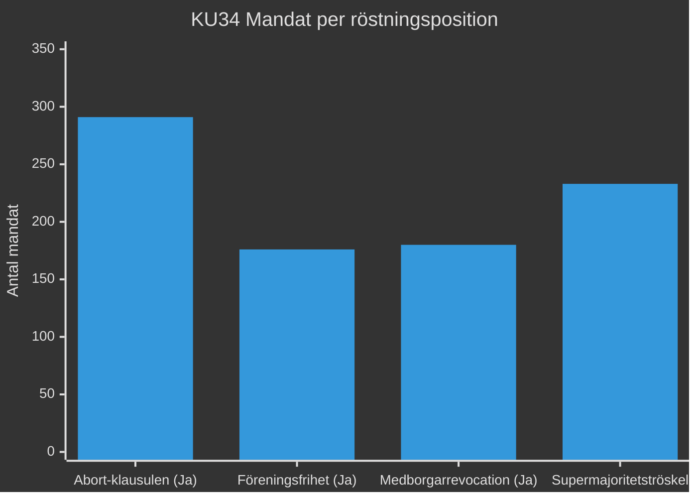

# Koalitionsmatematik — Evening Analysis 2026-05-15
**Author**: James Pether Sörling | **Mandatperiod**: 2022–2026 | **Datum**: 2026-05-15

## Riksdagssammansättning 2022–2026

| Parti | Mandat | Koalition | Förändring 2026 (estimerat) |
|-------|--------|-----------|---------------------------|
| M | 68 | Tidö | -3 → 65 |
| SD | 73 | Tidö | +2 → 75 |
| KD | 19 | Tidö | -1 → 18 |
| L | 16 | Tidö (stöd) | +2 → 18 |
| **Tidö total** | **176** (+ 18 L) = **194** | ≥175 krävs | ~176 |
| S | 107 | Opposition | +5 → 112 |
| C | 24 | Opposition | -4 → 20 |
| V | 24 | Opposition | +1 → 25 |
| MP | 18 | Opposition | -2 → 16 |
| **Opposition total** | **173** | — | ~173 |

*Estimat baserade på SOM-institutet väljarundersökningar jan-mars 2026*

## KU34 Supermajoritetsanalys

**Abort-klausulen**: S(107)+M(68)+C(24)+L(16)+KD(19)+V(24)+MP(18) = **276** (utan SD) + SD(73) potentiell = 349.
**Supermajoritetströskel**: 2/3 av 349 = **233 mandat**
**Risk**: Om SD splittras och 40+ SD-ledamöter röstar nej → abort-klausulen riskerar 276 < 233 — nej, 276 > 233. ABORT är säker.
**Föreningsfrihet-klausulen**: Tidömajoritet 194 + behöver ytterligare 39 → 194+39 = 233. S(107) = möjliggörare. Men S säger nej.
**Matematisk slutsats**: Föreningsfrihet och medborgarrevocation kan misslyckas utan S-stöd (om de inte röstar Ja).

## Migrationspolitik: Oppositionens optioner

| Scenario | Mandatbas | Möjlighet |
|----------|----------|-----------|
| Tidöpaketet antas med 194 | M+SD+KD+L = 194 | ✅ Sannolikt (alla 5 prop.) |
| HD03262 (PUT) fälls | Kräver 175+ mot (S+C+V+MP = 173) | ❌ Matematiskt omöjligt |
| Enstaka prop. (HD03267) fälls | Kräver SD-avhopp + S+C+V+MP = 176 | ⚠️ Möjligt om 1 SD-avhopp |
| Misstroendevotum | Kräver 175 mot aktiv koalition | ❌ Inga tecken |

## Valsimulering 2026 (baserat på SOM jan-mars 2026)

| Block | Mandatestimering | Förändring |
|-------|-----------------|-----------|
| Tidöblocket | 176 (+L 18) = 194 | Stabilt |
| Oppositionsblocket | 173 | Marginellt +/- |
| **Avgörande**: | **Vinnargränsen = 175** | — |

**Bedömning**: Valet 2026 är matematiskt exceptionellt jämnt. C:s positionering (migration+hyra) avgör om oppositionen kan nå 175+.

