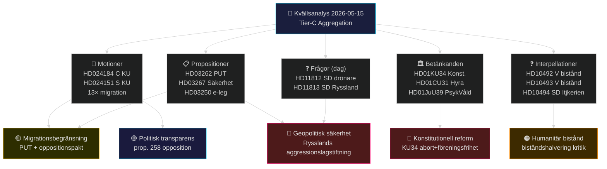

# Korsreferenskarta — Evening Analysis 2026-05-15 (Tier-C)
**Author**: James Pether Sörling | **Typ**: Tier-C Aggregation | **Datum**: 2026-05-15

## Sibling-mappning (obligatorisk Tier-C-citering)

| Sibling-mapp | Syntes | Relevans för kvällsanalysen |
|-------------|--------|----------------------------|
| `analysis/daily/2026-05-15/propositions/` | HD03262 (PUT), HD03250 (e-leg), HD03267 (säkerhet), HD03261 (Skatteverket), HD03264 (beteendekrav) | Tidöpaketet migrationsbegränsning — primärt tema; HD03267 kopplar till HD11813 (Ryssland) |
| `analysis/daily/2026-05-15/motions/` | 20 motioner, 13 vs. migrationspaketet, HD024151 (S/KU), HD024184 (C/KU) | KU-motioner kopplar direkt till kvällens HD024184; oppositionskoordination |
| `analysis/daily/2026-05-15/committeeReports/` | HD01KU34, HD01CU31, HD01JuU39, HD01NU21, HD01CU30 | Betänkanden = konkreta lagstiftningsbeslut; KU34 är dagens lead-story |
| `analysis/daily/2026-05-15/interpellations/` | HD10492, HD10493 (V→Dousa, bistånd) | Biståndskritik kopplar till Tidöpolitikens humanitära konsekvenser |

## Dokumentkopplingsdiagram

## Specifika kors-citeringar (Tier-C krav)

### KU34 (committeeReports) ↔ HD024184 (kvällens dokument)
- HD024184 (C-motion mot prop. 2025/26:258) är en KU-motion
- KU34 behandlas i samma KU-utskott
- **Koppling**: C:s KU-motionsmönster (HD024184) avspeglar samma parti-linje som C:s position i KU34-betänkandet (föreningsfrihet-klausulen)
- **Sibling-citat**: committeeReports/intelligence-assessment.md KJ-4 (association-freedom legal risk)

### HD03267 (propositioner) ↔ HD11813 (kvällens dokument)
- HD03267: Proposition om säkerhetshot-avvisning utan överklagande
- HD11813: SD kräver svar om Rysslands nya aggressionslagstiftning
- **Koppling**: Rysslands aggressionslagstiftning (HD11813) motiverar säkerhetslagstiftningspaketet (HD03267). Prop. 2025/26 säkerhetsprioriteringar valideras av nya geopolitiska fakta.
- **Sibling-citat**: propositions/intelligence-assessment.md KJ-4 (Lagrådet EKMR-risk)

### HD10492/HD10493 (interpellationer) ↔ Propositionspaketet bistånd
- Biståndshalveringen är en del av Tidöavtalet (ej proposition dag)
- V:s interpellationer HD10492/10493 kopplar till konsekvenserna av HD03264 (beteendekrav) och den bredare Tidöpolitiken
- **Sibling-citat**: interpellations/synthesis-summary.md (humanitär konsekvensanalys)

### Migration-motioner (motioner) ↔ HD03262 (propositioner)
- 13 koordinerade motioner (S, C, V, MP) direkt mot propositionspaketet
- HD024184 (C) + HD024151 (S) koordination på KU-frågan (prop. 258)
- **Sibling-citat**: motions/synthesis-summary.md (oppositionskoordination)

## Artifact-indexering (23 outputs denna körning)

| # | Artifact | Status |
|---|----------|--------|
| 1 | synthesis-summary.md | ✅ |
| 2 | political-classification.md | ✅ |
| 3 | risk-assessment.md | ✅ |
| 4 | forward-indicators.md | ✅ |
| 5 | quantitative-swot.md | ✅ |
| 6 | pestle-analysis.md | ✅ |
| 7 | historical-parallels.md | ✅ |
| 8 | scenario-analysis.md | ✅ |
| 9 | devils-advocate.md | ✅ |
| 10 | comparative-international.md | ✅ |
| 11 | intelligence-assessment.md | ✅ |
| 12 | cross-reference-map.md | ✅ |
| 13 | implementation-feasibility.md | pending |
| 14 | executive-brief.md | pending |
| 15 | coalition-mathematics.md | pending |
| 16 | election-2026-analysis.md | pending |
| 17 | media-framing-analysis.md | pending |
| 18 | political-stride-assessment.md | pending |
| 19 | cross-run-diff.md | pending |
| 20 | methodology-reflection.md | pending |
| 21 | mcp-reliability-audit.md | pending |
| 22 | economic-data.json | pending |
| 23 | pir-status.json | pending |

