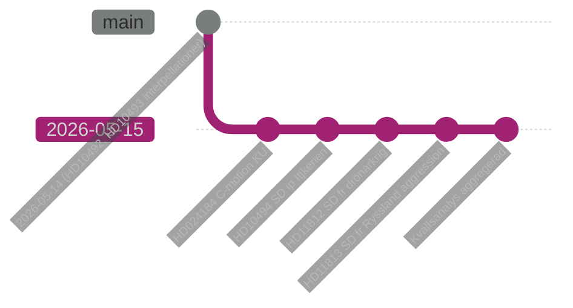

# Cross-Run Diff — Evening Analysis 2026-05-15
**Author**: James Pether Sörling | **Jämförelse**: Dag 2026-05-15 mot föregående analyser | **Datum**: 2026-05-15

## Nytt sedan föregående analyscykel

| Förändring | Kategori | Signifikans |
|-----------|----------|------------|
| HD11813: Rysslands aggressionslagstiftning publicerad | Geopolitisk eskalation | 🔴 HÖG — ny juridisk parameter |
| HD11812: Aurora 26 drönarkrig-fråga | Försvarskapacitet | 🟡 MEDEL |
| HD024184: C opponerar prop. 258 | Oppositionspolitik | 🟡 MEDEL — bekräftar C-S koordination |
| HD10494: SD kräver Itjkerien-erkännande | Utrikespolitisk positionering | 🟡 MEDEL |
| KU34 supermajoritetsgranskning (sibling) | Konstitutionell risk | 🔴 HÖG — SD:s röstning okänd |

## PIR-status: Förändring från föregående körning

### Ny-identifierade PIR:er (denna körning)

| PIR-ID | PIR-fråga | Ursprung |
|--------|-----------|---------|
| PIR-5 | Aurora 26 + drönarkrig kapacitetsbedömning | HD11812 (ny) |
| PIR-2 (Evening) | L:s formella position på KU34 föreningsfrihet-klausulen | IG-1 (identifierad idag) |

### PIR:er som förblir öppna (roll-forward från sibling-analyser)

| PIR-ID | Ursprung | Status |
|--------|---------|--------|
| PIR-1 (Propositions) | SD:s position på KU34 | ÖPPEN → ESK |
| PIR-2 (Propositions) | Lagrådets yttranden HD03262/HD03267 | ÖPPEN |
| PIR-3 (Propositions) | EU-kommissionens CEAS-bedömning | ÖPPEN |
| PIR-1 (CommitteeReports) | SD:s röstning KU34 föreningsfrihet | ÖPPEN → KRITISK |
| PIR-2 (CommitteeReports) | CU31 Hyresgästföreningen rättsutmaning | ÖPPEN |

## Narrativutveckling: Förstärkning och konvergens

| Narrativ | Trend | Förklaring |
|---------|-------|-----------|
| Geopolitisk säkerhet | 🔴 ESKALATION | HD11813 (ny) + Aurora 26 = tvåfrontig eskalering |
| Migrationsbegränsning | → STABIL | Oppositionspakten håller; inga nya brott |
| Konstitutionell reform | 🔴 KRITISK VECKOFAS | KU34-röstning nästa vecka |
| Humanitär biståndskritik | → STABIL | V:s interpellationer HD10492/10493 pågår |
| Politisk transparens | ↗ NY FRONT | C (HD024184) + S (HD024151) koordinerar — ny koalition för prop. 258-motstånd |

## Databas-diff: Nya dokument jämfört med igår

