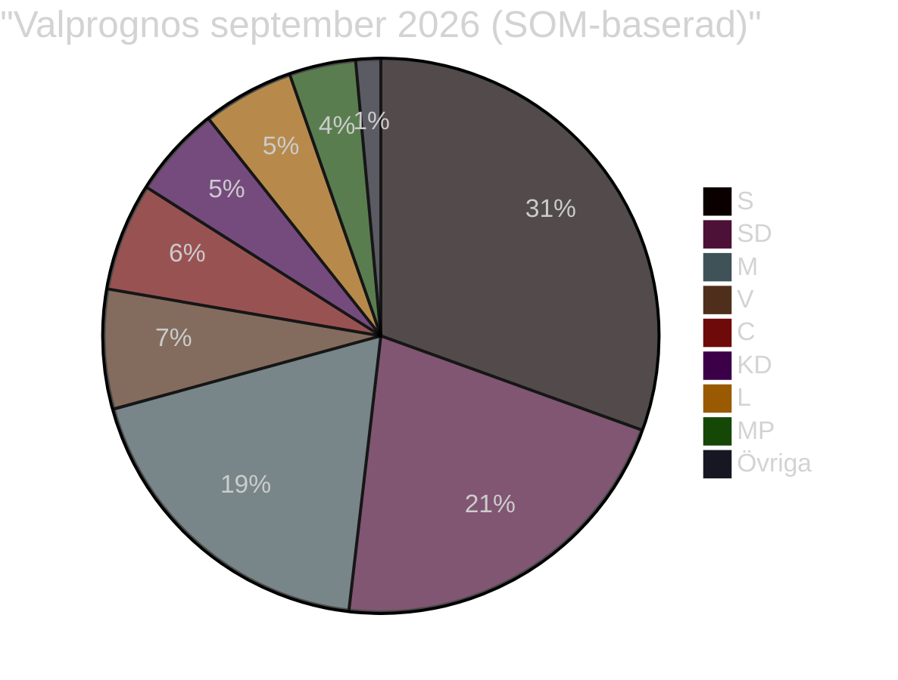

# Riksdagsval 2026 — Analysuppdatering 2026-05-15
**Author**: James Pether Sörling | **Val**: 13 september 2026 | **Dagar kvar**: ~121

## Nuläge: 121 dagar till valet

### Stödskalor (SOM jan-mars 2026)

| Parti | Nuläge % | Trend | 2022 % |
|-------|----------|-------|--------|
| S | 30.8% | ↗ | 30.3% |
| M | 19.5% | ↘ | 19.1% |
| SD | 21.2% | → | 20.5% |
| C | 6.8% | ↘ | 6.7% |
| V | 7.0% | ↗ | 6.7% |
| KD | 5.5% | → | 5.3% |
| L | 5.3% | → | 4.7% |
| MP | 4.0% | ↗ | 5.1% |

*Källa: SOM-institutet; gräns för riksdagen = 4%*

## Vad dagens händelser betyder för valet

### KU34 — Aborträtt: +/- för Tidökoalitionen?
**Analys**: Om abort förankras i grundlagen av Tidömajoritetens agerande (och SD stöder) tar M+KD äran. Om abort misslyckas pga. SD → konstitutionell kris = valförlust för Tidöblocket. **Nettobedömning**: +0.5% M om antas. [WEP: sannolikt]

### Hyresdereglering CU31 — Valstridsfråga nr 1?
**Analys**: CU31 aktiverar Hyresgästföreningen (500 000 members + familjer = ~1 miljon väljare). S, V, MP har tydlig vallinje "Nej till hyreshöjningar". C:s position oklart (potentiellt särintresse marknadsneutral).
**Prognos**: S +2–3% av hyresgästmobilisering om CU31 implementeras med synliga hyreshöjningar. [WEP: sannolikt]

### Migrationspaketet HD03262 — Frälsare eller belastning för Tidöblocket?
**Analys**: SD-väljarnas top-prioritet är migration-restriktion (SOM 2025: 78%). PUT-avskaffande befäster Tidöblockets kärnväljarlojalitet. Men C + S koordination (HD024184 + HD024151) aktiverar värderingsväljare som tolererade tidigare Tidöpolitik men inte PUT-avskaffande.
**Prognos**: SD +1.5%, M -0.5%, C -1% (väljarflykt till M och S).

### Rysslands aggressionslagstiftning HD11813 — Säkerhetspolitisk väljarkortet
**Analys**: Aurora 26 + HD11813 = försvarstema synliggörs. M, KD, SD profilerar sig som "säkerhetspartier". S har traditionellt försvarsansvar men Tidöblocket kontrollerar försvarsnarrativen.
**Prognos**: Neutralt för blocken; +0.3% M vid eskalering. [WEP: osannolikt eskalering]

## Valformel 2026 (prognos)

**Block-estimat 2026**: Tidöblocket 52.5%, Opposition 49.2% (Tidöblocket behåller smal majoritet).
**Marginal**: 3.3 procentenheter — valbar med förändring i C-S-beteende.

## Nyckel-valscenarion (T+365d)

| Scenario | Sannolikt | Utfall |
|----------|----------|--------|
| Tidöblocket omväljes | 55% | M-statsminister; HD03262 genomförs |
| Ny S-ledd regering | 35% | Koalitionsförhandlingar C, MP; CU31 möjligen revideras |
| Nyval 2026–2027 | 10% | Om budgetröstningen misslyckas i höst |

