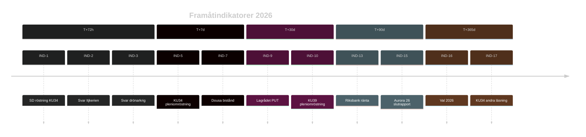

# Framåtindikatorer — Evening Analysis 2026-05-15
**Author**: James Pether Sörling | **Horizon**: T+72h / T+7d / T+30d / T+90d / T+365d / cycle

## Indikatorer per tidshorizont

### T+72h (2026-05-15 → 2026-05-18)

| Indikator | Händelse | Konsekvens om det händer |
|-----------|---------|--------------------------|
| IND-1 | SD bekräftar röstning på KU34 konstitutionsreform | Om nej → supermajoritet misslyckas; konstitutionell kris |
| IND-2 | Maria Malmer Stenergard svarar på HD10494 (Itjkerien) | Indikerar utrikespolitisk linje vs. Ryssland |
| IND-3 | Pål Jonson svarar på HD11812 (drönarkrig Aurora 26) | Avslöjar försvarskapacitetsbedömning |
| IND-4 | Ny MCP-uppdatering av voteringsresultat vecka 20 | Pleniomröstning KU34 konfirmeras |

### T+7d (2026-05-22)

| Indikator | Händelse | Konsekvens |
|-----------|---------|-----------|
| IND-5 | KU34 pleniomröstning (abort + föreningsfrihet + medborgarskap) | Supermajoritet ≥ 233 mandat krävs för gfundlagsändring |
| IND-6 | S eller C lämnar migrationspaktsfront | Oppositionskoordination fragmenteras |
| IND-7 | Dousa svarar på V:s biståndsfrågor HD10492/10493 | Signal om biståndsfilosofi-förändring |
| IND-8 | Lagrådets yttrande om HD03267 publiceras | Rättslig hållbarhet av säkerhetshot-proposition |

### T+30d (2026-06-15)

| Indikator | Händelse | Konsekvens |
|-----------|---------|-----------|
| IND-9 | Lagrådets yttrande HD03262 (PUT) publiceras | Rättslig risk för PUT-avskaffande |
| IND-10 | KU39 pleniomröstning (2026-06-16) om prop. 2025/26:258 | Politisk transparenslag antas/avslås |
| IND-11 | Migrationsverket implementationsplan för PUT | Bekräftar/motbevisar 2–4 år backlog |
| IND-12 | DIGG e-legitimation teknisk plan offentliggörs | Bekräftar/motbevisar IT-leveransrisk |

### T+90d (2026-08-15)

| Indikator | Händelse | Konsekvens |
|-----------|---------|-----------|
| IND-13 | Riksbank räntebesked (nästa möte) | Ekonomisk påverkan på bostadsmarknaden (CU31) |
| IND-14 | Oppositionspartier publicerar valmanifest | Migrationspolitik profilering |
| IND-15 | Aurora 26 övning slutrapport | Försvarsförmåga och drönarsårbarheter |

### T+365d / election-cycle

| Indikator | Händelse | Konsekvens |
|-----------|---------|-----------|
| IND-16 | Val 2026 (13 september) | Tidökoalitionen omväljas/fälls; migrationspolitik avgörande |
| IND-17 | Andra läsning KU34 i nytt riksmöte (2026/27) | Grundlagsändringen slutförs |
| IND-18 | EU-kommissionen bedömer HD03262 paktkonformitet | Europeisk rättsprocess om PUT-avskaffande |

## Indikatorkarta

