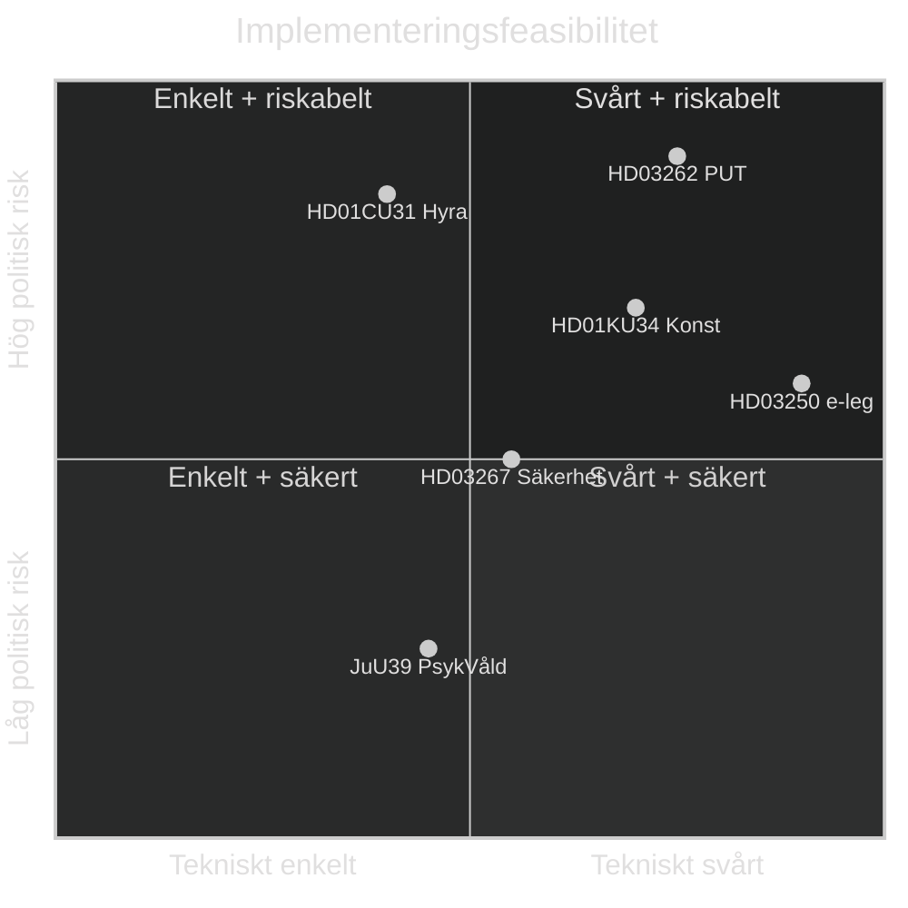

# Implementeringsfeasibilitet — Evening Analysis 2026-05-15
**Author**: James Pether Sörling | **Framework**: Technical Feasibility + DIW | **Datum**: 2026-05-15

## Implementeringsanalys per proposition/betänkande

### HD03262 — PUT-avskaffande (Röd: HÖG RISK)

| Faktor | Bedömning | Evidens |
|--------|-----------|---------|
| Lagstiftningskomplexitet | Hög | Ändrar Utlänningslagen + Migrationsdomstolsprocessen |
| Migrationsverket kapacitet | Kritisk gap | Statskontoret bekräftat; ~85 000 ärenden/år |
| IT-system anpassning | 12–18 månader | Nytt tillståndsklassificeringssystem krävs |
| Rättslig risk | Hög | EU-CEAS + EKMR; potentiell domstolsprocess |
| Tidslinje | 3–5 år full implementation | Baserat på dansk erfarenhet 2002–2005 |
| **Sammanfattning** | 🔴 PROBLEMFYLLT | Tekniskt genomförbart men humanitärt och rättsligt riskabelt |

### HD01KU34 — Konstitutionell reform (Gul: MEDEL RISK)

| Faktor | Bedömning | Evidens |
|--------|-----------|---------|
| Lagstiftningskomplexitet | Extremt hög | Grundlagsändring — 2 riksmöten + supermajoritet |
| Parlamentarisk risk | Hög | SD:s position okänd (IG-2); L:s position okänd (IG-1) |
| Rättslig implementering | Enkel om antas | Inkorporeras direkt i RF |
| EU-kompatibilitet | Generellt ok | ECHR Art. 11 risk för föreningsfrihet-klausulen |
| Tidslinje | 2026 + 2026/27 riksmöte (2 läsningar) | Konstitutionsprocess |
| **Sammanfattning** | 🟡 KRITISK RÖSTNINGSFAS | Abort-klausulen säker; föreningsfrihet och medborgarrevocation riskabla |

### HD01CU31 — Hyresdereglering (Röd: HÖG KONSEKVENS)

| Faktor | Bedömning | Evidens |
|--------|-----------|---------|
| Lagstiftningskomplexitet | Medel | Ändrar Hyreslagen JB 12 kap. |
| Hyresgästpåverkan | Kritisk | ~4 miljoner hyresgäster direkt; storstäder mest |
| Genomförandetid | 1–3 år | Successiv marknadsinpassning |
| Politisk motreaktion | Hög | Hyresgästföreningen 500 000 members; S, V, MP aktivt emot |
| Domstolsutmaningar | Möjliga | Proportionalitetstest |
| **Sammanfattning** | 🔴 SOCIOEKONOMISK RISK | Tekniskt enkelt att genomföra; konsekvenserna är svåra |

### HD01JuU39 — Psykologvåld (Grön: MÖJLIG med utmaningar)

| Faktor | Bedömning | Evidens |
|--------|-----------|---------|
| Lagstiftningskomplexitet | Medel | Brottsbalken + polisutbildning |
| Poliskapacitet | Underskott | Estimerade 100 000 anmälningar/år; polis hanterar 60 000 idag |
| Åklagarkapacitet | Underskott | Psykologisk bevisning komplex |
| EU-kompatibilitet | Hög | GREVIO-standard uppfylls |
| Tidslinje | 2–4 år full kapacitet | Rekrytering + utbildning polisiär specialisering |
| **Sammanfattning** | 🟢 GENOMFÖRBART men kapacitetsgap | Bred politisk uppslutning; polisen behöver förstärkning |

### HD03250 — e-legitimation (Röd: IT-LEVERANSRISK)

| Faktor | Bedömning | Evidens |
|--------|-----------|---------|
| Teknisk komplexitet | Extremt hög | Nationell digital identity-infrastruktur |
| DIGG kapacitet | Underskott | Historiska IT-projektsmisstag; 30%+ förseningsrisk |
| BankID-konkurrens | Hög | Kommersiellt motstånd; 8 miljoner BankID-användare |
| Budget | Okänt | Okänt exakt budget → IG |
| Tidslinje | 2028–2030 (optimistisk) | 3+ år förseningsrisk från propositions KJ-3 |
| **Sammanfattning** | 🔴 HÖGRISK IT-PROJEKT | Tekniskt komplicerat; DIGG:s historik bekymrar |

## Sammanfattande feasibilitetsmatris

