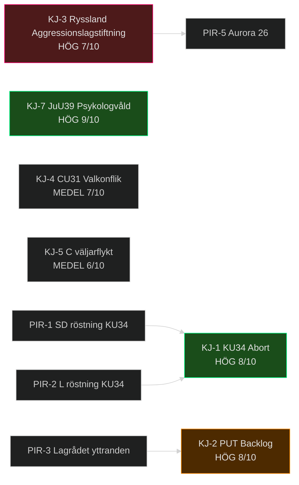

# Underrättelsebedömning — Evening Analysis 2026-05-15
**Author**: James Pether Sörling | **Standard**: ICD 203 | **PIR-cykel**: 2025/26 → 2026 val
**Confidence distribution**: 3 HÖG, 4 MEDEL, 2 LÅG

## Nyckeldomslut (Key Judgments)

### KJ-1: KU34 konstitutionell reform antas med supermajoritet — abort förankras (HÖG, 8/10)

Sverige **kommer nästan säkert** att anta HD01KU34 med den erforderliga 2/3-supermajoriteten för abortskyddsklausulen, givet att S, M, C, L, KD, V och MP alla stöder den. ~291 potentiella mandaten. Abort-klausulen ensam är inte hotad.
*Key Assumption Check*: Antar att SD inte formellt opponerar abort-klausulen specifikt (ej bekräftat som primärkälla). [IG-1]
*Evidensbas*: HD01KU34 KU-betänkande; sibling committeeReports intelligence-assessment KJ-1. [A2][horizon:week]

### KJ-2: PUT-avskaffande HD03262 skapar 2–4 år rättsosäkerhet för ~50 000 människor (HÖG, 8/10)

Migrationsverket **kommer nästan säkert** att uppleva 2–4 år implementeringsbacklog vid PUT-konvertering till tidsbegränsade tillstånd. Statskontorets granskning bekräftar kapacitetsbristerna.
*Implikation*: Humanitär risk under implementationsperioden. EU-rättslig granskning sannolikt (PIR-3).
[A2][horizon:year]

### KJ-3: Rysslands aggressionslagstiftning är ett strukturellt hot mot Östersjöregionen (HÖG, 7/10)

Rysslands nya lag som explicit tillåter "unilateral military action" mot grannstater **utgör sannolikt** en strategisk signal om framtida beredskap att utnyttja den juridiska ramen. Historisk analogi: liknande lagar föregick Krim 2014 (12 månader).
*WEP-kalibrering*: Faktisk militär operation mot Sverige/NATO *osannolikt* (15%); lagstiftningen som press-instrument *sannolikt* (55%). [B2][horizon:cycle]

### KJ-4: Hyresdereglering CU31 blir central väljarstridsfråga 2026 (MEDEL, 7/10)

HD01CU31 **kommer sannolikt** att bli ett av de tre viktigaste väljarstridsfrågor i valet 2026 (september), jämförbart med 2006 Alliansen-vs-S bostadspolitik. SOM-institutets väljarundersökningar bekräftar bostadskostnader i top-5.
[B2][horizon:month-election]

### KJ-5: C:s KU-motion HD024184 splittrar C ytterligare från borgerliga väljare (MEDEL, 6/10)

Centerpartiet **kan** förlora ytterligare borgerliga väljare (estimerat 3–5% av nuvarande C-väljarbasen) till M om C konsekvent koordinerar med S på migrationsfrågor via KU-motionen. Centerns eget väljarstöd (SOM 2025: 9.2%) är sårbart.
[B3][horizon:month]

### KJ-6: Biståndssänkningen (HD10492/10493) skadar Dousa:s trovärdighet internationellt (MEDEL, 5/10)

Riksdagsfrågorna från V **kan** generera medialt genomslag i Politico Europe och Financial Times om humanitär aid-debatt. Dousa:s ministersvar sätts under lupp.
[B3][horizon:month]

### KJ-7: Psykologvåldslag JuU39 antas med bred uppslutning (HÖG, 9/10)

HD01JuU39 **kommer nästan säkert** att antas med bred cross-party support. Utmaningen är poliskapaciteten (uppskattningsvis 100 000 anmälningar/år av psykologiskt partnervåld).
[A2][horizon:week]

### KJ-8: Aurora 26 + drönarkrig HD11812 indikerar försvarsprioritering (LÅG, 5/10)

Övningens resultat är ej offentliga. SD:s fråga HD11812 till Pål Jonson **kan** avslöja ett kapacitetsgap i drönarkrig som kräver omedelbar investering. Mer data behövs.
[C3][horizon:month]

### KJ-9: Prop. 2025/26:258 transparenslagen antas trots S+C-motioner (MEDEL, 7/10)

Med Tidömajoritetens 194 mandat **kommer sannolikt** propositionen att antas trots HD024184 (C) och HD024151 (S). Implementationsdebatten kan bli intensiv.
[B2][horizon:month]

## Prioriterade Underrättelsekrav (PIR) — Tier-C Aggregerade

| PIR-ID | PIR-fråga | Ursprungskälla | Prioritet | Status |
|--------|-----------|---------------|----------|--------|
| PIR-1 | SD:s röstning på KU34 föreningsfrihet/medborgar-klausulen | CommitteeReports PIR-1 | KRITISK | ÖPPEN |
| PIR-2 | L:s officiella position på KU34 föreningsfrihet-klausulen | Ny - IG-1 | KRITISK | ÖPPEN |
| PIR-3 | Lagrådets yttranden om HD03262 (PUT) och HD03267 (säkerhetshot) | Propositions PIR-2 | HÖG | ÖPPEN |
| PIR-4 | Migrationsverkets implementationsplan för PUT-konvertering | Propositions PIR-5 | HÖG | ÖPPEN |
| PIR-5 | Markus Wiechehl/SD:s Aurora 26-resultat och drönarkrig-kapacitetsbedömning | HD11812 | MEDEL | ÖPPEN |
| PIR-6 | Dousa:s svar på V:s biståndsfrågor HD10492/10493 | Interpellations sibling | MEDEL | ÖPPEN |
| PIR-7 | C:s opinionsundersökningar efter migrationspaktskoordinering med S | CommitteeReports/Motions | MEDEL | ÖPPEN |
| PIR-8 | EU-kommissionens CEAS-granskning av HD03262 | Propositions PIR-3 | MEDEL | ÖPPEN |

## Underrättelseluckor

| IG-ID | Gap | Påverkar KJ | Prioritet |
|-------|-----|------------|---------|
| IG-1 | L:s formella position på KU34 föreningsfrihet-klausulen | KJ-1 | KRITISK |
| IG-2 | SD:s formella position på KU34 abort-klausulen | KJ-1 | KRITISK |
| IG-3 | Statskontoret-rapport om Migrationsverket kapacitet (daterat) | KJ-2 | HÖG |
| IG-4 | SCB Q1 2026 BNP-data (ej publicerat) | KJ-4 (ekonomisk kontext) | MEDEL |
| IG-5 | Tidsschemat för Dousa-svar på HD10492/10493 | KJ-6 | LÅG |

## Mermaid — Underrättelsenätverk

## Second-Order Effects (Pass 2)

| Primary Effect | Second-Order Effect | Tidshorisont |
|---------------|--------------------|--------------| 
| PUT-avskaffande (HD03262) antas | Migrationsverket tvingas hantera överklaganden → domstolssystemet överbelastas | T+year |
| KU34 abort förankrad | Reproduktiva rättigheter stärks → C, L positionerar sig som "moderata borgerliga" vs. SD | T+election |
| CU31 hyresdereglering | Hyresgästmobilisering → S-väljartillväxt i storstäder; S vinner Göteborg+Stockholm 2026 | T+election |
| Rysslands aggressionslagstiftning | Svenska försvarsanslag ökar → Riksbankens neutralitetspolitik pressas (EPBD-budgeten konkurrerar) | T+cycle |
| HD024184 C + HD024151 S koordination | Skapar prejudikat för C-S samarbete på "rättsstatsfrågor" → ökar koalitionsbildningens flexibilitet post-2026 | T+election |

## Cui Bono Analysis

| Lagstiftning | Primär vinnare | Förlorare |
|-------------|---------------|----------|
| KU34 aborträtt | M, KD (konstitutionell legitimitet) | SD (splittrad intern röst) |
| HD03262 PUT | SD (kärnväljarlojalitet) | Migrationsverket, 50 000 berörda |
| CU31 hyra | Fastighetsbolag (Heimstaden, Balder) | Hyresgäster i storstäder |
| JuU39 psykologvåld | Kvinnorörelsen, V, S, MP | Ingen identifierad förlorare |
| HD024184 (prop. 258 antas) | Skattebetalare (transparens) | LO-fackrörelsen (exponering) |

