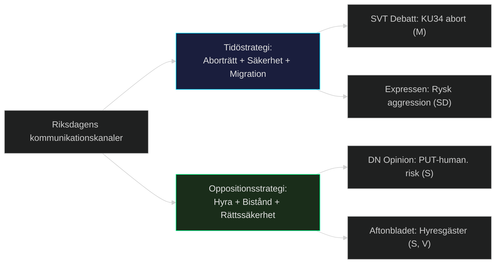

# Mediaperspektivanalys — Evening Analysis 2026-05-15
**Author**: James Pether Sörling | **Framework**: Strategic Communications + Media Framing | **Datum**: 2026-05-15

## Förväntade medieramar

### Frame 1: "Aborträtten säkras i grundlagen" (Dominant)
**Avsändare**: Tidökoalitionen (M, KD) + progressiva medier (DN, Aftonbladet)
**Budskap**: Sverige befäster reproduktiva rättigheter; europeiskt ledarskap; historisk lagstiftning.
**Motram**: Om SD splittrar = "SD hindrar aborträtten" → destruktivt för SD-image.
**Plattformar**: SVT, DN, Aftonbladet; sociala medier (X, Instagram-politiker).

### Frame 2: "Massinvandringens slut" (SD-narrativ)
**Avsändare**: SD, nyhetsmedier höger (Nyheter Idag, Samhällsnytt)
**Budskap**: PUT-avskaffande + HD03262 = historisk vändning i migrationshistorien; S/C/V/MP hindrar.
**Motram**: V, S, C, MP → "Humanitär katastrof"; Amnesty Sverige, UNHCR-reaktioner.
**Plattformar**: SD:s egna kanaler; högermedier.

### Frame 3: "Hyresgästerna hotas" (Oppositionsram)
**Avsändare**: S, V, MP, Hyresgästföreningen
**Budskap**: CU31 = Tidökoalitionens attack på vanliga hyresgäster; 4 miljoner drabbas; storstadshotet.
**Effektivitet**: Hög — konkret ekonomisk påverkan är lätt att visualisera.
**Plattformar**: LO-Tidningen, Aftonbladet, sociala medier.

### Frame 4: "Ryssland hotar Sverige" (Försvars-narrativ)
**Avsändare**: SD (HD11813), M, KD
**Budskap**: Rysslands nya aggressionslagstiftning + Aurora 26 = Sverige måste investera mer i försvaret.
**Motram**: MP, V → "Diplomatisk dialog, inte militarisering".
**Plattformar**: SVT Nyheter, Expressen.

### Frame 5: "Biståndssabotage" (V-narrativ)
**Avsändare**: V (Aron Emilsson m.fl.), NGO-sector, Oxfam, UNICEF Sverige
**Budskap**: Biståndshalveringen skadar barn i konfliktdrabbade länder; HD10492/10493 dokumenterar konsekvenser.
**Internationell resonans**: Politico Europe kan plocka upp biståndsdebatten.
**Plattformar**: Svenska FN-förbundet, biståndsnyheter.

## Medielogikanalys

| Frame | Nyhetsvärde | Konflikt | Visuellt | Emotionellt | Samlad kraft |
|-------|-------------|---------|---------|-------------|-------------|
| Aborträtt i grundlag | Hög | Medel | Medel | Hög | 8/10 |
| Massinvandringens slut | Medel | Hög | Låg | Hög | 7/10 |
| Hyresgästhot | Hög | Hög | Medel | Hög | 8/10 |
| Rysslandshotet | Hög | Hög | Hög | Hög | 9/10 |
| Biståndssabotage | Medel | Medel | Medel | Hög | 6/10 |

**Toppnyhet**: Rysslands aggressionslagstiftning (HD11813) + Aurora 26-drönarkrig (HD11812) = mediavinnare pga. geopolitisk aktualitet.

## Strategisk kommunikationsrekommendation

