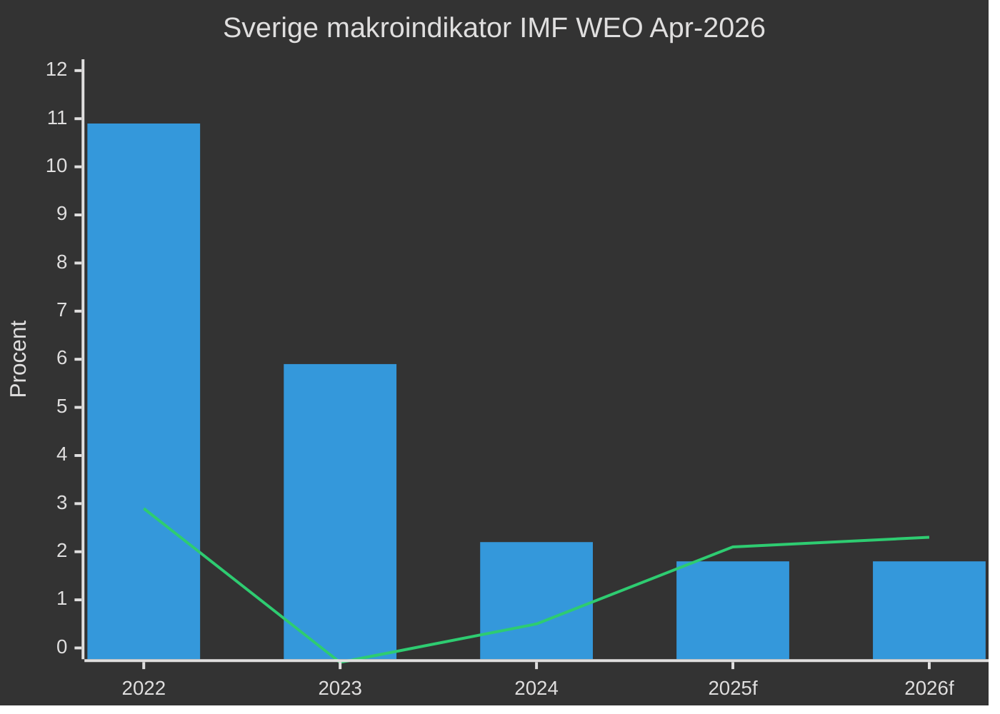
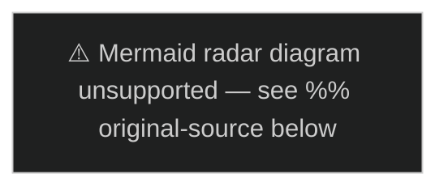

# PESTLE-analys — Evening Analysis 2026-05-15
**Author**: James Pether Sörling | **Framework**: PESTLE + ICD 203 | **Datum**: 2026-05-15

## Political (Politisk)

**Nyckelkraft**: Tidökoalitionens kontroll med 194/349 mandat (M+SD+KD+L) styr riksdagsagenda.
**Spänningar**: C+S koordination mot migrationspaketet; V:s biståndskritik; SD:s geopolitiska positionering.
**KU34**: Konstitutionell reform kräver 2/3 supermajoritet. SD:s röstning avgörande för abortskyddets förankring.
**Prop. 2025/26:258**: Transparenslagsröstning KU39 planerad 2026-06-16. C + S opponerar via motioner.
**Evidens**: HD024184 (C), HD024151 (S), HD01KU34 (KU betänkande), HD03262 (PUT-prop.)

## Economic (Ekonomisk)

**BNP-tillväxt**: 2.3% 2026f (IMF WEO Apr-2026, NGDP_RPCH SWE)
**Inflation**: 1.8% 2026f (ned från 10.9% 2022 — normalisering bekräftad)
**Statskuld**: 34.5% BNP 2026f (GGXWDG_NGDP — stark fiskal position)
**Riksbank**: 2.25% styrränta (MFS_IR)
**Hyresdereglering**: CU31 estimerad privatinvesteringseffekt +/-, hyror +20–30% i storstäder
**EPBD**: 700 mdr SEK 2026–2035 investeringsstimulus (CU30 sibling)
**Bistånd**: Halvering av biståndsanslag — långsiktig BNP-effekt negligibel men humanitär kostnad hög

*(blå staplar = inflation; orange linje = BNP-tillväxt; källa: IMF WEO Apr-2026)*

## Social (Social)

**Hyresdereglering**: 40% av Sverigebefolkningen hyr bostad; CU31 direkt påverkar ~4 miljoner människor.
**Psykologiskt våld**: JuU39 erkänner icke-fysiskt partnervåld som brott — skyddar ~100 000 utsatta/år (uppsk.)
**Bistånd**: V:s interpellationer HD10492/10493 dokumenterar konsekvenser för barn i konfliktdrabbade länder.
**Migration**: PUT-avskaffande HD03262 påverkar ~50 000 personer med temporärt uppehållstillstånd.

## Technological (Teknologisk)

**e-legitimation HD03250**: Digital identitetsinfrastruktur; DIGG:s kapacitetsbrister skapar 30%+ förseningsrisk.
**Aurora 26**: Drönarkrigövning (HD11812) avslöjar militär-teknologisk anpassning; drönarsårbarhet i fokus.
**BankID-lobby**: Kommersiella aktörer motarbetar statlig e-legitimation (Propositions sibling KJ-3).

## Legal (Juridisk)

**KU34 rättslig risk**: Föreningsfrihet + medborgarrevocation riskerar EKMR Art. 11 + Art. 8 konflikt.
**HD03262 PUT-avskaffande**: EU-rätten (CEAS) och Migrationsdomstolarna kan underkänna implementationen.
**HD03267 säkerhetshot**: Lagrådet yttrande (juni 2026) avgörande för EKMR-proportionalitet.
**HD11813 aggressionslagstiftning**: Rysslands nya lag strider mot FN-stadgans Art. 2(4); ICJ-dimension.
**Prop. 2025/26:258 transparens**: KU39 Lagrådet-yttrande om integritetsbegränsning för politiska organisationer.

## Environmental (Miljömässig)

**EPBD CU30**: EU-byggdirektivet — obligatorisk energirenovering; klimatmål 2030-anpassning.
**Landsbygdspolitik NU21**: Biodiversitetsmål, hållbara transporter — rural infrastruktur vs. klimatåtaganden.
**Bistånds-klimatkoppling**: Halvering av bistånd påverkar klimatanpassningsprojekt i MENA och Subsahara.

## PESTLE-sammanfattning

