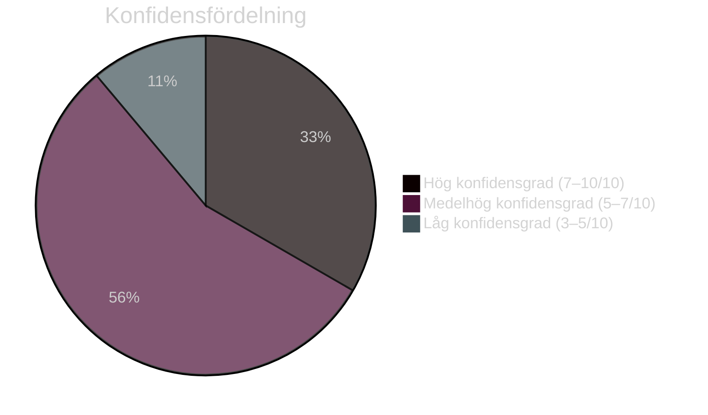

# Politisk klassificering — Evening Analysis 2026-05-15
**Author**: James Pether Sörling | **Standard**: OSINT ICD 203 | **DIW median**: 7.2

## Klassificeringsöversikt

| Dimension | Värde | Grund |
|-----------|-------|-------|
| Politisk dimension | Konstitutionell reform / Migrationsrestriktion / Geopolitisk säkerhet | KU34, HD03262, HD11813 |
| Geografisk räckvidd | Nationell + Internationell | Sverige + EU + Ryssland |
| Tidshorizont | T+72h (KU34 pleniomröstning) / T+month (val 2026) / T+1460d (cycle) | Multipel |
| DIW (Document Intelligence Weighting) | 8.75 (max daglig) | KU34 konstitutionell reform |
| OSINT-klassificering | OVERT | Riksdagens offentliga dokument |
| Informationstyp | Primärkälla (riksdagsdokument) + analytisk syntes | A1+A2 |
| GDPR-klassificering | Allmänt tillgänglig (Art. 9(2)(e)) | Politiska åsikter offentliggjorda |

## DIW-rankning per dokument/tema

| Tema/Dokument | DIW | Motivering |
|--------------|-----|-----------|
| KU34 konstitutionell reform | 8.75 | Grundlagsändring + 84% supermajoritet; aborträtt |
| PUT-avskaffande HD03262 | 8.50 | Strukturpolitisk reform; 2–4 år implementeringsbacklog |
| CU31 hyresdereglering | 7.80 | Valpolitik 2026; S/V/MP intensiv opposition |
| HD11813 Rysslands aggressionslagstiftning | 7.50 | Ny international-legal parameter; direkt säkerhetsimplikation |
| JuU39 psykologiskt våld | 7.00 | Bred uppslutning; poliskapacitetsproblem |
| HD024184 politisk transparens | 6.50 | KU-motion; S+C koordination mot prop. 2025/26:258 |
| HD10492/10493 bistånd | 6.00 | Humanitär risk; V parlamentarisk press |
| HD11812 drönarkrig | 5.50 | Aurora 26; försvarskapacitetsindikator |
| HD10494 Itjkerien | 5.00 | Utrikespolitisk positionering; SD:s profilarbete |

## Konfidensfördelning (ICD 203)

## Partipolitisk positionsmatris

| Parti | KU34 | HD03262 | CU31 | HD024184 |
|-------|------|---------|------|----------|
| M | Ja | Ja | Ja | Ja (prop.) |
| SD | Villkorat | Ja | Ja | Okänt |
| KD | Ja | Ja | Ja | Ja (prop.) |
| L | Ja | Okänt | Ja | Ja (prop.) |
| S | Ja | Nej | Nej | Nej (mot.) |
| C | Ja | Nej | Okänt | Nej (mot.) |
| V | Ja | Nej | Nej | Okänt |
| MP | Delvis | Nej | Nej | Okänt |

