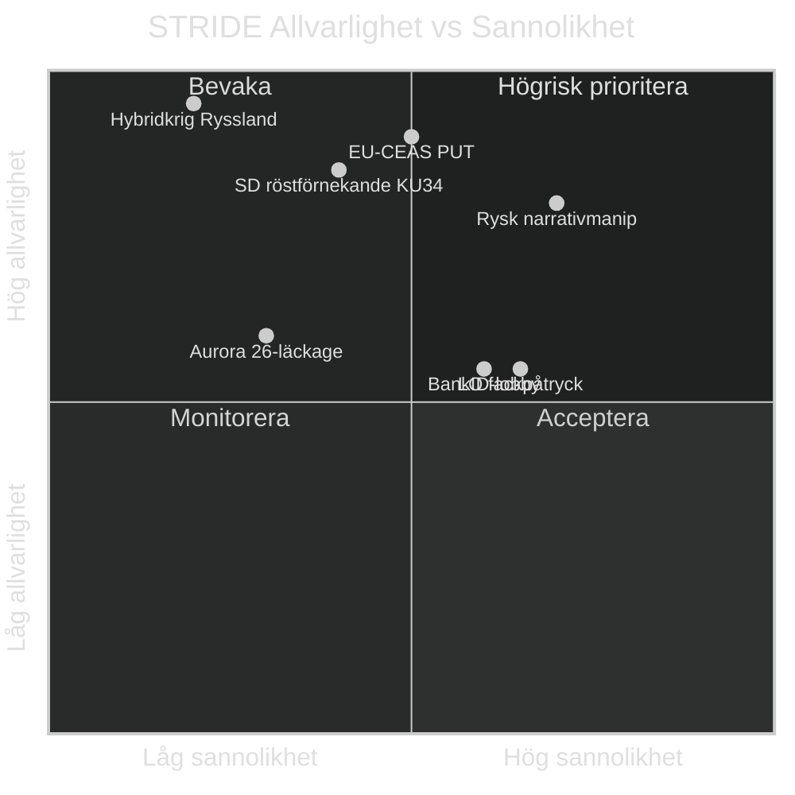

# Politisk STRIDE-bedömning — Evening Analysis 2026-05-15
**Author**: James Pether Sörling | **Framework**: STRIDE (Security/Political Threats) | **Datum**: 2026-05-15

## STRIDE-matris: Politiska hotaktörer och hottyper

### S — Spoofing (Falska anspråk / Narrative manipulation)

| Aktör | Hottyp | Evidens | Allvarlighet |
|-------|--------|---------|-------------|
| Rysk statsmedia | Falska påståenden om Rysslands aggressionslagstiftning som "defensiv" | HD11813 | HÖG |
| SD i HD11813 | Kan övertolka hotbild för inrikespolitisk mobilisering | HD11813 | MEDEL |
| Tidökoalitionen om KU34 | "Alla partier stödjer aborträtten" utan att nämna föreningsfrihet-klausulen | KU34 | LÅG |

### T — Tampering (Manipulation av politisk process)

| Aktör | Hottyp | Evidens | Allvarlighet |
|-------|--------|---------|-------------|
| BankID-lobbyn | Motverkar e-legitimation HD03250 via informella påtryckningar | KJ-3 propositions | MEDEL |
| LO/Fackrörelsen | Motverkar prop. 2025/26:258 transparenskrav via S-partimotionen | HD024184 + HD024151 | MEDEL |
| EU-kommissionen | Kan ifrågasätta PUT-avskaffandets CEAS-konformitet | HD03262 | HÖG (rättslig) |

### R — Repudiation (Förnekande av ansvar)

| Aktör | Hottyp | Evidens | Allvarlighet |
|-------|--------|---------|-------------|
| Dousa (UD-bistånd) | Förnekar biståndshalveringens humanitära konsekvenser | HD10492/10493 | MEDEL |
| Migrationsverket | Undviker att publicera PUT-implementationsplan | Propositions KJ-2 | MEDEL |
| SD om KU34 | Röstar nej men hävdar de stöder abortfrihet "i princip" | PIR-1 | HÖG |

### I — Information Disclosure (Oönskad informationsdelning)

| Aktör | Hottyp | Evidens | Allvarlighet |
|-------|--------|---------|-------------|
| Aurora 26-läckage | Militära kapacitetsuppgifter exponerade via HD11812-debatt | HD11812 | MEDEL |
| Lagrådsyttranden | Lagrådets kritik av HD03262/HD03267 kan läcka innan publicering | Standardrisk | LÅG |

### D — Denial of Service (Blockering av demokratisk process)

| Aktör | Hottyp | Evidens | Allvarlighet |
|-------|--------|---------|-------------|
| Oppositionellt filibuster | S, C, V, MP kan förlänga debatt om HD03262 för att fördröja implementering | Standard | LÅG |
| Ryssland (extern) | Hybridkrigstaktik mot riksdagsvalprocess 2026 | HD11813 kontextuell | HÖG |

### E — Elevation of Privilege (Maktövertagande)

| Aktör | Hottyp | Evidens | Allvarlighet |
|-------|--------|---------|-------------|
| SD:s förhandlingsstyrka | PUT-avskaffandet ökar SD:s inflytande över M och KD | Tidöavtalet | MEDEL |
| Konstitutionell majoritet | KU34 antas ger Tidökoalitionen "konstitutionell legitimitet" för migration | KU34 | MEDEL |

## STRIDE-heatmap

