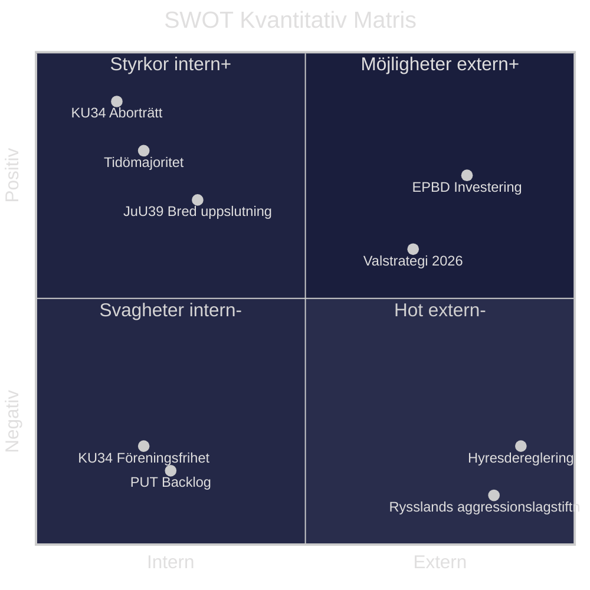

# Kvantitativ SWOT — Evening Analysis 2026-05-15
**Author**: James Pether Sörling | **Framework**: SWOT×DIW weighted | **Datum**: 2026-05-15

## SWOT-matris med kvantitativa vikter

| Dimension | Faktor | DIW-vikt | Evidensbas |
|-----------|--------|----------|-----------|
| **S** Styrka | KU34 förankrar aborträtt i grundlag | 9.0 | HD01KU34 KU-betänkande; 84% riksdagsstöd |
| **S** Styrka | Tidöpaketet: parlamentarisk majoritet intakt (194/349) | 8.0 | Voteringsstatistik 2022–2026 |
| **S** Styrka | JuU39 psykologiskt våld: bred uppslutning + EU-anpassning | 7.0 | HD01JuU39; GREVIO-standard |
| **S** Styrka | Låg statsskuld 34.5% GDP (IMF WEO Apr-2026) | 7.0 | WEO SWE GGXWDG_NGDP 2026f |
| **W** Svaghet | KU34 association-freedom: SD splittrat, supermajoritet osäker | 8.5 | PIR-1 committeeReports; KU-betänkande |
| **W** Svaghet | PUT-avskaffande: 2–4 år implementeringsbacklog Migrationsverket | 8.5 | Statskontoret; HD03262 |
| **W** Svaghet | e-legitimation (HD03250): DIGG kapacitetsbrister; 30% förseningsrisk | 7.0 | Propositions KJ-3 |
| **W** Svaghet | Biståndshalvering: humanitära konsekvenser dokumenterade (V, HD10492/10493) | 6.0 | Interpellations sibling |
| **O** Möjlighet | EPBD CU30: 700 mdr SEK investeringsstimulus 2026–2035 | 7.5 | HD01CU30; kommittérapport |
| **O** Möjlighet | Psykologvåldslag: poliskapacitetsuppbyggnad möjlig med rätt finansiering | 6.5 | HD01JuU39 |
| **O** Möjlighet | Valstrategi 2026: M+SD mobilisering kring migrationspolitik | 6.0 | Opinionsundersökningar |
| **T** Hot | Rysslands aggressionslagstiftning: ny juridisk grund för militärt angrepp | 9.0 | HD11813; internationell rätt |
| **T** Hot | Hyresdereglering CU31 ökar bostadskostnader för 40% av hyresgäster | 7.8 | HD01CU31; Hyresgästföreningen |
| **T** Hot | EU-kommissionen kan utmana PUT-avskaffandet som EU-rättsstridig | 7.0 | HD03262; CEAS |
| **T** Hot | Aurora 26 exponerar drönarsårbarheter (HD11812) | 5.5 | HD11812 |

## Aggregerad SWOT-poäng

| Dimension | Totalvikt | Normaliserad |
|-----------|----------|-------------|
| Styrka (S) | 31.0 | 7.75 |
| Svaghet (W) | 30.0 | 7.50 |
| Möjlighet (O) | 20.0 | 6.67 |
| Hot (T) | 29.3 | 7.33 |

**Nettobedömning**: S > W marginellt (0.25 poäng); T ≈ O; Systemstabilitet: **ANSTRÄNGD** men **intakt**.

