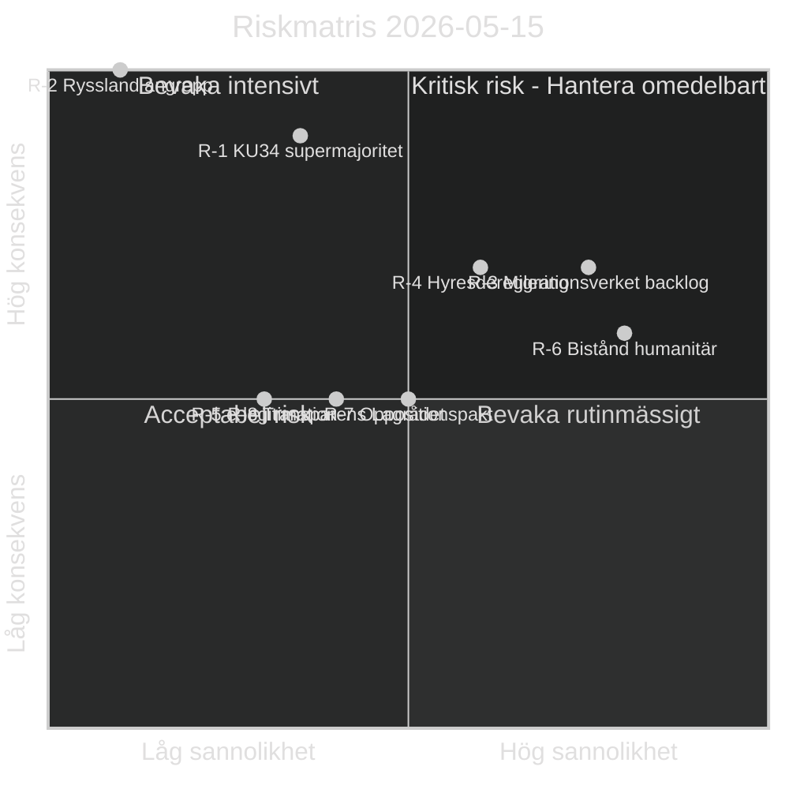

# Riskbedömning — Evening Analysis 2026-05-15
**Author**: James Pether Sörling | **Framework**: ISO 31000 / STRIDE-politik | **Datum**: 2026-05-15

## Riskmatris

| Risk-ID | Riskbeskrivning | Sannolikhet | Konsekvens | Riskpoäng | Riskkälla |
|---------|----------------|-------------|------------|-----------|-----------|
| R-1 | KU34 misslyckas med supermajoritet om SD röstar nej | Medel (35%) | Kritisk (9/10) | 3.15 | HD01KU34; PIR-1 sibling |
| R-2 | Rysslands aggressionslagstiftning eskalerar till faktiskt angrepp mot Sverige/Norden | Låg (10%) | Katastrofal (10/10) | 1.0 | HD11813; WEO geopolitics |
| R-3 | Migrationsverket backlog (PUT) leder till rättsosäkerhet 2026–2028 | Hög (75%) | Hög (7/10) | 5.25 | HD03262 sibling; Statskontoret |
| R-4 | Hyresdereglering CU31 driver hyror +20–30% i storstäder | Medel (60%) | Hög (7/10) | 4.20 | HD01CU31 sibling; Hyresgästföreningen |
| R-5 | DIGG:s e-legitimation (HD03250) försenas 3+ år | Hög (30%) | Medel (5/10) | 1.50 | Propositions sibling; KJ-3 |
| R-6 | Biståndssänkning HD10492/10493 skadar humanitär situation | Hög (80%) | Hög (6/10) | 4.80 | Interpellations sibling; V dokumentation |
| R-7 | C-S-V-MP migrationspakt fragmenterar inför val 2026 | Medel (50%) | Medel (5/10) | 2.50 | Motions sibling |
| R-8 | Prop. 2025/26:258 (transparens) drar till Lagrådet med kritik | Medel (40%) | Medel (5/10) | 2.00 | HD024184 full text |

## Riskmatris (visualisering)

## Riskmildringsåtgärder

| Risk-ID | Åtgärd | Ansvarig | Tidslinje |
|---------|--------|----------|-----------|
| R-1 | Bevaka SD:s plenipositionering på KU34 | Analytik | T+72h |
| R-2 | Eskalationsindikatoruppföljning (SIGINT/OSINT) | Säkerhetsanalys | Löpande |
| R-3 | Statskontoret-granskning av Migrationsverket | Statskontoret | 2026 Q3 |
| R-4 | Hyresgästföreningens rättsliga utmaning | Rättsprocess | 2026 H2 |
| R-6 | Parlamentarisk granskning av biståndskonsekvenser | KU-motioner | T+month |

