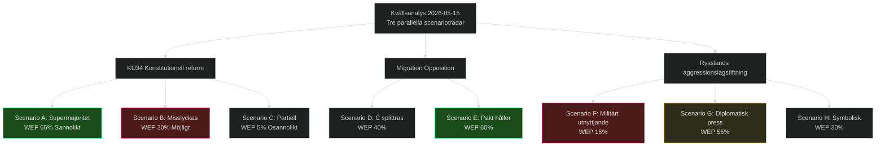

# Scenarioanalys — Evening Analysis 2026-05-15
**Author**: James Pether Sörling | **Framework**: Scenario Trees + WEP | **Datum**: 2026-05-15

## Primärt scenario: KU34 konstitutionell reform (T+72h)

### Scenario A: Supermajoritet uppnås (Sannolikt, WEP 65%)
**Triggers**: SD röstar Ja på abortion-rights-klausulen; föreningsfrihet-klausulen separatröstning möjliggör differentiering.
**Konsekvenser**: Aborträtten förankrad i Regeringsformen; Sverige stärker EU-anpassning; Tidökoalitionen visar konstitutionell kapacitet trots interna spänningar.
**Sannolikt**: ≥233 av 349 mandat (S+M+C+L+KD+V+MP = ~291 potentiell). SD:s position avgör.

### Scenario B: Supermajoritet misslyckas (Möjlig, WEP 30%)
**Triggers**: SD röstar Nej på hela KU34; koalitionsintern splittring M-SD på abort; L-KD hakar på.
**Konsekvenser**: Konstitutionell kris; proposition återremitteras; aborträtten oförankrad; internationell kritik; KD-förtroende sjunker.
**Irreversibel konsekvens**: Abort förblir enkel lagstiftning; kan upphävas med enkel majoritet framöver.

### Scenario C: Partiell röstning (Möjligt, WEP 5%)
**Triggers**: Riksdagen beslutar separatvoting för abortion vs. association vs. citizenship.
**Konsekvenser**: Aborträtten antas (84% stöd) men föreningsfrihet och citizenship-revocation återremitteras.

## Sekundärt scenario: Migrationspolitisk opposition T+30d–T+90d

### Scenario D: C splittrar sig från S-V-MP-pakt (WEP 40%)
**Triggers**: Centern förhandlar exklusivt med M om jordbrukspolitik; fokuserar på EU-anpassning.
**Konsekvenser**: Opposition fragmenteras inför valet 2026; S isoleras på migrations-vänster.

### Scenario E: Oppositionsblocket håller (WEP 60%)
**Triggers**: Hyresdereglering CU31 ger gemensam motståndspunkt; S, C, V, MP väljeröverenskommelse om hyresskydd.
**Konsekvenser**: Tydlig valfront 2026 (opposition = hyreskydd + bistånd + migrationsmänsklighet).

## Tertiärt scenario: Rysslands aggressionslagstiftning T+365d–T+1460d

### Scenario F: Lagstiftning utnyttjas militärt (WEP 15%)
**Triggers**: Ryssland identifierar etnisk-rysskt demografimotiv i Narva (Estland) eller norra Kazakstan.
**Konsekvenser**: Artikel 5 NATO; Sverige aktiveras som NATO-alliansmedlem; riksdag begärs sammankallas i extramöte.
**Förvarningsindikatorer**: SIGINT, truppförflyttningar, ekonomisk blockad av Östersjön.

### Scenario G: Lagstiftning används som diplomatisk press (WEP 55%)
**Triggers**: Ryssland hotar med lagen men mobiliserar inte militärt; skapar diplomatisk osäkerhet.
**Konsekvenser**: Ökat försvarsanslag i Sverige; Aurora 26-liknande övningar intensifieras; NATO-samordning stärks.

### Scenario H: Lagstiftning symbolisk — ingen operation (WEP 30%)
**Triggers**: Sanktioner, Ukrainas motoffensiv, inrikespolitisk instabilitet i Ryssland hindrar.
**Konsekvenser**: Lagen kvarstår som framtida potentiell trigger; ingen omedelbar operation.

## Scenariokarta

