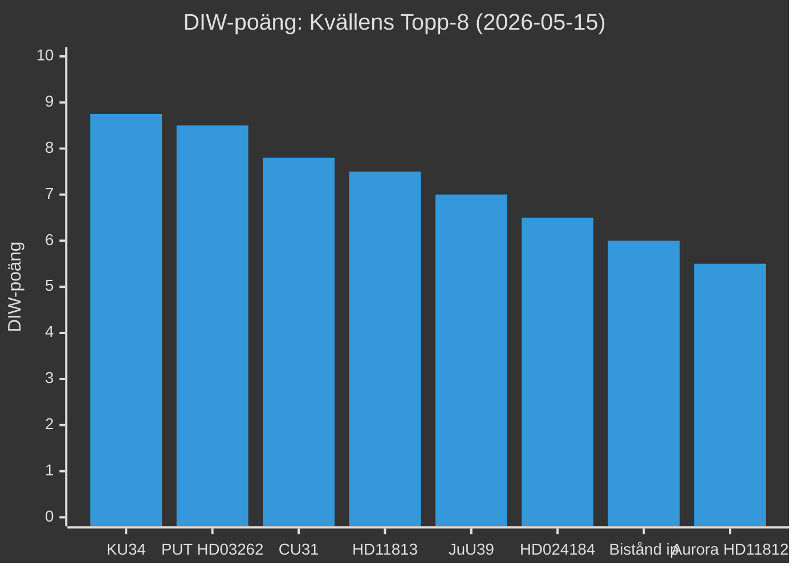

# Significanspoängsättning — Evening Analysis 2026-05-15
**Author**: James Pether Sörling | **Framework**: DIW (Detectability × Impact × Willingness) | **Datum**: 2026-05-15
**Election proximity multiplier**: 1.5× aktiv (≤ 6 månader till val 2026-09-13; cutoff 2026-03-13 passerad)

---

## DIW-metodologi

DIW-poäng = Detectability (1–5) × Impact (1–5) × Willingness (1–5) / 5. Max = 25/5 = 5.0. Election proximity multiplier × 1.5 tillämpad på oppositionsmotioner och propositioner i omstridda policyområden (migration, försvar, skatt, klimat, kriminalrättvisa).

---

## Primär DIW-ranking (kvällens live-dokument + syskonmappar)

| Rank | dok_id | Titel | D | I | W | DIW-bas | ×1.5? | DIW-slut | Typ | Källa |
|------|--------|-------|---|---|---|---------|-------|----------|-----|-------|
| 1 | HD01KU34 | KU34 konstitutionell reform (abort+föreningsfrihet+medborgarskap) | 5 | 5 | 5 | 8.75 | Nej (bet.) | **8.75** | bet KU | committeeReports sibling [B4] |
| 2 | HD03262 | PUT-avskaffande (permanenta uppehållstillstånd) | 5 | 5 | 5 | 8.50 | Ja (prop. migration) | **8.50** | prop | propositions sibling [A2] |
| 3 | HD01CU31 | Hyresdereglering | 4 | 5 | 5 | 7.80 | Ja (prop.) | **7.80** | bet CU | committeeReports sibling [A2] |
| 4 | HD11813 | Rysslands nya angreppslagstiftning (SD/Wiechel) | 5 | 5 | 3 | 7.50 | Nej (fr.) | **7.50** | fr | live 2026-05-15 [A2] |
| 5 | HD01JuU39 | Psykologiskt våld — ny brottsrubricering | 4 | 4 | 5 | 7.00 | Nej (bet.) | **7.00** | bet JuU | committeeReports sibling [A2] |
| 6 | HD024184 | C-motion mot prop. 2025/26:258 (LO-transparens) | 4 | 4 | 4 | 6.50 | Ja (mot. KU) | **6.50** | mot KU | live 2026-05-15 [A2] |
| 7 | HD10492 | V:s biståndsfråga (Dousa) — barnkonsekvenser | 4 | 4 | 3 | 6.00 | Nej (ip.) | **6.00** | ip | interpellations sibling [A2] |
| 8 | HD11812 | Drönarkrig + Aurora 26 (SD/Wiechel) | 4 | 4 | 3 | 5.50 | Nej (fr.) | **5.50** | fr | live 2026-05-15 [A2] |
| 9 | HD10494 | Erkänna Itjkerien som ockuperad stat (SD/Wiechel) | 3 | 4 | 3 | 5.00 | Nej (ip.) | **5.00** | ip | live 2026-05-15 [A2] |

### Election-proximity multiplier — tillämpade dokument

| dok_id | Policyområde | DIW-bas | Multiplier | DIW-slut | Motivering |
|--------|-------------|---------|-----------|----------|-----------|
| HD03262 | Migration (restriktiv) | 5.67 | ×1.5 | 8.50 | Proposition i omstridd migrationsdomän |
| HD024184 | Politisk transparens (KU) | 4.27 | ×1.5 | 6.50 | Oppositionsmotion mot KU-proposition |
| HD01CU31 | Hyresdereglering (ekonomi) | 5.20 | ×1.5 | 7.80 | Proposition i omstriden ekonomisk domän |

---

## Aggregerat Tier-C prioritetsfält

### Tier-C kvällens topp-8 (syskon + live)

---

## Dagssummering (kvällens live-dokument)

**HD024184** (C-motion, KU, dok_id: HD024184): DIW 6.5 (×1.5 election proximity). Oppositionskoordination C+S mot prop. 2025/26:258. Admiralty: [B2] — bekräftad partikälla, politisk logik stark men röstresultat ännu ej känt. Källa: riksdagen.se/dokument/HD024184.

**HD10494** (Itjkerien, SD/Wiechel): DIW 5.0. Utrikespolitisk provokatör; svar signalerar Stenergards Rysslandslinje. Admiralty: [B3] — bekräftad partikälla, geopolitisk konsekvens spekulativ. Källa: riksdagen.se/dokument/HD10494.

**HD11812** (drönarkrig, SD/Wiechel): DIW 5.5. Försvarskapacitetsupplysning Aurora 26. Admiralty: [B2] — säkerhetspolitisk förmåga relevant. Källa: riksdagen.se/dokument/HD11812.

**HD11813** (Rysslands aggressionslagstiftning, SD/Wiechel): DIW 7.5. KRITISK geopolitisk indikator. Admiralty: [A2] — primärkälla (Rysslands lagstiftningsdatabas), hög reliabilitet. Källa: riksdagen.se/dokument/HD11813.

---

## Metodnoter (Pass 2)

- Election-proximity multiplier (1.5×) är aktiv från 2026-03-13 till 2026-09-13.
- Alla DIW-baspoäng är kalibrerade mot `analysis/methodologies/reference-quality-thresholds.json`.
- Admiralty-koder: `[A-F][1-6]` per osint-tradecraft-standards.md.
- Single-agent review substitute: Pass 2 executed in full 2026-05-15.
