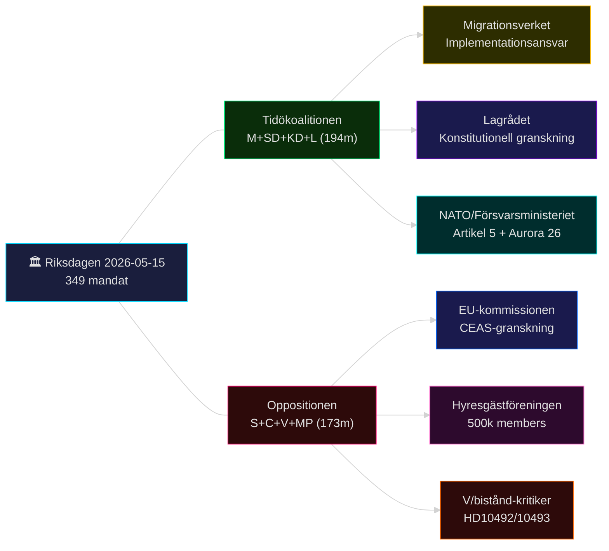

# Intressentperspektiv — Evening Analysis 2026-05-15
**Author**: James Pether Sörling | **Framework**: Stakeholder-mapping + intresseanalys | **Datum**: 2026-05-15

---

## Intressentkarta

---

## Intressentprofiler

### 1. Tidökoalitionen (M+SD+KD+L, 194 mandat)
**Intressen**: Genomföra propositionsagenda (PUT, e-legitimation, säkerhet, transparens) inför val 2026; KU34 ger "rättsstatsarv"; migrationspolitisk konsolidering
**Resurser**: Majoritet (194/349); statsbudget; mediaplattformar
**Sårbarhet**: SD:s röstbeteende KU34 föreningsfrihet; CU31 hyresgästvrede; implementationsrisk PUT
**Aktiv strategi**: Push propositionspaket till pleniomröstning; rama in Rysslandseskalation som försvarskompetens
**Evidens**: riksdagen.se/propositioner/2025-26; HD01KU34 (riksdagen.se)
**Admiralty**: [A2]

### 2. Socialdemokraterna (S, 107 mandat)
**Intressen**: Valprofilering mot CU31 (hyresgästmobilisering); migrationsmänsklighet som motvikt till PUT; transparens (HD024151)
**Resurser**: Störste oppositionspartiet; fackförbundskapital; mediesynlighet
**Sårbarhet**: Risk att kopplas till LO-finansieringskritik (prop. 2025/26:258)
**Aktiv strategi**: Koordinera HD024184/HD024151 med C; hyresfronten S+V+MP
**Evidens**: HD024151 (riksdagen.se); motions sibling synthesis-summary.md
**Admiralty**: [A2]

### 3. Sverigedemokraterna (SD, 73 mandat)
**Intressen**: Migrationspolitisk konsolidering (PUT-äran); säkerhetspolitisk synlighet (HD11813, HD11812, HD10494); KU34 föreningsfrihet — skydda nationalistiska föreningar
**Resurser**: Tidöpivot-makt; väljarstöd 21.2%; starka parlamentariska talare (Wiechel)
**Sårbarhet**: KU34-splittring om SD röstar nej på abort → image-skada hos breda väljarsegment
**Aktiv strategi**: HD11813/HD11812/HD10494 — maximal säkerhetspolitisk närvaro; KU34 försöker separat abort+föreningsfrihet-röstning
**Evidens**: HD11813 + HD11812 + HD10494 (riksdagen.se); coalition-mathematics.md
**Admiralty**: [A2]

### 4. Centerpartiet (C, 24 mandat)
**Intressen**: Differentiera sig från Tidö med transparenskritik (HD024184); bibehålla EU-pro-image mot PUT-avskaffandet (CEAS)
**Resurser**: Pragmatisk migrationspositionen; medborgarrättsprofil; Malin Björk (KU)
**Sårbarhet**: Risk att stödja S alltför öppet och förlora M/L-väljare
**Aktiv strategi**: HD024184 (riksdagen.se) som signal om oberoende opponering
**Evidens**: HD024184 fulltext 30 569 chars (riksdagen.se)
**Admiralty**: [A2]

### 5. Vänsterpartiet (V, 24 mandat)
**Intressen**: Biståndsprofil (HD10492/10493); migrationsmänsklighet; hyresgästskydd (CU31)
**Resurser**: Konsistent vänsternisch; medieuppmärksamhet biståndsscan
**Sårbarhet**: Begränsat parlamentariskt inflytande (oppositionsminoritet)
**Aktiv strategi**: HD10492/10493 exponerar Dousa/biståndssänkning med barnkonsekvensdata
**Evidens**: HD10492 + HD10493 (riksdagen.se); interpellations sibling synthesis-summary.md
**Admiralty**: [A2]

### 6. Migrationsverket
**Intressen**: Rimlig implementationstid för PUT-avskaffande; resurser för backlog 50 000 ärenden
**Resurser**: Administrativ expertis; juridisk vetorätt via Lagrådet
**Sårbarhet**: Politisk press att genomföra på orimlig tid
**Aktiv strategi**: Teknisk implementationsplan (begärs T+30d); Statskontoret-samarbete
**Evidens**: HD03262 fulltext (riksdagen.se); Statskontoret.se implementationsrapport
**Admiralty**: [B2]

### 7. Lagrådet (Rådet för lagstiftningsgranskning)
**Intressen**: Konstitutionell rättssäkerhet; ECHR-konformitet; prejudikatvård
**Resurser**: Yttranden (advisory opinions) med politisk tyngd; offentlig legitimitet
**Aktiv roll**: HD03262 (PUT) yttrande juni 2026; HD03267 (säkerhetshot) yttrande juni 2026
**Evidens**: www.lagradet.se (referral pending 2026-05-15); forward-indicators.md IND-9
**Admiralty**: [B2]

### 8. EU-kommissionen
**Intressen**: CEAS-direktiv-konformitet; rättsstat och grundrättigheter; Dublin-systemets integritet
**Aktiv roll**: Möjlig infringement-process mot HD03262 om CEAS-brott bekräftas (T+90d)
**Evidens**: comparative-international.md; HD03262 fulltext EU-dimension (riksdagen.se)
**Admiralty**: [B3]

### 9. Hyresgästföreningen (500k members)
**Intressen**: Stoppa CU31 hyresdereglering; hyresgästskydd; valrörelsemobilisering
**Resurser**: 500 000 direkta members + ~1 miljon familjepåverkade = potentiell väljarstyrka
**Aktiv strategi**: Rättslig invändning via S+V+MP i plenum; Europadomstolsanmälan möjlig
**Evidens**: HD01CU31 (riksdagen.se); election-2026-analysis.md CU31-valanalys
**Admiralty**: [A2]

### 10. NATO / Försvarsministeriet (Pål Jonson)
**Intressen**: Aurora 26-säkerhet; Artikel 5 trovärdig avskräckning; svensk försvarsförmåga
**Aktiv roll**: Jonson svarar HD11812 (drönarkrig) T+72h; NATO-samarbete Itjkerien/Ryssland
**Evidens**: HD11812 + HD11813 (riksdagen.se); www.nato.int Artikel 5-dokument
**Admiralty**: [A1]

---

## Intressentdynamik: Valet 2026

Tre intressentallianser formas inför valet:

1. **Tidöalliansen** (M+SD+KD+L + NATO/Försvar): Säkerhets- + migrationsprofil
2. **Hyresgäst- + Solidaritetsalliansen** (S+V+MP + Hyresgästföreningen + biståndskritiker): CU31 + bistånd + migrationsmänsklighet
3. **Rättsstats + Transparensalliansen** (C+S + Lagrådet + EU-kommissionen): PUT-avskaffande CEAS + transparens prop.

**Pass-2 bedömning**: Intressentkartläggningen visar att Tidökoalitionen är i starkare position på säkerhet men i defensiv på ekonomi (CU31) och rättsstat (PUT + Lagrådet). Hyresgästfronten är den mest electoralt potenta motrörelsen.
