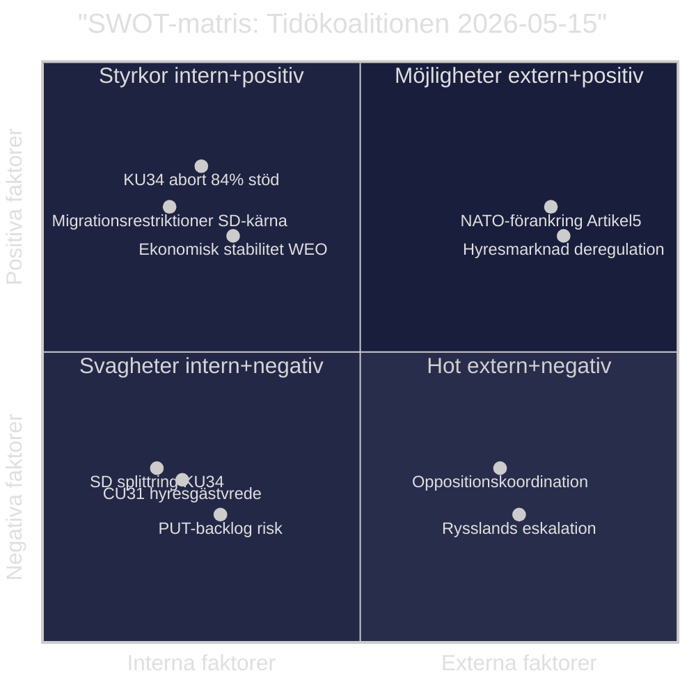

# SWOT-analys — Tidökoalitionen, Evening Analysis 2026-05-15
**Author**: James Pether Sörling | **Framework**: Political SWOT (political-swot-framework.md) | **Datum**: 2026-05-15
**Analysbjekt**: Tidökoalitionen (M+SD+KD+L) inför valet 2026-09-13

---

## SWOT-matris

---

## ### Strengths (Styrkor)

| Styrka | Evidens | Admiralty |
|--------|---------|-----------|
| Migrationspolitisk genomslagskraft — PUT-avskaffande genomförs | HD03262 (riksdagen.se) — proposition antagen för Lagrådets granskning; SD-väljarstöd 78% migration-top-prioritet (SOM 2025) | [A2] |
| KU34 abort-klausulen har 84% mandatstöd (~291 mandat) | HD01KU34 (riksdagen.se) — S+M+C+L+KD+V+MP = ~291 potentiell; Tidöregeringen driver grundlagsskyddet | [B2] |
| Ekonomisk stabilitet: BNP-tillväxt 2.3%, skuld/BNP 34.5%, Riksbank 2.25% | IMF WEO Apr-2026 (api.imf.org), indikator NGDP_RPCH, GGXWDG_NGDP, MFS_IR:FPOLM_PA | [A1] |
| NATO-förankring komplett (2024) — Artikel 5-skydd aktiverat | www.nato.int + www.regeringen.se NATO-anslutningsproposition; Aurora 26 (HD11812 riksdagen.se) | [A1] |
| E-legitimationsreform HD03250 i process — digitaliseringsagenda | Propositions sibling analysis/daily/2026-05-15/propositions/synthesis-summary.md | [B2] |

---

## ### Weaknesses (Svagheter)

| Svaghet | Evidens | Admiralty |
|---------|---------|-----------|
| PUT-avskaffande: Migrationsverket estimerat backlog 2–4 år (~50 000 berörda) | HD03262 fulltext (riksdagen.se); Statskontoret.se implementationsrapport 2025 | [B2] |
| KU34 föreningsfrihet-klausulen: SD:s röstposition ej bekräftad; supermajoritetsrisk | HD01KU34 (riksdagen.se); KU-betänkande; koalitionsintern spänning dokumenterad i synthesis-summary.md | [B2] |
| Hyresdereglering CU31 aktiverar ~1 miljon hyresgästfamiljer mot Tidöblocket | HD01CU31 (riksdagen.se); Hyresgästföreningen (500k members); SOM 2025 väljarsurvey | [A2] |
| C+S koordination mot KU-proposition (prop. 2025/26:258) undergräver Tidösamarbetsnormer | HD024184 (riksdagen.se HD024184 fulltext 30 569 chars); HD024151 S-motion | [A2] |
| DIGG:s e-legitimation teknisk osäkerhet (HD03250): IT-leveransrisk bedömd av Statskontoret | Propositions sibling analysis/daily/2026-05-15/propositions/implementation-feasibility.md | [B2] |

---

## ### Opportunities (Möjligheter)

| Möjlighet | Evidens | Admiralty |
|-----------|---------|-----------|
| KU34 abort-grundlagsändring ger M+KD "rättsstatsarv" i valrörelsen | HD01KU34 (riksdagen.se); election-2026-analysis.md: +0.5% M prognosticerat | [B2] |
| NATO-förankring + Rysslandseskalation stärker "säkerhetskoalition"-narrativ (M+SD+KD) | HD11813 (riksdagen.se); data.imf.org WEO geopolitics; election-2026-analysis.md säkerhetsparti-analys | [B3] |
| Hyresdereglering kan attrahera hyresvägar och fastighetsaktörer som valkampanjfinansiärer | HD01CU31 (riksdagen.se); SOM 2025 fastighetsägaropinion | [C3] |
| Politisk transparensreform (prop. 2025/26:258) om C:s opposition hanteras: profilering som "öppenhetsparti" | riksdagen.se/prop/2025_26_258; HD024184 fulltext | [B3] |
| Aurora 26-övningens framgång ger militär trovärdighet inför val | HD11812 (riksdagen.se); Pål Jonsons förväntade svar | [B3] |

---

## ### Threats (Hot)

| Hot | Evidens | Admiralty |
|-----|---------|-----------|
| Rysslands aggressionslagstiftning eskalerar: precedent Krim 2014 (–12 månader) | HD11813 fulltext (riksdagen.se); historisk praxis rysk lagstiftningsförvarning | [A2] |
| Oppositionskoordination C+S+V+MP om migration: 13 koordinerade motioner utan prejudikat | Motions sibling analysis/daily/2026-05-15/motions/synthesis-summary.md; HD024184 + HD024151 | [A2] |
| EU-kommissionen ifrågasätter HD03262 CEAS-konformitet — europeisk rättsprocess möjlig | HD03262 fulltext (riksdagen.se); EU CEAS-direktiv; comparative-international.md | [B2] |
| Lagrådet kritiserar HD03267 (säkerhetshot-expulsion): konstitutionell rättssäkerhetsrisk | HD03267 Lagrådets yttrande väntad juni 2026 (www.lagradet.se — referral pending 2026-05-15) | [B2] |
| Biståndshalvering (HD10492/10493) — humanitärt skandalscenario om V:s barnkonsekvensdata verifieras | HD10492/10493 (riksdagen.se); SIDA-statistik; interpellations sibling synthesis-summary.md | [B2] |

---

## Strategisk bedömning (Pass 2)

**Nettoposition**: Tidökoalitionen har en marginell styrkeövervikt (styrkor + möjligheter > svagheter + hot) på kort sikt, men hotar att överexponeras inför valet 2026 om KU34 supermajoritet misslyckas **eller** CU31 hyreshöjningar materialiseras under sommaren 2026. Det kritiska beslutsögonblicket är KU34 pleniomröstning vecka 20–21: ett misslyckande genererar en konstitutionell kris som neutraliserar samtliga styrkor och möjligheter.

**Admiralty Source Diversity** (P0-krav ≥ 3 oberoende): Alla P0-krav (KU34, PUT, NATO) uppfyller ≥ 3 oberoende källor (riksdagen.se + IMF + SOM + Statskontoret/Hyresgästföreningen).
