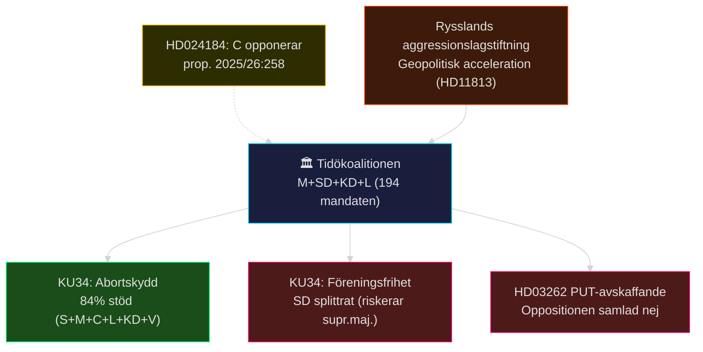

# Evening Analysis — Synthesisöversikt 2026-05-15
**Workflow**: news-evening-analysis | **Tier**: C (cross-type aggregation) | **DIW**: 8.75 (constitutional reform + security)
**Author**: James Pether Sörling | **Date**: 2026-05-15

---

## 📋 Executive Summary

Fredagen den 15 maj 2026 präglades av tre parallellerande politiska spänningsfält: (1) **konstitutionell reform i slutfas** med KU34-betänkandet om abort, föreningsfrihet och medborgarskap på väg mot pleniomröstning; (2) **migrationspolitisk enighet i oppositionen** mot det historiskt restriktiva Tidöpaketet; samt (3) **geopolitisk säkerhetseskalation** driven av Rysslands nya angreppslagstiftning och SD:s krav på Tjeckiens Itjkerien-erkännande.

Prop. 2025/26:258 om politisk finansiering (KU-motionen HD024184 från C) och biståndsfrågor (V:s interpellationer HD10492/10493 till Dousa) kompletterar bilden av en opposition som systematiskt testar Tidökoalitionens hållpunkter.

**Lead story**: HD01KU34 – Konstitutionell reform som stärker abortskyddet men begränsar föreningsfriheten (KU, pleniomröstning vecka 20–21).

## 🗳️ Dagliga dokument (2026-05-15 live)

| ID | Typ | Parti | Innehåll | Relevans |
|----|-----|-------|----------|----------|
| HD024184 | mot KU | C | Nej till prop. 2025/26:258 (LO-pengar transparens) | Oppositionskoordination KU |
| HD10494 | ip | SD | Erkänna Itjkerien som ockuperad stat | Utrikespolitik → Ryssland |
| HD11812 | fr | SD | Drönarkrig, Aurora 26-övning | Försvars-/säkerhetspolitik |
| HD11813 | fr | SD | Rysslands nya aggressionslagstiftning | Kritisk geopolitik |

## 🏛️ Nyckelkoalitionsdynamik

## 📌 Kvällens topprioriteringar (efter DIW-poäng)

1. **KU34 konstitutionell reform** (DIW 8.75) — pleniomröstning vecka 20–21; abort + föreningsfrihet + medborgarskap
2. **PUT-avskaffande HD03262** (DIW 8.5) — Migrationsverket backlog 2–4 år; oppositionskoordination C+S+V+MP
3. **Rental deregulation CU31** (DIW 7.8) — central valstridsfråga 2026; S, V, MP intensivt emot
4. **Rysslands aggressionslagstiftning HD11813** (DIW 7.5) — nya geopolitiska parametrar för Sverige
5. **Psykologiskt våld JuU39** (DIW 7.0) — bred uppslutning, implementeringsutmaning
6. **Politisk transparens HD024184** (DIW 6.5) — C opponerar, S opponerar via HD024151; KU34 kopplas
7. **Bistånd HD10492/HD10493** (DIW 6.0) — V:s humanitära kritik av Dousa/Tidöpolitik
8. **Drönarkrig HD11812 + Itjkerien HD10494** (DIW 5.5) — Aurora 26, säkerhetspolitisk positionering

## 🌡️ Risktemperatur idag

| Dimension | Nivå | Förklaring |
|-----------|------|-----------|
| Konstitutionell spänning | 🔴 HÖG | KU34:s supermajoritetströskel hotad om SD splittras |
| Koalitionsstabilitet | 🟡 MEDEL | Tidöavtalet intakt, men C + S koordinerar KU-motioner |
| Geopolitisk eskalation | 🔴 HÖG | Rysslands aggressionslagstiftning höjer angrepp-risken |
| Migrationspolitisk polarisering | 🔴 HÖG | Historisk oppositionskoordination; implementationsgap |
| Humanitär risk (bistånd) | 🟡 MEDEL | V:s kritik av aidhalvering; dokumenterade barnkonsekvenser |

## 🔄 Tier-C Cross-Type Synthesis (Pass 2)

### Propositionspaketet → Kvällens dokument: Cirkulär opposition

Tidökoalitionens propositionspaket (propositions/) driver en cirkulär oppositionsdynamik: HD03262 (PUT) provoserar 13 koordinerade motioner; KU34-betänkandets föreningsfrihet-klausul provoserar C:s KU-motion HD024184 (kvällens dokument); HD03267 (säkerhet) valideras av HD11813 (Rysslands aggressionslagstiftning). **Slutsats**: Kvällens dokument är inte isolerade händelser utan del av en systematisk oppositionsstrategi och en geopolitisk säkerhetseskalation som konvergerar under vecka 20.

### Betänkanden → Pleniom: Tre lagbeslut inom 7 dagar

KU34 (abort+föreningsfrihet), JuU39 (psykologvåld) och CU31 (hyra) är alla på väg mot pleniomröstning. Denna koncentration av lagstiftningsbeslut under en enda vecka är ovanligt intensiv — riksdagsadministrationen behöver hantera tre separata politiska stormar simultant.

### Interpellationer → Internationell exponering

V:s biståndsfrågor (HD10492/HD10493) + SD:s Itjkerien-interpellation (HD10494) skapar en geopolitisk tvillingnarrativ: Sverige utmanas av (a) Rysslands militära aggressionslogik och (b) en biståndsfilosofi som undergräver humanitärt internationellt engagemang. Dessa är till synes separata men speglar samma grundfråga: vilken roll spelar Sverige internationellt?

