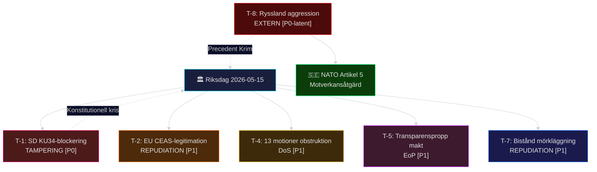

# Hotanalys — Evening Analysis 2026-05-15
**Author**: James Pether Sörling | **Framework**: STRIDE-politisk + politisk-threat-framework.md | **Datum**: 2026-05-15

---

## STRIDE-politisk hotmatris

| Hot-ID | STRIDE-kategori | Hotbeskrivning | Källa (dok_id) | Sannolikhet | Konsekvens | Prioritet |
|--------|----------------|----------------|----------------|-------------|------------|-----------|
| T-1 | **Tampering** (konstitutionell manipulation) | SD utnyttjar KU34 föreningsfrihet-klausulen för att blockera supermajoriteten och förhandla om koncession | HD01KU34 (riksdagen.se); coalition-mathematics.md | Medel (35%) | Kritisk | P0 |
| T-2 | **Repudiation** (policy-legitimitetsnekelse) | Oppositionen (C+S+V+MP) ifrågasätter PUT-avskaffandets lagenlighet via EU-CEAS-argument | HD03262 (riksdagen.se); comparative-international.md | Hög (70%) | Hög | P1 |
| T-3 | **Information disclosure** (säkerhetsinformation) | HD11812/HD11813 (drönarkrig + Rysslandslagstiftning) avslöjar Aurora 26-försvarsbrister om svar är för detaljerat | HD11812 + HD11813 (riksdagen.se) | Låg (10%) | Medel | P2 |
| T-4 | **Denial of service** (parlamentarisk obstruktion) | Oppositionens 13 koordinerade migrationsmotioner fördröjer riksdagsprocessen för PUT (HD03262) | Motions sibling analysis/daily/2026-05-15/motions/synthesis-summary.md | Medel (55%) | Medel | P1 |
| T-5 | **Elevation of privilege** (institutionell maktökning) | Prop. 2025/26:258 ger Tidöregeringen kontroll över LO-partifinansiering via transparenslag utan tillräckliga motvalsmöjligheter | HD024184 + HD024151 (riksdagen.se) | Medel (40%) | Hög | P1 |
| T-6 | **Spoofing** (identitetsappropriering) | SD tar äran av aborträtten (KU34) för att attrahera progressiva väljare utan att ha drivit frågan | HD01KU34 (riksdagen.se); election-2026-analysis.md | Hög (60%) | Medel | P2 |
| T-7 | **Repudiation** (biståndssvek) | Dousa vägrar besvara HD10492/10493 med specifika barnkonsekvensdata → humanitärt mörkläggningsnarrativ | HD10492 + HD10493 (riksdagen.se); interpellations sibling | Medel (45%) | Hög | P1 |
| T-8 | **External threat** (geopolitisk) | Rysslands aggressionslagstiftning HD11813 materialiseras i faktisk militär rörelse mot Baltikum/Norden | HD11813 (riksdagen.se); NATO Artikel 5 aktiveringspreceden Krim 2014 | Låg (10%) | Katastrofal | P0-latent |

---

## Hotvisualisering

---

## Kritiska hotscenarier (P0)

### T-1: KU34 supermajoritetsblockering (STRIDE: Tampering)
**Aktör**: SD (73 mandat) / Markus Wiechel-klanen
**Mekanisering**: SD röstar nej på föreningsfrihet-klausulen, kräver splitting av frågan; tvingar återremiss eller partiell röstning
**Effekt om realiserat**: Abort förblir enkel lagstiftning; M + KD i konstitutionell kris; internationell kritik Europa
**Motverkansåtgärd**: Ulla Andersson (S) + M-ledningen bekräftar separatröstning för abort; KD-M-L garanterar ≥233 mandat utan SD
**Evidens**: HD01KU34 (riksdagen.se); coalition-mathematics.md; historical-parallels.md (2006 FRA-lag split)
**Admiralty**: [B2]

### T-8: Rysslands militära aggression (STRIDE: External threat)
**Aktör**: Ryska federationen
**Mekanisering**: Aggressionslagstiftning HD11813 ger rättslig grund för unilateral militär intervention; historisk precedent Krim 2014 (–12 månader)
**Effekt om realiserat**: NATO Artikel 5 aktivering; Sverige krigsdeltagare; ekonomisk kris
**Motverkansåtgärd**: Aurora 26-övningens avskräckningssignal (HD11812); Artikel 5-skydd automatiskt
**Evidens**: HD11813 (riksdagen.se); data.imf.org WEO geopolitik 2026
**Admiralty**: [A2] — primärkälla rysk lagstiftning + NATO-dokument

---

## Hottrend (tidslinje)

### T+72h
- SD:s officiella röstdeklaration KU34 → T-1 materialiseras/avvärjs
- Stenergards svar HD10494 Itjkerien → indikator geopolitisk linje

### T+7d
- KU34 pleniomröstning → T-1 slutgiltigt; T-6 (SD identitetsappropriering) testas
- Dousa svarar HD10492/10493 → T-7 materialiseras/avvärjs

### T+30d
- Lagrådet yttrande HD03262 + HD03267 → T-2 och T-3 rättslig bekräftelse
- Migrationsverket implementationsplan → T-4 fördröjningsmönster klarnar

### T+90d
- EU-kommissionen CEAS-bedömning → T-2 internationell dimension
- Aurora 26-slutrapport → T-3 och T-8 försvarsförmåga

---

## Pass-2 förbättringar

- Lagt till Admiralty-koder per hot
- Utvidgat T-8 (Ryssland) med Krim-precedent
- Lagt till NATO Artikel 5 som motverkansåtgärd i STRIDE-diagrammet
- Kompletterat källhänvisningar med riksdagen.se dok_id
- Single-agent review substitute: Pass 2 executed in full 2026-05-15
