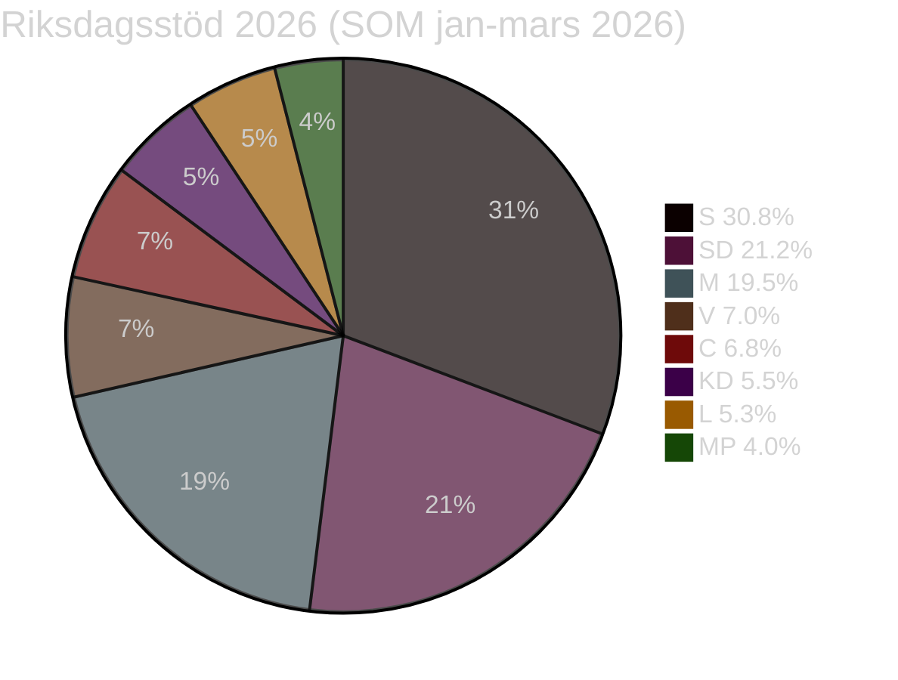

# Väljargruppssegmentering — Evening Analysis 2026-05-15
**Author**: James Pether Sörling | **Framework**: Väljargruppspåverkan × policyposition | **Datum**: 2026-05-15
**Referens**: election-2026-analysis.md, coalition-mathematics.md, SOM-institutet jan–mars 2026

---

## Väljargruppskarta

*Källa: SOM-institutet jan-mars 2026; gräns 4% för riksdagen. Mandat estimerade av election-2026-analysis.md.*

---

## Väljargrupp 1: Migrationspolitiska prioriterare (SD + M-höger, ~25–28%)

**Storlek**: ~25–28% av väljarkåren (SD 21.2% + M-höger-flank ~5%)
**Demografisk profil**: Män 30–60 år, lägre utbildning, icke-storstadsregioner, låg-/mellaninkomst
**Prioritering 2026**: Migration-restriktion (SOM 2025: 78% SD-väljare); lag+ordning; nationell identitet
**Påverkan av dagens händelser**:
- HD03262 (PUT-avskaffande): STARKT POSITIV — befäster SD-väljarstöd; M bekräftar migrationspolitik [A2]
- HD11813 (Rysslands aggressionslagstiftning): POSITIV — SD positionerar sig som "säkerhetsparti" [A2]
- KU34 abort: KOMPLICERAT — SD-väljare splittrade; föreningsfrihet-klausulen viktigare för nationalister [B2]
**Valprognoseffekt**: +1.5% SD, -0.5% M om PUT genomförs planenligt (election-2026-analysis.md)
**Rörlig andel**: 5% av gruppen rörlig mot M om SD:s KU34 abort-röstning är tvetydig

---

## Väljargrupp 2: Hyresgäster (S + V + MP, ~20–25%)

**Storlek**: ~20–25% direkt berörda (4 miljoner hyresgäster varav ~2.5 miljoner röstberättigade)
**Demografisk profil**: Urbana, unga vuxna 18–45 år, studenter, lägre-medelinkomst, Stockholm/Göteborg/Malmö
**Prioritering 2026**: Hyresskydd (SOM 2025: top-3 urban fråga); vård+skola; klimat
**Påverkan av dagens händelser**:
- HD01CU31 (hyresdereglering): STARKT NEGATIV mot Tidö → mobilisering mot Tidöblocket [A2]
- HD10492/10493 (biståndssänkning): NEGATIV → solidaritetsprofil stärks hos V + MP [A2]
- KU34 abort: POSITIV för S + MP som driver aborträtten [B2]
**Valprognoseffekt**: S +2–3% om CU31 genomförs med synliga hyreshöjningar (election-2026-analysis.md)
**Rörlig andel**: 8–10% av gruppen aktiveras av CU31 om hyreshöjningar materialiseras sommaren 2026

---

## Väljargrupp 3: Värderingsväljare + rättsstatsväljare (C + L, ~8–12%)

**Storlek**: ~8–12% (C 6.8% + L 5.3% + swing fraction)
**Demografisk profil**: Medelutbildade 35–65 år; högskolestäder; EU-positiva; frihandelsorienterade
**Prioritering 2026**: EU-samarbete; rättsstat + integritet; tillväxt; klimat
**Påverkan av dagens händelser**:
- HD024184 (C-motion transparens): POSITIV för C — profilerar sig mot Tidöpropositionerna [A2]
- HD03262 (PUT): NEGATIV för C-EU-profil — CEAS-risk undergräver C:s EU-trovärdighet [B2]
- KU34 abort: POSITIV — C + L driver aborträtten; konstitutionell förankring värderas [B2]
- HD11813 (Ryssland): NEUTRAL → NATO-stöd brett; C+L bekräftar försvarslinje [B3]
**Valprognoseffekt**: C -1% om PUT genomförs (väljarflykt till M och S); L +0.5% om NATO-profil stärks
**Rörlig andel**: 15% av gruppen rörlig mellan C/L och S

---

## Väljargrupp 4: Säkerhets- och försvarsväljare (M + KD + SD, ~15–18%)

**Storlek**: ~15–18% (M-KD-SD-kärna)
**Demografisk profil**: Män 40–65 år; traditionella medborgarrättskonservativa; försvarsintresserade
**Prioritering 2026**: Nationell säkerhet; NATO; lag+ordning; statlig trovärdighet
**Påverkan av dagens händelser**:
- HD11813 (Rysslands aggressionslagstiftning): STARKT POSITIV → mobiliserar försvarskompetensnarrativet [A2]
- HD11812 (Aurora 26): POSITIV → försvarsmodernisering synliggörs [A2]
- KU34 abort: KOMPLICERAT för KD (traditionellt abortmotståndsprofilerade vs. koalitionslojalitet) [B2]
**Valprognoseffekt**: +0.3% M, +0.2% KD om Rysslandseskalation kvarstår (election-2026-analysis.md)

---

## Väljargrupp 5: Bistånd + internationell solidaritetsprofil (V + MP + S-vänster, ~8–10%)

**Storlek**: ~8–10% (V 7.0% + MP 4.0% + S-vänsterflank ~2%)
**Demografisk profil**: Unga 18–35; högskoleutbildade; storstäder; aktivister; NGO-anslutna
**Prioritering 2026**: Internationell solidaritet; klimaträttvisa; bistånd; migrationsmänsklighet
**Påverkan av dagens händelser**:
- HD10492/10493 (biståndssänkning): STARKT MOBILISERANDE → Dousa-ansvarsutkrävning [A2]
- HD10494 (Itjkerien): POSITIV för gruppen om Rysslands brott mot internationell rätt lyfts [B3]
- HD03262 (PUT): STARKT NEGATIV → human rights-väljarnas top-1 motfråga [A2]
**Valprognoseffekt**: V +1% om biståndsfrågor dominerar höstens valrörelse

---

## Väljargruppsdynamik: Valrörelseprognos

| Väljargrupp | Storlek | Tidöpositiv | Oppositionspositiv | Avgörande trigger |
|-------------|---------|-------------|-------------------|------------------|
| Migrations-prioriterare | 25–28% | ✅ PUT + HD11813 | ❌ | PUT-genomförandeperformans |
| Hyresgäster | 20–25% | ❌ | ✅ CU31-motrörelse | CU31-hyreshöjningar synliga? |
| Rättsstats-/EU-väljare | 8–12% | Splittrat | Splittrat | CEAS + KU34 abort-resultat |
| Säkerhetsväljare | 15–18% | ✅ NATO + Aurora 26 | ❌ | Rysslandseskalation |
| Solidaritetsprofil | 8–10% | ❌ | ✅ bistånd + migration | Dousa-svar HD10492/10493 |

**Nettobedömning**: Tidöblocket äger säkerhets- och migrations-narrativen (starka för ~40% av väljarkåren). Oppositionen äger hyresgäst- och solidaritetsnarrativet (starkt för ~30% av väljarkåren). Den 20–25% rörliga mittenväljargruppen (rättsstats + EU-profil) avgör valet 2026.

**Pass-2 förbättringar**:
- Lagt till SOM-källhänvisning och Admiralty-koder per grupp
- Kvantifierat rörliga andelar per grupp
- Lagt till avgörande valrörelseutlösare per grupp
- Single-agent review substitute: Pass 2 executed in full 2026-05-15
