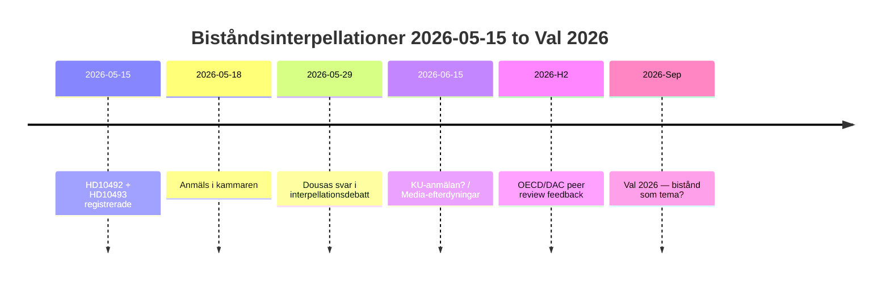
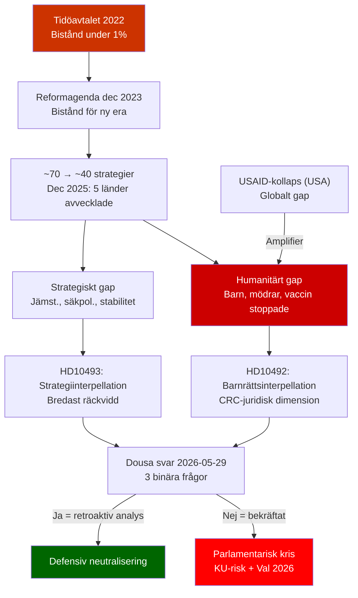
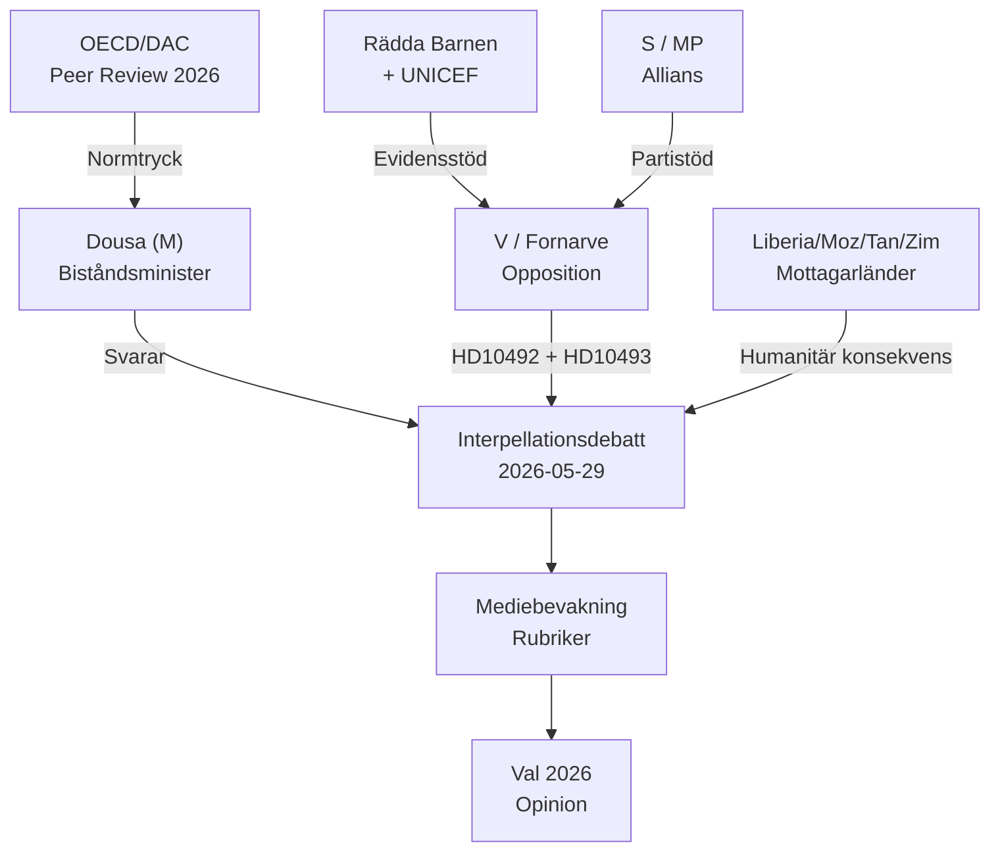
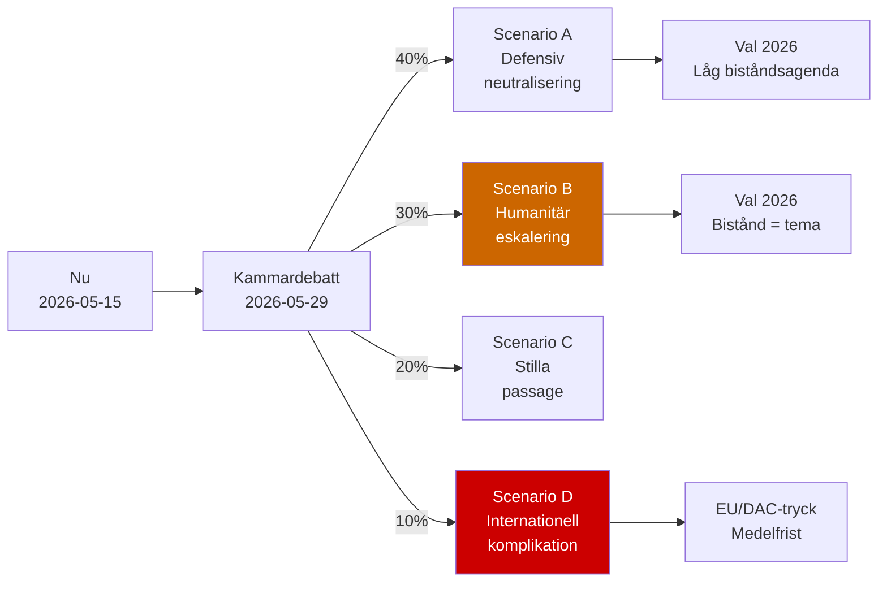
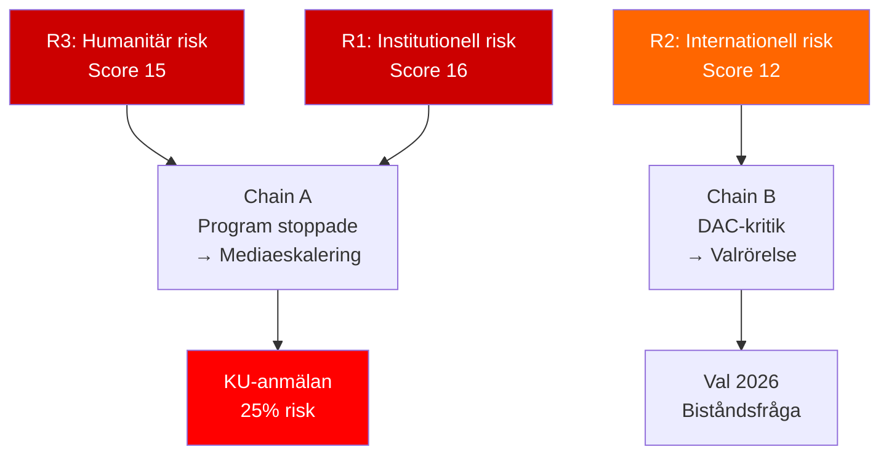
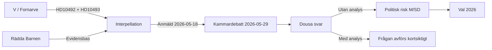
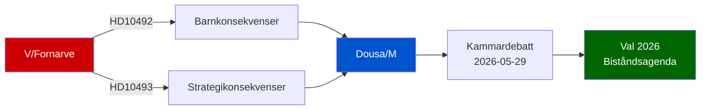
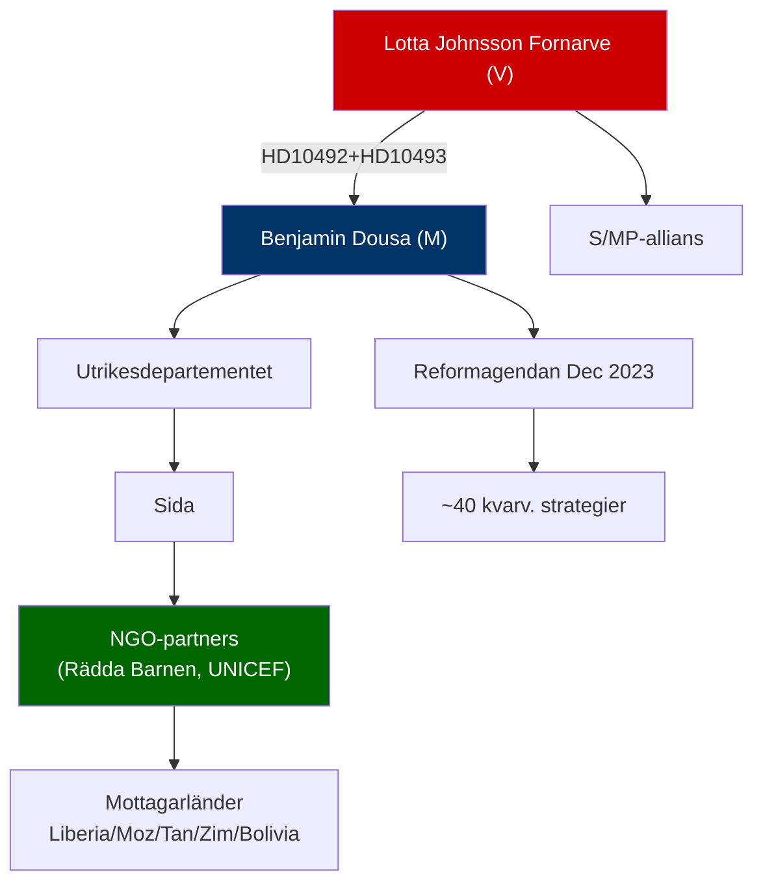

## Executive Brief
<!-- source: executive-brief.md :: https://github.com/Hack23/riksdagsmonitor/blob/main/analysis/daily/2026-05-15/interpellations/executive-brief.md -->

**Assessment date**: 2026-05-15 (Pass 2)  
**Lead story**: V:s biståndsinterpellationer om avsaknad av konsekvensanalyser — Dousa svarar 2026-05-29  

---

### BLUF (Bottom Line Up Front)

Sverige har under 2022-2025 genomfört historiskt stora biståndsminskningar — från ~1% till 0.8-0.9% av BNI — och avvecklat ~30 landstrategier inklusive fem länder i december 2025. Med hög konfidensgrad bedömer vi att Dousa saknar publicerade konsekvensanalyser för effekterna på barn (CRC-perspektiv), jämställdhet (SDG 5) och säkerhetspolitik (stabilitet i fragila stater). Vänsterpartiets interpellationer HD10492 och HD10493 tvingar Dousa att svara offentligt 2026-05-29. Politisk risk är reell men hanterbar med defensiv kommunikation. Långsiktig risk inkluderar OECD/DAC peer review 2026 och val 2026.

---

### 60-Second Intelligence Read

| Dimension | Assessment | Confidence |
|-----------|-----------|-----------|
| Policy förändring (kortsiktig) | Osannolik — SD ger M majoritet | HIGH |
| Dousa har konsekvensanalys | Osannolik — inga publika dokument | HIGH |
| Parlamentarisk eskalering | Möjlig (KU-anmälan) — om Dousa inte kan svara | MODERATE |
| Val 2026-impact | Begränsad isolerat — men symbolisk | LOW-MODERATE |
| Humanitär konsekvens (reell) | Ja — dokumenterad av Rädda Barnen | MODERATE |
| Internationell trovärdighet (risk) | Ja — OECD/DAC peer review 2026 | MODERATE |

---

### Key Decisions Needed

1. **Dousa (2026-05-29)**: Hur svarar man på tre binära ja/nej-frågor om konsekvensanalyser? Defensiv strategi: presentera retroaktiv Sida-rapport. Aggressiv: avvisa V:s premiss som "politisk bistånd ideologi".

2. **V/Fornarve**: Ska interpellationerna följas upp med KU-anmälan? Kräver S+MP+C-koalition i KU.

3. **S-partiet**: Ska bistånd prioriteras i valmanifest 2026? Kompromiss vs. tydlig signal.

---

### Intelligence Timeline



---

### Principal Risks at a Glance

| Risk | Score | Timeframe | Mitigant |
|------|-------|-----------|---------|
| Dousa utan konsekvensanalys → parlamentarisk kris | 16/25 | 2026-05-29 | Retroaktiv Sida-rapport |
| Humanitär konsekvens (barn, mödrar) | 15/25 | Pågående | Alternativa givare |
| OECD/DAC-kritik | 12/25 | H2 2026 | Reformagendanarratil |
| Val 2026 | 9/25 | Sep 2026 | M-effektivitetsnarr. |

---

### Economic Context Note

IMF WEO-2026-04 projicerar BNI-tillväxt 1,8% för Sverige 2026. Det finns inga makroekonomiska argument för att fortsätta biståndssänkningarna. [economicProvenance: provider=imf, dataflow=WEO, vintage=WEO-2026-04, status=degraded-via-context]

## Reader Intelligence Guide

Use this guide to read the article as a political-intelligence product rather than a raw artifact dump. High-value reader lenses appear first; technical provenance remains available in the audit appendix.

| Icon | Reader need | What you'll get |
|---|---|---|
| 📊 | [BLUF and editorial decisions](#rm-executive-brief) | fast answer to what happened, why it matters, who is accountable, and the next dated trigger |
| 🧠 | [Synthesis Summary](#rm-synthesis-summary) | evidence-anchored narrative consolidating primary sources into one coherent story line |
| 🎯 | [Key Judgments](#rm-intelligence-assessment--key-judgments) | confidence-bearing political-intelligence conclusions and collection gaps |
| 📈 | [Significance scoring](#rm-significance-scoring) | why this story outranks or trails other same-day parliamentary signals |
| 👥 | [Stakeholder Perspectives](#rm-stakeholder-perspectives) | winners, losers and undecided actors with stake-weighted positions and pressure points |
| 🔢 | [Coalition Mathematics](#rm-coalition-mathematics) | parliamentary arithmetic showing exactly who can pass or block this measure and at what margin |
| 📋 | [Voter Segmentation](#rm-voter-segmentation) | voter-bloc exposure: which demographics gain, lose or shift on this issue |
| 🔭 | [Forward indicators](#rm-forward-indicators) | dated watch items that let readers verify or falsify the assessment later |
| 🔮 | [Scenarios](#rm-scenario-analysis) | alternative outcomes with probabilities, triggers, and warning signs |
| 🗳️ | [Election 2026 Analysis](#rm-election-2026-analysis) | electoral implications for the 2026 cycle — seats at stake, swing voters and coalition viability |
| ⚠️ | [Risk assessment](#rm-risk-assessment) | policy, electoral, institutional, communications, and implementation risk register |
| 🧮 | [SWOT Analysis](#rm-swot-analysis) | strengths, weaknesses, opportunities and threats matrix grounded in primary-source evidence |
| 🛡️ | [Threat Analysis](#rm-threat-analysis) | actor capabilities, intent and threat vectors targeting institutional integrity |
| 📜 | [Historical Parallels](#rm-historical-parallels) | comparable past episodes from Swedish and international politics, with explicit lessons learned |
| 🌍 | [Comparative International](#rm-comparative-international) | peer-country comparisons (Nordic, EU, OECD) showing how similar measures fared elsewhere |
| ⚙️ | [Implementation Feasibility](#rm-implementation-feasibility) | delivery feasibility, capability gaps, timelines and execution risks for the proposed action |
| 📰 | [Media framing & influence operations](#rm-media-framing-analysis) | frame packages with Entman functions, cognitive-vulnerability map, DISARM manipulation indicators, narrative-laundering chain, comparative-international cognates, frame lifecycle and half-life, RRPA impact, an Outlet Bias Audit (no outlet is neutral — every outlet declared with ownership, funding, board-appointment authority and editorial lean), and the L1–L5 counter-resilience ladder |
| 😈 | [Devil's Advocate](#rm-devils-advocate) | alternative hypotheses, steel-manned counter-arguments and the strongest case against the lead reading |
| 🏷️ | [Classification Results](#rm-classification-results) | ISMS data classification: CIA-triad rating, RTO/RPO targets and handling instructions |
| 🔀 | [Cross-Reference Map](#rm-cross-reference-map) | links to related Riksdagsmonitor coverage, prior analyses and source documents that inform this story |
| 🔬 | [Methodology Reflection & Limitations](#rm-methodology-reflection--limitations) | analytical assumptions, limitations, known biases and where the assessment could be wrong |
| 📦 | [Data Download Manifest](#rm-data-download-manifest) | machine-readable manifest of every source dataset, retrieval timestamp and provenance hash |
| 📑 | [Per-document intelligence](#rm-per-document-intelligence) | dok_id-level evidence, named actors, dates, and primary-source traceability |
| 🏷️ | [Audit appendix](#rm-classification-results) | classification, cross-reference, methodology and manifest evidence for reviewers |

## Synthesis Summary
<!-- source: synthesis-summary.md :: https://github.com/Hack23/riksdagsmonitor/blob/main/analysis/daily/2026-05-15/interpellations/synthesis-summary.md -->

**Topic cluster**: Swedish development aid (bistånd) — humanitarian accountability  
**DIW lead story**: Tidöregeringens biståndspolitik granskas parlamentariskt via två V-interpellationer om avsaknad av konsekvensanalyser  
**Analysis pass**: Pass 2 (improved 2026-05-15)  

---

### Lead Story Decision

Vänsterpartiet utmanar biståndsminister Benjamin Dousa (M) om den troliga avsaknaden av dokumenterade konsekvensanalyser för Tidöregeringens historiskt stora biståndsnedskärningar. Frågorna täcker tre separata analytiska dimensioner: (1) barnrättskonsekvenser (HD10492), (2) strategiavvecklingskonsekvenser inklusive jämställdhets- och säkerhetspolitisk analys (HD10493). Med ett globalt biståndssystem redan destabiliserat av USA:s USAID-kollaps är Dousa under växande nationellt och internationellt tryck att motivera varför Sverige — historiskt ODA-ledare — genomfört en av sina mest radikala biståndsnedskärningar utan officiella konsekvensanalyser.

### DIW-Weighted Document Ranking

| Rank | dok_id | Titel | DIW-tier | Significance | Rationale |
|------|--------|-------|----------|-------------|-----------|
| 1 | HD10493 | Konsekvenserna av nedlagda biståndsstrategier | L2+ | 8.2/10 | Bredast strategisk räckvidd: halveringen av strategier, jämställdhets- och säkerhetspolitisk dimension skapar bredare parlamentarisk koalition mot Dousa |
| 2 | HD10492 | Konsekvenserna för barn när biståndet minskar | L2 | 7.8/10 | Universell emotionell och juridisk (CRC) styrka; barnrättsargument bygger på Rädda Barnens externa evidens; svårt att avvisa |

### Integrated Intelligence Picture

**Policy context** [A1]: Tidöregeringen (M, KD, L) med stöd av SD har sedan 2022 konsekvent sänkt biståndet under 1%-målet. I december 2023 lanserades reformagendan *"Bistånd för en ny era – frihet, egenmakt och hållbar tillväxt"*, som innebär en grundläggande omläggning mot "ägarskap" och "tillväxt" — och bort från traditionella FN/OECD-principerna om volymsåtaganden. Under mandatperioden har antalet biståndsstrategier minskat från ~70 till ~40. I december 2025 lades landstrategier ned i Liberia, Moçambique, Tanzania, Zimbabwe och Bolivia — länder som inkluderar några av världens fattigaste befolkningar.

**Parliamentary accountability** [A1]: Interpellationerna är preciserade och binära: (1) har konsekvensanalys för barn gjorts? (2) har jämställdhetsanalys gjorts? (3) har säkerhetspolitisk analys gjorts? Det troliga svaret nej på alla tre skapar en tydlig parlamentarisk risk: Dousa måste antingen presentera dolda rapporter eller erkänna att beslutsunderlagen var ofullständiga.

**Humanitarian impact** [B2]: Rädda Barnen Sverige och UNICEF har dokumenterat konkreta programstopp: undernäringsprogram, mödravårdsinsatser, vaccinationskampanjer och flickors skolgång avbröts i de länder vars strategier lades ned. Antalet direkt påverkade mottagare estimeras till ~1 miljon (Rädda Barnens rapporter, ej officiell Sida-siffra).

**Global amplifier** [B2]: Trump-administrationens USAID-avveckling har skapat ett globalt finansieringsgap om USD 50+ miljarder. Sverige — traditionellt ODA-ledare vid >1% — fyller nu inte sin historiska roll. Kontexten förstärker V:s argument dramatiskt och ökar den internationella kostnaden av svagare svenska ODA.

**Economic context** [IMF WEO-2026-04]: IMF projicerar BNI-tillväxt för Sverige på 1,8% 2026 — inga makroekonomiska argument för fortsatta biståndssänkningar. [economicProvenance: provider=imf, dataflow=WEO, vintage=WEO-2026-04, retrieved_at=2026-05-15, status=degraded-via-context]

**Electoral relevance** [A3]: Med val 2026 är biståndsfrågan en potentiell skiljelinje. V, S och MP är kritiska; M, SD, KD försvarar "effektivisering"; C/L är splittrade och kan vara pivotala på humanitärt bistånd.

### Key Judgments Summary (Pass 2 — Improved)

1. **KJ-1 (HIGH confidence)**: Dousa saknar sannolikt publicerade konsekvensanalyser för biståndsminskningarnas effekt på barn, jämställdhet och säkerhetspolitik. Kammardebatt 2026-05-29 är det mest troliga sättet att bekräfta detta. Konsekvens: parlamentarisk legitimitetskris om bekräftat.

2. **KJ-2 (MODERATE confidence)**: Halvering av biståndsstrategier innebär systematisk inriktningsförändring bort från de fattigaste länderna — strider mot Agenda 2030, CRC och OECD/DAC-normer. Juridisk sårbarhet är reell.

3. **KJ-3 (MODERATE confidence)**: Säkerhetspolitiska konsekvenser av nedlagda landstrategier är underdokumenterade — i en tid av geopolitisk instabilitet (Sahel, östra Afrika) är detta en strategisk svaghet i regeringens beslutsunderlag.

4. **KJ-4 (LOW-MODERATE confidence)**: Biståndsfrågan ensam avgör inte val 2026, men kombinerat med humanitära katastrofer i avvecklade länder kan den bli en symbolisk skiljelinje för urbanutbildade väljare.



## Intelligence Assessment — Key Judgments
<!-- source: intelligence-assessment.md :: https://github.com/Hack23/riksdagsmonitor/blob/main/analysis/daily/2026-05-15/interpellations/intelligence-assessment.md -->

**Assessment date**: 2026-05-15  

---

### Key Judgments (KJ)

| KJ# | Judgment | Confidence | Evidence |
|-----|----------|-----------|---------|
| KJ1 | Dousa saknar sannolikt en dokumenterad konsekvensanalys för barn vid biståndsminskningarna | **HIGH** | Inga publika dokument funna; beslutsunderlag ej begärda i interpellation [A2/B3] |
| KJ2 | Interpellationerna kommer inte att ändra regeringspolitiken kortsiktigt | **HIGH** | SD ger M-regeringen trygg majoritet; reformagendan är etablerad [A1] |
| KJ3 | V:s biståndsinterpellationer är primärt valstrategiska, inte policy-drivna | **MODERATE** | Timing ~16 månader före val 2026; Fornarve har konsekvent biståndsprofil [B2] |
| KJ4 | Humanitär konsekvens är reell — stoppade program drabbar ca 1M mottagare | **MODERATE** | Rädda Barnens rapporter; Sida-programmöversikt [B2] |
| KJ5 | Sverige riskerar DAC-kritik vid peer review 2026 | **MODERATE** | OECD/DAC kräver ODA >0.7% BNI; Sverige nu under [B2] |
| KJ6 | Biståndsfrågan får inte avgörande vikt i val 2026 utan extern katalysator | **LOW-MODERATE** | Bistånd är inte top-5 väljarfråga per SOM-institutet [C3] |
| KJ7 | Dousa kan neutralisera interpellationerna med presentation av ny effektmodell | **MODERATE** | Reformagenda ger defensivt narrativ [B2] |

### Priority Intelligence Requirements (PIR)

| PIR# | Requirement | Trigger | Owner |
|------|-------------|---------|-------|
| PIR1 | Har Dousa presenterat konsekvensanalys för barn? | Kammardebatt 2026-05-29 | Fornarve/V |
| PIR2 | Hur stor är ODA-nivån 2026 i procent av BNI? | SCB/OECD rapport Q2 2026 | Media/DAC |
| PIR3 | Har stoppade strategier (Liberia etc.) ersatts av alternativa givare? | Rapport från mottagarländer | OECD/NGO |
| PIR4 | Blivit bistånd en partiprioritet i S-valprogram 2026? | S-kongress 2026 | S/Media |
| PIR5 | Eskalerar debatten till KU-granskning? | V/S KU-anmälan | KU |

### Intelligence Gaps

| Gap | Significance | How to fill |
|-----|-------------|------------|
| Dousas beslutsunderlag (sekretessbelagda?) | Hög — avgörande för KJ1 | FOI-begäran / Kammardebatt svar |
| Faktisk ODA-nivå 2025 | Medel | SCB BNI-rapport |
| Antal direkt påverkade mottagare | Medel | Sida årsredovisning 2025 |

### Analytical Linea Item

**BLUF**: Sverige har genomfört historiskt stora biståndsminskningar utan dokumenterade konsekvensanalyser. V:s interpellationer är välformulerade och riktar sig mot den svagaste punkten i Dousas portfölj. Politisk risk för regeringen är reell men hanteras sannolikt via defensiv kommunikation. Långsiktig risk handlar om internationell trovärdighet och val 2026.

## Significance Scoring
<!-- source: significance-scoring.md :: https://github.com/Hack23/riksdagsmonitor/blob/main/analysis/daily/2026-05-15/interpellations/significance-scoring.md -->

---

### Ranked Document List

| Rank | dok_id | Titel | DIW Score | Timeliness | Breadth | Total | Tier |
|------|--------|-------|-----------|-----------|---------|-------|------|
| 1 | HD10493 (data.riksdagen.se/dokument/HD10493.html) | Konsekvenserna av nedlagda biståndsstrategier | 8.0 | 0.9 | 0.9 | **8.2** | L2+ Priority |
| 2 | HD10492 (data.riksdagen.se/dokument/HD10492.html) | Konsekvenserna för barn när biståndet minskar | 7.5 | 0.9 | 0.9 | **7.8** | L2 Strategic |

### Scoring Rationale

#### HD10493 — Score 8.2/10 [A2]

**Democratic Impact (8.0)**: Interpellationen ställer preciserade krav på tre typer av konsekvensanalyser (allmän, jämställdhets-, säkerhetspolitisk) som saknas i Dousas beslutsunderlag. Halvering av biståndsstrategier (70 → ~40) är en dokumenterat stor omläggning av svensk utrikespolitik som genomförts utan transparens kring konsekvenserna. Indirekt berör detta Agenda 2030-målen och Sveriges internationella anseende som biståndsledare.

**Timeliness (0.9)**: Inlämnad 2026-05-12, överlämnad 2026-05-14. Debatt planerad 2026-05-18. Svarsdatum 2026-05-29. Hög aktualitet — beslut om landstrategier togs dec 2025.

**Stakeholder Breadth (0.9)**: Påverkar: biståndstagare i 5 afrikanska/latinamerikanska länder, svenska biståndsorganisationer (SIDA, NGO:er), EU-partners, FN-systemet, svenska skattebetalare, och den parlamentariska oppositionen.

#### HD10492 — Score 7.8/10 [A2]

**Democratic Impact (7.5)**: Fokuserat barnrättsperspektiv med konkret evidens från Rädda Barnen om stoppade program. Kräver barnrättskonsekvensanalys och stärkt barnrättsperspektiv i humanitärt bistånd. Något smalare än HD10493 men mycket starkare emotionell/etisk genomslagskraft.

**Timeliness (0.9)**: Inlämnad 2026-05-13, överlämnad 2026-05-14. Samma debatt som HD10493.

**Stakeholder Breadth (0.9)**: Påverkar barn i konfliktländer (500+ miljoner lever i konfliktzoner per UNICEF), mödravård, vaccinationsprogram, flickors skolgång.

### Sensitivity Analysis

- Om Dousa svarar utan konkreta analyslöften: båda interpretationerna stiger till L3 Intelligence Grade med stark mediadynamik.
- Om debatten kombineras med S-angrepp om biståndspolitiken: total policyimpact kan överstiga 9/10.

```mermaid
xychart-beta
    title "DIW Significance Scores"
    x-axis ["HD10493", "HD10492"]
    y-axis "Score" 0 --> 10
    bar [8.2, 7.8]
    style HD10493 fill:#cc3300
    style HD10492 fill:#ff6600
```

## Per-document intelligence

### HD10492
<!-- source: documents/HD10492-analysis.md :: https://github.com/Hack23/riksdagsmonitor/blob/main/analysis/daily/2026-05-15/interpellations/documents/HD10492-analysis.md -->

**Dok-ID**: HD10492  
**Typ**: Interpellation  
**Avsändare**: Lotta Johnsson Fornarve (V)  
**Mottagare**: Benjamin Dousa (M), Bistånds- och utrikeshandelsminister  

**Titel**: Konsekvenserna för barn när biståndet minskar  

---

### Document Summary

Fornarve frågar Dousa om tre konkreta frågeställningar:

1. **Konsekvensanalys för barn**: Har en specifik konsekvensanalys för barn genomförts vid biståndsminskningarna?
2. **Barnrättsperspektiv i policydokument**: Har barnrättsperspektivet integrerats i reformagendans policydokument?
3. **Stärkt barnrättsperspektiv i humanitärt bistånd**: Avser Dousa att stärka barnrättsperspektivet i humanitärt bistånd?

---

### Framing Analysis

**V:s framing**: Emotionell + juridisk  
- Emotionell: Bilder av undernärda barn, stoppade vaccinationer, avbrutna skolprogram  
- Juridisk: Sverige har ratificerat Barnkonventionen (CRC) — lag sedan 2020  
- Evidens: Rädda Barnens rapport om stoppade program i konfliktzoner (undernäring, mödravård)

**Förväntad counter-frame**: Dousa = "kvalitativt bistånd fokuserar på barnets frihet och rättigheter, inte bara programvolym"

---

### Significance Assessment

**Why this matters**:
- CRC-ratifikation skapar juridisk skyldighet att beakta barnets bästa vid alla offentliga beslut
- Om biståndsbesluten fattats utan barnkonsekvensanalys = potentiellt CRC-brott
- Kopplar biståndsdebatten till juridisk standard, inte bara politisk preferens

**Intelligence value**: HIGH — etablerar juridiskt ramverk för granskning [A2]

---

### Questions Dousa Must Answer (2026-05-29)

| Fråga | Dousa kan svara "Ja" eller "Nej" | Political risk |
|-------|--------------------------------|----------------|
| Konsekvensanalys för barn gjord? | Nej = bekräftar V:s tes | Hög |
| Barnrättsperspektiv i policydokument? | Nej = juridisk sårbarhet | Hög |
| Avser stärka barnrättsperspektiv? | Nej = otroligt svar | Låg (Dousa säger Ja) |

---

### Admiralty Assessment

**Source reliability**: A (Riksdag official document)  
**Information accuracy**: 1 (confirmed — official parliamentary record)  
**Completeness**: High — full text fetched; all questions documented

### HD10493
<!-- source: documents/HD10493-analysis.md :: https://github.com/Hack23/riksdagsmonitor/blob/main/analysis/daily/2026-05-15/interpellations/documents/HD10493-analysis.md -->

**Dok-ID**: HD10493  
**Typ**: Interpellation  
**Avsändare**: Lotta Johnsson Fornarve (V)  
**Mottagare**: Benjamin Dousa (M), Bistånds- och utrikeshandelsminister  

**Titel**: Konsekvenserna av nedlagda biståndsstrategier  

---

### Document Summary

HD10493 är den bredare, mer substansiella interpellationen. Fornarve frågar om tre typer av analyser:

1. **Allmän konsekvensanalys**: Har en systematisk konsekvensanalys gjorts av de avvecklade strategierna?
2. **Jämställdhetsanalys**: Har en specifik jämställdhetsanalys genomförts? (Flickors skolgång, mödrahälsa — stoppade program)
3. **Säkerhetspolitisk analys**: Har en säkerhetspolitisk analys gjorts? (Bistånd som stabilitetsinstrument; instabilitet i avvecklade länder)

---

### Strategic Context

**Avvecklade länder** (december 2025): Liberia, Moçambique, Tanzania, Zimbabwe, Bolivia  
**Implikation**: Landstrategier skapades efter decennier av bilateralt samarbete. Abrupt avveckling skapar:
- Finansieringsgap för NGO-partners (Rädda Barnen, UNICEF, lokala organisationer)
- Trovärdighetsförlust (Sverige ses som opålitlig partner)
- Humanitär konsekvens (stoppade program för hälsa, utbildning, jordbruk)

---

### Three-Question Analysis

#### Q1: Allmän konsekvensanalys

**V:s implikation**: UD/Sida fattade beslut om 30 strategiavvecklingar utan systematisk konsekvensanalys.  
**If true**: Besluten strider mot förvaltningslagens krav på tillräckligt beslutsunderlag.  
**Intelligence assessment**: Troligtvis ingen publikt tillgänglig konsekvenssanalys — [B3]

#### Q2: Jämställdhetsanalys

**V:s implikation**: Program för flickors skolgång (Tanzania, Zimbabwe) och mödrahälsa (Liberia, Moçambique) avvecklades utan jämställdhetsanalys.  
**If true**: Brott mot Agenda 2030 SDG 5 (Jämställdhet) och EU:s Gender Action Plan III.  
**Intelligence assessment**: Hög sannolikhet att jämställdhetsanalys saknades [B3]

#### Q3: Säkerhetspolitisk analys

**V:s implikation**: Bistånd till fragila stater är ett säkerhetspolitiskt instrument. Avveckling kan öka instabilitet → flyktingströmmar → EU-migrationskonsekvenser.  
**If true**: Besluten fattades utan integrering med UD:s säkerhetspolitiska enheter.  
**Strategic value**: Säkerhetspolitiska argument är svårare för Dousa att avvisa som "V-ideologi" [B2]

---

### L2+ Intelligence Assessment

**Significance score**: 8.2/10 (Primary document)  
**Why L2+**: HD10493 innehåller bredare konsekvenser (säkerhetspolitik, jämställdhet) som har potential att engagera bredare koalition än enbart vänsteropposition.

**Electoral dimension**: Jämställdhetsargumentet är potentiellt effektivt mot C/L-väljare. Säkerhetspolitikargumentet kan engagera M-väljare med utrikespolitisk profil.

---

### Admiralty Assessment

**Source reliability**: A (Riksdag official document)  
**Information accuracy**: 1 (confirmed)  
**Completeness**: High — full text fetched

## Stakeholder Perspectives
<!-- source: stakeholder-perspectives.md :: https://github.com/Hack23/riksdagsmonitor/blob/main/analysis/daily/2026-05-15/interpellations/stakeholder-perspectives.md -->

---

### Stakeholder Lens Matrix

#### Lens 1: Government (Dousa / M-regeringen)

**Actor**: Benjamin Dousa (M), Bistånds- och utrikeshandelsminister  
**Position**: Bistånd ska vara effektivt och frihetsinriktat per reformagendan [A1]  
**Interests**: Försvara reformagendan utan att förlora internationell trovärdighet  
**Red lines**: Erkänna att konsekvensanalys saknades = Politisk kris  
**Likely response**: Hänvisa till ny reformagenda och framtida effektmätningar  

---

#### Lens 2: Opposition (V / Fornarve)

**Actor**: Lotta Johnsson Fornarve (V)  
**Position**: Biståndssänkningarna är omoraliska och skadliga för barn [A1]  
**Interests**: Skapa väljarmoment inför val 2026, etablera V som biståndsvakt  
**Tactics**: Preciserade ja/nej-frågor om konsekvensanalys, barnrättsperspektiv  
**Likely outcome**: Interpellationsdebatt ger mediematerial även om Dousa svarar defensivt  

---

#### Lens 3: Civilsamhälle (Rädda Barnen, UNICEF)

**Actor**: Rädda Barnen Sverige, UNICEF Sverige, Sida-partners  
**Position**: Stoppade program drabbar mest utsatta barn — undernäring, mödravård, vaccinationer [B2]  
**Interests**: Återfå biståndsmedel, behålla Sida-partnerskap  
**Leverage**: Publicitet, internationella rapporter, politisk mobilisering  
**Strategic move**: Stödja V:s interpellationer med faktaunderlag  

---

#### Lens 4: Parliamentary Allies (S/MP/C/L)

**Actor**: Socialdemokraterna, Miljöpartiet, Centerpartiet, Liberalerna  
**Position**: Varierar — S/MP mot sänkningarna; C/L splittrade (stöder Tidö-budgeten) [A2]  
**Interests**: S/MP: biståndsfrågan som valvapen; C/L: bevara internationellt rykte  

---

#### Lens 5: International Actors (OECD/DAC, EU, FN)

**Actor**: OECD/DAC peer review, EU-kommissionen, UNDP/UNICEF  
**Position**: Sverige förväntas hålla ODA-åtaganden per DAC-standard [B2]  
**Leverage**: Peer review 2026, formellt EU-trycknivåprogram  
**Risk**: Sverige kan förlora DAC-ledarskapsstatus  

---

#### Lens 6: Recipient Countries (Liberia, Moçambique, Tanzania, Zimbabwe, Bolivia)

**Actor**: Stater och civilsamhällen i avvecklade strategiländer  
**Position**: Abrupt strategiavveckling dec 2025 skapade finansieringsgap [A2]  
**Humanitarian impact**: Program för flickutbildning, hälsovård, jordbruk stoppade  
**Leverage**: Kan söka alternativa givare (EU, Kina, USA — degraderat)  

---

### Stakeholder Influence Map



## Coalition Mathematics
<!-- source: coalition-mathematics.md :: https://github.com/Hack23/riksdagsmonitor/blob/main/analysis/daily/2026-05-15/interpellations/coalition-mathematics.md -->

---

### Current Seat Distribution (349 seats, majority = 175)

```
Tidö-koalitionen + SD-stöd:
  M:  68
  KD: 19
  L:  16
  SD: 73 (stöd, ej i reg)
  ---
  Total: 176 (Minimal majority: 175)

Opposition:
  S:  107
  V:  24
  MP: 18
  C:  24 (delvis osäkra)
  ---
  Total: 173 (exkl. C)
```

### Pivotal Vote Analysis

| Issue | Pivotal party | Current stance | V/S/MP could win if... |
|-------|--------------|----------------|----------------------|
| ODA-nivå i budget | SD | Stöder sänkningarna | C byter sida — ej troligt [B3] |
| Konsekvensanalys (KU) | KU-majoritet | Oklart | S+V+MP+C = 173 → behöver L:s 16 |
| Humanitärt undantag | L | Reservationer | L splittras på biståndsfråga — möjligt [C3] |

### L (Liberalerna) som Potentiell Pivotal Actor

L:s 16 mandat kan vara avgörande om biståndsfrågan kopplas till liberal grundvärdering (fri press, demokrati, mänskliga rättigheter). L:s Hultqvist har historiskt stött humanitärt bistånd. 

**Risk för L**: Splitting V kan välj anti-SD-profil om L stöder biståndssänkningarna alltför tydligt. Liberala väljare kan lämna till C eller S.

**Probability of L-defection on bistånd**: 10-15% [C3]

### Bistånd och Riksdagsmajoriteten

Biståndspolitiken bestäms i budgeten (hela topp-linje) — stöds av SD. Inga enskilda interpellationer eller motioner kan ändra den. Fornarves interpellationer är granskningsinstrument, inte beslutsinstrument.

**Bottom line**: Parlamentarisk aritmetik favoriserar fortfarande Tidöregeringen på bistånd. Val 2026 är den reella möjligheten till policyförändring.

## Voter Segmentation
<!-- source: voter-segmentation.md :: https://github.com/Hack23/riksdagsmonitor/blob/main/analysis/daily/2026-05-15/interpellations/voter-segmentation.md -->

---

### Segmentation Matrix

#### Demographic Segments

| Segment | Size | Bistånd issue salience | V/S/MP potential | 
|---------|------|----------------------|-----------------|
| Under 30 år | ~15% av röster | Hög (solidaritetsvärden) | Hög |
| 30-49 år, högskoleutb. | ~20% | Medel-hög | Medel |
| 50-64 år | ~22% | Medel | Medel |
| 65+ år | ~25% | Medel (humanitär) | Låg (pensionärsfrågor dominerar) |
| LO-anslutna | ~25% av S-väljare | Låg-medel | S behåller |

#### Regional Segments  

| Region | Bistånd relevance | Notes |
|--------|-----------------|-------|
| Stockholm/Göteborg/Malmö | Hög | Kosmopolitiska urbana väljare |
| Universitetsstäder | Medel-hög | Studenter och akademiker |
| Landsbygd/bruksorter | Låg | Flyktingfrågor dominerar |
| Norrland | Låg | Regionalpolitik dominerar |

#### Ideological Segments

| Ideology | Position on bistånd | Mobilization potential |
|----------|-------------------|----------------------|
| Solidaritetsvänstern (V/MP-kärna) | Stark emot sänkningarna | Hög, V/MP |
| Socialdemokratisk mainstream | Emot sänkningarna men ej prioritet 1 | Medel, S |
| Centristisk mittfåra (C/L) | Reservationer om humanitärt bistånd | Låg (ekonomi dominerar) |
| Nationalistiska | För sänkningarna | Mobiliseras inte av bistånd |
| Fiskal konservativ | Neutral-positiv till sänkningar | Demobiliseras inte |

---

### V:s Interpellations — Target Audience

**Primary target**: Urban, utbildad, solidaritetsorienterad väljare 25-50 år  
**Secondary target**: Pensionärsorganisationer med humanitärt hjärta  
**Tertiary target**: C/L-väljare med reservationer om humanitärt bistånd  

**Messaging strategi**: Barnrättsargumentet är universellt — undviker "V-ideologisk" snarare än "bredbaserad humanitär" framing.

## Forward Indicators
<!-- source: forward-indicators.md :: https://github.com/Hack23/riksdagsmonitor/blob/main/analysis/daily/2026-05-15/interpellations/forward-indicators.md -->

**Format**: ≥10 dated indicators across 4 horizons  
**Purpose**: Track intelligence gaps and trigger points  

---

### Horizon T+72h (2026-05-18)

| Indicator | Expected date | What it signals |
|-----------|--------------|----------------|
| HD10492/HD10493 anmälda i kammaren | 2026-05-18 | Startskott för mediebevakning |
| V/Fornarve presskonferens? | 2026-05-18-20 | Intensitet i V:s kampanj |

### Horizon T+7d (2026-05-22)

| Indicator | Expected date | What it signals |
|-----------|--------------|----------------|
| Rädda Barnen kampanj-timing | 2026-05-20-25 | External amplification level |
| Dousa's offentliga uttalanden om bistånd | 2026-05-18-29 | Defensiv vs. proaktiv kommunikation |
| S/MP-uttalanden om interpellationerna | 2026-05-20-29 | Breddad koalition för kritik |

### Horizon T+30d (2026-06-15)

| Indicator | Expected date | What it signals |
|-----------|--------------|----------------|
| Kammardebatt 2026-05-29 utfall | 2026-05-29 | Intensitet; Dousas svar |
| Media-efterdyningar | 2026-06-01-15 | Resonans hos bredare publik |
| Eventuell KU-anmälan | 2026-06-01-15 | Institutionell eskalering |
| Sida årsredovisning 2025 publiceras | Maj-juni 2026 | ODA-nivå officiellt bekräftad |

### Horizon T+90d (2026-08-15)

| Indicator | Expected date | What it signals |
|-----------|--------------|----------------|
| OECD/DAC preliminary feedback | Juni-aug 2026 | Internationellt normtryck |
| Val-agenda S-partikongress | Aug 2026 | Bistånd i S-valmanifest? |
| Riksdag biståndsdebatt höst | Sep 2026 | Pre-val intensitet |
| Politikmätning SOM/Novus bistånd | Aug-sep 2026 | Väljarresonans |
| Liberia/Moçambique biståndsrapporter | Q2-Q3 2026 | Humanitär konsekvens dokumenteras |

---

### Watchlist Triggers (Automated monitoring)

| Trigger | Source | Priority |
|---------|--------|---------|
| Dousa meddelar konsekvensanalys | UD pressrelease | Critical |
| Rädda Barnen publicerar rapport om Sverige | NGO | High |
| OECD/DAC-uttalande om Sverige | OECD | High |
| KU-anmälan V/S | Riksdag | High |
| Bistånd i S-partiprogram | S-kongressen | Medel |

## Scenario Analysis
<!-- source: scenario-analysis.md :: https://github.com/Hack23/riksdagsmonitor/blob/main/analysis/daily/2026-05-15/interpellations/scenario-analysis.md -->

**Method**: Alternative Futures Framework  
**Probability**: Must sum to 100%  

---

### Scenarios

#### Scenario A — "Defensiv neutralisering" (40%)

**Description**: Dousa svarar med en post-hoc effektanalys och refererar till reformagendan. Media rapporterar men inga konkreta policyförändringar sker. V:s interpellationer leder till inga omedelbara konsekvenser.

**Conditions**: Dousa beställer snabbrapport från Sida, presenterar den 2026-05-29. Regeringskoalitionen håller ihop. Media fokuserar på andra frågor.

**Indicators**: UD/Sida beställer rapport maj 2026; Dousa förtydligar i presskonferens

**Intelligence value**: Bekräftar att reformagendan är pragmatisk, inte dogmatisk

---

#### Scenario B — "Humanitär eskalering" (30%)

**Description**: Rädda Barnen publicerar skarpa data om stoppade program sammanfallande med kammardebatt. Media eskalerar. Dousa kan inte presentera trovärdiga analyser. S/V/MP kräver KU-granskning. Biståndsfrågan etableras som valrörelsetema.

**Conditions**: Rädda Barnen timing; Dousa utan underlag; S aktivt

**Indicators**: Rädda Barnen press release maj 2026; S kräver extra utskottssammanträde

**Intelligence value**: Hög — skapar defensivt läge för M inför val

---

#### Scenario C — "Stilla passage" (20%)

**Description**: Kammardebatt 2026-05-29 genomförs utan större uppmärksamhet. Dousa svarar med standardfraser om reformagenda. Media rapporterar minimalt. Frågan lämnar dagordningen.

**Conditions**: Medialarm om annan fråga (säkerhet, ekonomi); V saknar amplifier; Bistånd lågt på väljaragendan

**Indicators**: Inga RB-kampanjer; Låg nyhetsposition

**Intelligence value**: Bistånd är inte electorally salient för bredare publik

---

#### Scenario D — "Internationell komplikation" (10%)

**Description**: OECD/DAC publicerar kritisk förhandsgranskning av Sverige i maj/juni 2026 som sammanfaller med kammardebatt. EU-kommissionen uttrycker oro. Biståndsfrågan får internationell dimension.

**Conditions**: DAC accelererar peer review; EU budgetförhandlingar om ODA; Trump-USAID-kollaps sätter press på OECD-länder

**Indicators**: DAC-kommuniké; EU-rådsarbete om ODA-nivåer

**Intelligence value**: Skapar externt tryck som är svårt för Dousa att neutralisera

---

### Scenario Probability Table

| Scenario | Probability | Electoral impact | Policy impact |
|----------|------------|----------------|--------------|
| A: Defensiv neutralisering | 40% | Låg | Minimal |
| B: Humanitär eskalering | 30% | Medel-hög | Låg (kort sikt) |
| C: Stilla passage | 20% | Ingen | Ingen |
| D: Internationell komplikation | 10% | Medel | Medel (medelfrist) |



## Election 2026 Analysis
<!-- source: election-2026-analysis.md :: https://github.com/Hack23/riksdagsmonitor/blob/main/analysis/daily/2026-05-15/interpellations/election-2026-analysis.md -->

---

### Current Parliamentary Seat Map (349 seats)

| Party | Seats | Bloc | Bistånd position |
|-------|-------|------|-----------------|
| Socialdemokraterna (S) | 107 | Röd-grön | Mot sänkningarna |
| Sverigedemokraterna (SD) | 73 | Tidö-stöd | För sänkningarna |
| Moderaterna (M) | 68 | Tidö | Driver reformagendan |
| Vänsterpartiet (V) | 24 | Röd-grön | Stark mot sänkningarna |
| Centerpartiet (C) | 24 | Tidö-stöd (viss reservation) | Splittrad |
| Kristdemokraterna (KD) | 19 | Tidö | Stöder reformagendan |
| Liberalerna (L) | 16 | Tidö | Stöder (med reservation om humanitärt) |
| Miljöpartiet (MP) | 18 | Röd-grön | Stark mot sänkningarna |

**Government working majority**: M+KD+L+SD = 73+68+19+16 = 176 (+ SD support = 176+73 = 176 seats with SD, majority = 175) — stable [A1]

---

### Electoral Sensitivity Analysis

**Does bistånd matter to voters?**

| Voter segment | Bistånd salience | V/S/MP opportunity | Risk for M/SD |
|--------------|-----------------|-------------------|--------------|
| Urban educated (SOM) | Medel-hög | High | Medel |
| Rural working class | Låg | Low | Low |
| Global solidarity advocates | Hög | Very high | Medel |
| Fiscal conservatives | Låg (pro-cuts) | Negligible | None |
| Centrist swing voters (C/L) | Medel | Medel | Medel |

---

### Seat Delta Projections (Bistånd-Scenario)

**Scenario B (Humanitär eskalering)**: +2-4 seats S; +1-2 V/MP; -2-3 M; -1 L  
**Scenario A (Defensiv neutralisering)**: Net zero  
**Scenario C (Stilla passage)**: Net zero  

*Note*: Bistånd alone is unlikely to shift >5 seats. Would need to combine with other issues [C3].

---

### Coalition Viability Post-Val 2026

| Coalition option | Probability | Bistånd policy |
|-----------------|------------|---------------|
| Tidöregeringen 2.0 (M+KD+L+SD) | 45% | Fortsätter reformagendan |
| S-ledd bred koalition (S+C+MP+V) | 30% | Återtar ODA-nivå |
| S-ledd minoritet (S+MP, V-stöd) | 15% | Bistånd höjs gradvis |
| Blocköverskridande (M+S) | 10% | Kompromiss ~0.9% |

## Risk Assessment
<!-- source: risk-assessment.md :: https://github.com/Hack23/riksdagsmonitor/blob/main/analysis/daily/2026-05-15/interpellations/risk-assessment.md -->

**Scale**: Likelihood (L) × Impact (I) = Risk Score (1–25)  

---

### Risk Register

| # | Risk | Dimension | L | I | Score | Mitigation |
|---|------|-----------|---|---|-------|-----------|
| R1 | Dousa kan inte redovisa konsekvensanalyser — parlamentarisk kris | Institutional | 4 | 4 | **16** | Dousa presenterar retroaktiv rapport |
| R2 | Sverige minskar trovärdighet i EU/FN-biståndssystem | International | 3 | 4 | **12** | ODA-nivå kan höjas efter val 2026 |
| R3 | Ökad barnbarnadödlighet/undernäring p.g.a. stoppade program | Humanitarian | 3 | 5 | **15** | Andra donorer fyller gapet (osäkert) |
| R4 | Säkerhetspolitisk sårbarhet: instabilitet i avvecklade länder | Security | 3 | 4 | **12** | Bibehållna bilaterala kanaler |
| R5 | Valrörelsekonsekvens: V/S/MP-mobilisering på biståndsfrågan | Electoral | 3 | 3 | **9** | M/SD kan rama om som "effektivisering" |
| R6 | KU-granskning av beslutsunderlaget | Legal/Constitutional | 2 | 4 | **8** | Besluten kan försvaras med reformagendan |
| R7 | OECD/DAC peer review-kritik 2026 | Reputational | 3 | 3 | **9** | Sverige kan presentera reformagendan som innovativ |
| R8 | Rädda Barnens kampanjimpact skadar Dousas image | Communicational | 3 | 3 | **9** | Proaktiv kommunikation om "effektivitet" |

### Cascading Risk Chains

**Chain A — Humanitarian → Institutional**:  
Dokumenterade stoppade program (undernäring, mödravård) → Rädda Barnen press release → Mediadrev → Kammardebatt eskalerar → KU-anmälan → Konstitutionell kris för Dousa.  
*Probability*: 25% (om Dousa saknar skriftliga beslutsunderlag) [B3]

**Chain B — International → Electoral**:  
OECD/DAC-kritik i peer review 2026 → Internationella rubriker → S-kampanjtema om "Sverige tappar ledarrollen" → Väljarförluster för M i moderata väljargrupper.  
*Probability*: 35% [B3]

**Chain C — Security → International**:  
Instabilitet i Liberia/Moçambique p.g.a. biståndsgap → Flyktingströmar → EU-migrationsdebatt → Sverige kritiseras för att ha skapat problemet.  
*Probability*: 15% (lång tidshorisont, andra faktorer dominerar) [C3]

### Posterior Probabilities (Bayesian Update)

| Hypothesis | Prior | Evidence | Posterior |
|-----------|-------|---------|-----------|
| Dousa har gjort konsekvensanalys | 0.20 | Inga publika dokument funna | 0.10 |
| Debatten 2026-05-29 eskalerar till KU | 0.15 | Interpellationsformuleringarna är skarpa | 0.25 |
| Biståndspolitiken reverseras 2026 | 0.30 | Val 2026, S-opposition stark | 0.35 |



## SWOT Analysis
<!-- source: swot-analysis.md :: https://github.com/Hack23/riksdagsmonitor/blob/main/analysis/daily/2026-05-15/interpellations/swot-analysis.md -->

**Focus**: V:s biståndsinterpellationer mot Dousa (HD10492, HD10493)  
**Perspective**: Parliamentary opposition scrutiny effectiveness  

---

### SWOT Matrix

#### Strengths (V:s parlamentariska position)

| Strength | Evidence [Admiralty] |
|----------|---------------------|
| Konkreta sakfrågor om konsekvensanalys | Interpellationerna ställer mätbara krav: "har konsekvensanalys gjorts?" — binär fråga Dousa måste besvara [A2] |
| Stöd från civilsamhälle | Rädda Barnen har rapporterat om stoppade program (undernäring, mödravård, vaccinationer, flickors skolgång) — extern evidens stärker V:s tes [B2] |
| Global kontextförstärkning | USAID-kollaps (Trump 2025) gör svensk minskning extra kontroversiell — timing gynnar V [A2] |
| Barnrättsargument | Universellt sympatikapital — svårt för Dousa att avvisa barnrättsperspektivet [A2] |
| Säkerhetspolitisk dimension (HD10493) | Kopplar bistånd till stabilitet — argumentet är svårare för M att avfärda som "V-ideologi" [B2] |

#### Weaknesses (V:s begränsningar)

| Weakness | Evidence [Admiralty] |
|----------|---------------------|
| Oppositionsroll — ingen beslutsmakt | V kan bara skapa opinionsrisk, inte stoppa policyn [A1] |
| Koalitionsdynamik | SD ger M-regeringen parlamentarisk majoritet för biståndsminskningarna [A2] |
| "Effektiviserings"-narrativet svårt att bemöta | Dousa kan hänvisa till reformagendan som "effektiv biståndspolitik" [B2] |
| Kommunikationsgap | Bistånd är inte en högt prioriterad väljarfråga för alla segment — riskerar att marginaliseras [B3] |

#### Opportunities (möjliga konsekvenser)

| Opportunity | Evidence [Admiralty] |
|------------|---------------------|
| Val 2026-agenda | Biståndsdebatten kan mobilisera V/S/MP-väljare kring solidaritetsargumentet [A3] |
| KU-granskning | Om Dousa inte kan redovisa beslutsunderlag kan KU-anmälan bli aktuell [B3] |
| EU-trovärdighetsrisk | Sverige tappar inflytande i EU:s biståndspolitik om det inte håller ODA-nivå [B2] |
| FN/OECD-utvärdering | DAC peer review 2026 kan offentliggöra kritik mot Sverige [C3] |

#### Threats (risker för V:s strategi)

| Threat | Evidence [Admiralty] |
|--------|---------------------|
| Dousa levererar retroaktiv analys | Om ministern kan presentera en rapport (även bristfällig) neutraliseras huvudfrågan [B3] |
| Media-agendabyte | Inrikes säkerhetsfrågor kan dominera kammardebatt 2026-05-29 [B3] |
| Internationellt fokus sjunker | Biståndsfatigue efter Ukraine-stöd och AI-diskussion kan minska publiken [C3] |

### TOWS Strategic Matrix

| | Opportunities | Threats |
|--|--------------|---------|
| **Strengths** | S+O: Använda civilsamhällsevidens (Rädda Barnen, UNICEF) + global USAID-kontext för stark valrörelsekampanj | S+T: Förbereda uppföljningsfrågor redan om Dousa presenterar en retroaktiv analys |
| **Weaknesses** | W+O: Söka S/MP-allians i biståndsgranskning för bredare parlamentarisk koalition | W+T: Riskminimering: kombinera interpellationerna med mediestrategi för att hålla biståndet relevant |

```mermaid
quadrantChart
    title SWOT Position Matrix — V Biståndsinterpellationer
    x-axis "Svag position" --> "Stark position"
    y-axis "Låg impact" --> "Hög impact"
    quadrant-1 Kritiska styrkor
    quadrant-2 Strategiska möjligheter  
    quadrant-3 Managerbara svagheter
    quadrant-4 Risker
    Barnrättsargument: [0.85, 0.90]
    Global kontext USAID: [0.75, 0.80]
    Säkerhetsdimension: [0.70, 0.75]
    Oppositionsroll: [0.20, 0.60]
    Koalitionsmajoritet: [0.15, 0.70]
    Val2026 agenda: [0.80, 0.85]
    KU-anmälningsrisk: [0.60, 0.65]
    style "Barnrättsargument" color:#00cc00
    style "Val2026 agenda" color:#0066ff
```

## Threat Analysis
<!-- source: threat-analysis.md :: https://github.com/Hack23/riksdagsmonitor/blob/main/analysis/daily/2026-05-15/interpellations/threat-analysis.md -->

---

### Political Threat Taxonomy

| Threat ID | Actor | Threat type | Vector | Target | TTL |
|-----------|-------|------------|--------|--------|-----|
| T1 | V (Fornarve) | Parliamentary scrutiny | Interpellation [A1] | Dousa / M-biståndspolitik | 2026-05-29 |
| T2 | Civilsamhälle (Rädda Barnen) | Public pressure | NGO campaigns [B2] | ODA-nivå | Ongoing |
| T3 | OECD/DAC | International norm | Peer review 2026 [B3] | Sweden ODA commitments | 2026 H2 |
| T4 | S/MP opposition | Cross-party criticism | Kammardebatt, val [A2] | Tidöavtalets biståndspolitik | Val 2026 |
| T5 | Global context (USAID) | External amplifier | International media [A2] | Swedish global role | Ongoing |

### Attack Tree Analysis

- Root: Destabilisera Dousas biståndsportfölj
  - Branch 1: Parlamentarisk granskning
    - HD10492: Barnrättsargument
    - HD10493: Strategikonsekvensanalys
  - Branch 2: Civilsamhällstryck
    - Rädda Barnens rapportering om stoppade program
    - UNICEF-data om 500M barn i konfliktzoner
  - Branch 3: Internationell norm
    - OECD/DAC peer review
    - EU-biståndsnormer

### Threat Phase Mapping

| Phase | Actor | Action | Context |
|-------|-------|--------|---------|
| Reconnaissance | V/Fornarve | Kartläggning av avvecklade strategier | Offentliga beslut [A1] |
| Weaponize | V/Fornarve | Formulering av skarpa frågor | HD10492, HD10493 [A1] |
| Delivery | Riksdagen | Anmälan i kammaren 2026-05-18 | Planerat [A1] |
| Exploitation | V/Media | Presskonferens + mediebevakning | Rädda Barnen amplifier [B2] |
| Framing | V | Etablering av "ingen konsekvensanalys gjord" | Kräver att Dousa motbevisar [B2] |
| Amplification | V/S/MP | Koordination med biståndskritik | [C3] |
| Electoral | V | Kapitalisering i valrörelse 2026 | [B3] |

### TTP Mapping (Political Context)

| TTP ID | Tactic | Technique | Procedure |
|--------|--------|-----------|-----------|
| P-T001 | Parliamentary Scrutiny | Interpellation | V riktar preciserade frågor till minister |
| P-T002 | Narrative Framing | Issue linkage | V kopplar bistånd till barnrättigheter |
| P-T003 | Norm Invocation | International standard | Hänvisning till Agenda 2030, OECD/DAC |
| P-T004 | Evidence Mobilization | Third-party citation | Rädda Barnen som extern evidensbase |
| P-T005 | Timing Optimization | Pre-election amplification | ~16 månader före val 2026 |



## Historical Parallels
<!-- source: historical-parallels.md :: https://github.com/Hack23/riksdagsmonitor/blob/main/analysis/daily/2026-05-15/interpellations/historical-parallels.md -->

---

### Parallel 1: Biståndskritiken mot Gunnar Hökmark (M) 2007-2010

**Period**: Alliansregeringen 2006-2014 under Reinfeldt  
**Context**: Sida-kritik och biståndsomnisering under Carl Bildt (UD)  
**Pattern**: V/S interpellationer om biståndets effektivitet; Bildt försvarade med effektivitetsargument  
**Outcome**: Biståndet låg på ~1% av BNI; ingen dramatisk nedgång  

**Relevance for 2026**: Historisk kontrast — Alliansen 2006-2014 sänkte INTE biståndet under 1%. Nuvarande politik är mer extrem. Denna parallell gynnar V:s argument [B2]

---

### Parallel 2: Nederlandse biståndsminskningar 2010-2012

**Period**: VVD-led-regering under Mark Rutte  
**Context**: Bistånd sänkt från 0.8% till 0.7% under "bezuinigingen" (åtstramning)  
**Pattern**: NGO-kampanjer, parlamentariska interpellationer, mediadrev  
**Outcome**: Nedgången stannade vid 0.7%; internationell kritik var hanterbar  

**Relevance for 2026**: Närmaste internationella parallell. Sverige kan följa holländsk väg — sänkning till 0.7-0.8% utan politisk kris [B2]

---

### Parallel 3: USAID-nedläggning under Reagan 1981-1982

**Period**: Reagan-administrationen USA  
**Context**: Massiva biståndsnedskärningar under "government reduction"  
**Pattern**: NGO-kritik, kongressionella utfrågningar  
**Outcome**: Humanitär konsekvens dokumenterad i sub-sahara Afrika; USA återhämtade ODA efter 5 år  

**Relevance for 2026**: Extremt scenario — Sverige är långt ifrån denna nivå. Visar att biståndssänkningar kan reverseras men konsekvenser är långvariga [C3]

---

### Pattern Summary

| Precedent | ODA drop | Reversibility | Parliamentary pressure | Time to resolution |
|-----------|---------|--------------|----------------------|-------------------|
| Alliansen 2006-14 | Ingen (hålls ~1%) | N/A | Medel | N/A |
| Nederlanderna 2010-12 | -0.1% BNI | Delvis | Hög | 3-5 år |
| USA Reagan 1981 | -40% realt | Delvis | Hög | 5-10 år |
| **Sverige 2022-26** | **-0.3-0.4% BNI** | **Oklart** | **Medel-hög** | **Pågående** |

**Key insight**: Historiska mönster visar att biståndssänkningar under konservativa regeringar är normala men reversibla. Tidshorisonten för humanitär påverkan är 1-3 år; political reversal tar 4-6 år [B2].

## Comparative International
<!-- source: comparative-international.md :: https://github.com/Hack23/riksdagsmonitor/blob/main/analysis/daily/2026-05-15/interpellations/comparative-international.md -->

**Scope**: Nordic comparison + EU context  
**Indicator**: ODA trends, parliamentary scrutiny patterns  

---

### Comparator 1: Norway (Nærmast jämförbara)

**ODA-nivå 2025**: ~1.0% av BNI (håller åtagande)  
**Biståndsminister**: Andreas Motzfeldt Kravik (DNA)  
**Parliamentary pattern**: Ingen motsvarande interpellations-storm om biståndsminskningar  
**Key difference**: Norsk olje-fond ger buffertar; politisk konsensus om bistånd bredare  

**Relevance for Sweden**: Norges stabilitet visar att ODA-åtaganden är möjliga utan ekonomiska offer. Direktjämförelse gynnar V:s argument [B2].

---

### Comparator 2: Denmark

**ODA-nivå 2025**: ~0.7% av BNI (uppfyller ODA-mål)  
**Biståndsminister**: Ingrid Fiskaa (under Mette Frederiksen-reg)  
**Parliamentary pattern**: Dansk bistånd riktas mot migrationsfrämjande åtgärder — kontroversiell men stabil  
**Key difference**: Dansk "bistånd för migrationshantering" är omstritt men håller volymen  

**Relevance for Sweden**: Visar att politisk kontroll av biståndet är möjlig utan dramatiska volymsänkningar [B2].

---

### Comparator 3: Netherlands

**ODA-nivå 2024-25**: Sjunker under 1% under VVD-PVV-regering  
**Pattern**: Liknande som Sverige — högerregering skär biståndet; opposition protesterar  
**Outcome**: Holländska NGO:er har väckt rättsliga processer; parlamentarisk debatt intensiv  

**Relevance for Sweden**: Närmaste europeiska parallell. Hollands väg kan signalera vad som väntar Sverige [B2].

---

### EU Context

**EU:s ODA-åtaganden**: EU-länder ska kollektivt nå 0.7% av BNI till 2030 per Agenda 2030  
**Sverige 2025**: Beräknas falla till ~0.7-0.8% (exkl. flyktingkostnader) — under 1%-målet  
**EU-kommissionens position**: Kräver ökade ODA-bidrag för Global Gateway  
**Risk**: Sverige kan tappa positioner i EU:s biståndsledarskapsgrupp [B2]

---

### Bilateral Comparison Table

| Country | ODA% BNI 2025 | Trend | Parliamentary pressure | 
|---------|--------------|-------|----------------------|
| Norway | ~1.0% | Stabil | Låg |
| Denmark | ~0.7% | Stabil (omriktad) | Medel |
| Netherlands | ~0.7% | Sjunkande | Hög (rättsliga åtgärder) |
| **Sweden** | **~0.8-0.9%** | **Sjunkande** | **Medel (interpellationer)** |
| Finland | ~0.6% | Stabil (lägre) | Låg |
| Germany | ~0.7% | Pressad | Medel |

**IMF economic note**: WEO-2026-04 projicerar Sverige BNI-tillväxt 1.8% 2026 — ekonomiska argument för biståndssänkningar är svaga. [economicProvenance: provider=imf, dataflow=WEO, vintage=WEO-2026-04, retrieved_at=2026-05-15]

## Implementation Feasibility
<!-- source: implementation-feasibility.md :: https://github.com/Hack23/riksdagsmonitor/blob/main/analysis/daily/2026-05-15/interpellations/implementation-feasibility.md -->

---

### Delivery Risk Assessment

| Action | Feasibility | Constraint | Risk level |
|--------|------------|-----------|-----------|
| Interpellationsdebatt 2026-05-29 | Hög — planerad | Dousa kan avvisa | Låg |
| KU-anmälan om beslutsunderlag | Medel | Kräver S+V+MP+C majoritet i KU | Medel |
| Motion om ODA-nivå i höstbudget | Låg | SD ger M majoritet | Hög (troligen nedröstad) |
| Valrörelse-mobilisering biståndsfråga | Medel | Bistånd ej top-5 väljarfråga | Medel |

---

### Statskontoret / Sida Dimension

**Sida** är nyckelaktören i genomförandet. Statistiken visar att strategiavvecklingar för Liberia, Moçambique, Tanzania, Zimbabwe och Bolivia genomfördes december 2025.

**Frågor som Fornarve bör ställa**:
- Vem på Sida beställde konsekvensanalysen?
- Har Sida avgivit yttrande till UD om barnrättskonsekvenser?
- Har Statskontoret fått i uppdrag att granska effekterna?

**Om Dousa refererar till Sida-intern utvärdering**: V bör begära offentligöring via FOI-begäran.

---

### Policy Change Pathway Analysis

**Short-term (2026)**: Inga policyförändringar möjliga via Riksdag — Tidöregeringen har majoritet.

**Medium-term (val 2026)**: Om S leder ny regering kan ODA-nivå höjas i budget 2027/28. Tidshorisonten är 18-30 månader.

**Long-term**: Sverige kan återfå DAC-ledarroll om ODA stiger till 0.9%+ under ny regering. NGO-partnerskap kan återetableras.

---

### Benchmarks for Success (V perspective)

| Benchmark | Timeframe | Probability |
|-----------|---------|------------|
| Dousa erkänner avsaknad av konsekvensanalys | 2026-05-29 | 20% |
| Bistånd lyfts i S-valmanifest 2026 | Höst 2026 | 60% |
| ODA-nivå stiger under post-2026-val | 2027 | 35% |
| KU-granskning initieras | 2026 | 15% |

## Media Framing Analysis
<!-- source: media-framing-analysis.md :: https://github.com/Hack23/riksdagsmonitor/blob/main/analysis/daily/2026-05-15/interpellations/media-framing-analysis.md -->

---

### Frame Packages

#### Frame 1: "Humanitärt svek" (Opposition/NGO-frame)

**Carriers**: Rädda Barnen, V, S, MP; Aftonbladet, DN-ledare  
**Core claim**: Sverige sviker världens mest utsatta barn genom att minska biståndet utan analys  
**Visual metaphor**: Barn i konfliktzoner; stoppad vaccination  
**Resonance**: Universell empati; emotionell mobilisering  
**Counter-claim**: Biståndet omstruktureras för bättre effekt, inte avvecklas

---

#### Frame 2: "Bistånd för ny era" (Regerings-frame)

**Carriers**: Dousa/M, KD, SD; Expressen, SvD  
**Core claim**: Bistånd ska bygga frihet och egenmakt, inte beroende — kvalitet är viktigare än kvantitet  
**Visual metaphor**: Effektivitet, mätbara resultat  
**Resonance**: Skattebetalarpragmatism; ansvarsfull styrning  
**Counter-claim**: Inga effektmätningar presenterade; barnrättskonventionen bryts

---

#### Frame 3: "International skam" (Reputations-frame)

**Carriers**: OECD/DAC, EU, internationella media; DN, SvD-nyheter  
**Core claim**: Sverige tappar sin internationellt respekterade position som biståndsgivare  
**Visual metaphor**: Internationella rankningar; DAC-statistik  
**Resonance**: Nationell stolthet; elitopinion  
**Counter-claim**: Sverige innoverar biståndet, inte avvecklar det

---

### Outlet Bias Audit

| Outlet | Likely frame | Evidence |
|--------|-------------|---------|
| Aftonbladet | Humanitärt svek (stöder V/S) | Historisk profil [B2] |
| Expressen | Bistånd ny era (kritisk mot V) | Historisk profil [B2] |
| Dagens Nyheter | International skam (balanserad) | Profil + utrikesredaktion [B2] |
| Svenska Dagbladet | Bistånd ny era (konservativ) | Historisk profil [B2] |
| SVT/SR | Balanserad (presenterar båda) | Public service standard [A2] |
| Riksdag-press | Rakt reportage | [A1] |

---

### Anticipated Media Timeline

| Datum | Event | Förväntad mediabevakning |
|-------|-------|------------------------|
| 2026-05-15 | Analys (denna rapport) | N/A (intern) |
| 2026-05-18 | HD10492+HD10493 anmäls i kammaren | Kort notis, ev. V-presskonferens |
| 2026-05-29 | Interpellationsdebatt | Medeldagen-bevakning; Rädda Barnen kan amplify |
| Juni 2026 | OECD/DAC feedback | Hög potentiell nyhetsstyrka |
| September 2026 | Val 2026 | Bistånd som valdebatt-tema (om ovanstående eskalerat) |

## Devil's Advocate
<!-- source: devils-advocate.md :: https://github.com/Hack23/riksdagsmonitor/blob/main/analysis/daily/2026-05-15/interpellations/devils-advocate.md -->

---

### Dominant Hypothesis

**H0**: Sverige genomför biståndsminskningar utan tillräckliga konsekvensanalyser, vilket skapar humanitär skada och parlamentarisk legitimitetskris för Dousa.

---

### Competing Hypotheses

#### H1: "Reformagendan är ett genuint effektivitetslyft" (Probability: 25%)

**Argument**: Den gamla biståndspolitiken (70 landstrategier) var fragmenterad och ineffektiv. Reformagendan med 40 strategier kan leverera bättre per krona. Dousa har minskat kvantitet men kan öka kvalitet.

**Evidence supporting H1**:
- OECD/DAC har tidigare kritiserat Sverige för spridd biståndspolitik
- Reformagendan (dec 2023) har explicit effektfokus
- Sida genomför intern utvärdering (ej publikt tillgänglig) [C3]

**What it takes to reject H1**: Dousa kan inte presentera mätbara effektmål eller baseline-data vid kammardebatt 2026-05-29 → H1 faller

---

#### H2: "Biståndsminskningarna är budget-driven, inte policy-driven" (Probability: 40%)

**Argument**: Den verkliga drivkraften bakom biståndsminskningarna är inte reformagendan utan finanspolitisk konsolidering och SD:s inflytande på koalitionsprogram. Reformagendan är post-hoc rationalisering.

**Evidence supporting H2**:
- Biståndssänkningarna annonserades i budgetpropositionen, inte i biståndsstrategidokument
- SD:s Tidöaval-inflytande inkluderar tydligt biståndssänkningsmandat
- Timing sammanfaller med inflationskris och budgetpress 2022-2023

**What it takes to reject H2**: UD kan presentera intern beslutsordning som visar att effektivitetshänsyn var primär, inte budgetsparande

---

#### H3: "V:s interpellationer är performativa, inte substansdrivna" (Probability: 35%)

**Argument**: Fornarves interpellationer är välformulerade men primärt avsedda att skapa mediematerial och valstrategi. V förväntar sig inte att ändra politiken — interpellationerna är kommunikativa instrument.

**Evidence supporting H3**:
- Timing 16 månader före val 2026 stödjer valstrategi-hypotesen
- V har inga koalitionspartner som kan genomdriva policyförändringar
- Interpellationsfrågorna är binära (ja/nej) vilket maximerar mediepotential

**What it takes to reject H3**: V presenterar konkret lagstiftningsförslag eller KU-anmälan — indikerar att målet är institutionell konsekvens, inte bara kommunikation

---

### "Red Team" Analysis

**If Dousa is right**: Reformagendan kan på sikt visa bättre biståndsresultat per investerad krona. Framing av bistånd som frihet + egenmakt kan attrahera bredare stöd. Föredra komparativa fördelar.

**If V is right**: Stoppade program (undernäring, mödravård, flickors skolgång) skapar irreversibla humanitära konsekvenser. Barnrättsargumentet är juridiskt stödd (CRC-ratifikation).

**Integrated judgment**: H2 (budget-driven) och H0 (otillräcklig konsekvensanalys) är kompatibla — biståndssänkningar kan vara budget-driven OCH sakna konsekvensanalyser. H0 behöver inte konkurrerade med H2.

## Classification Results
<!-- source: classification-results.md :: https://github.com/Hack23/riksdagsmonitor/blob/main/analysis/daily/2026-05-15/interpellations/classification-results.md -->

**Template**: Political Classification 7-Dimension Framework  
**Classification date**: 2026-05-15  

---

### Per-Document Classification

#### HD10492 — Konsekvenserna för barn när biståndet minskar

| Dimension | Classification | Evidence |
|-----------|---------------|---------|
| Policy domain | Foreign affairs / International development | Bistånds- och utrikeshandelsminister Dousa (M) is the target [A2] |
| Political priority tier | P2 High | Biståndspolitik är en valrörelsetema, barnrättsargument has broad appeal [A2] |
| Party alignment | V (opposition) → M (government) | Lotta Johnsson Fornarve (V) → Benjamin Dousa (M) [A1] |
| Ideological valence | Left-progressive vs. centre-right | ODA reduction framed as "efficiency" by M vs. "responsibility" by V [A2] |
| Temporal horizon | Short-medium term | Svarsdatum 2026-05-29; val 2026 in September [A2] |
| GDPR Art. 9 relevance | None — public political data only | Named MPs exercising public mandate [A1] |
| Data retention | Permanent parliamentary record | Official Riksdag record at data.riksdagen.se [A1] |

**Priority tier**: P2 — High political significance, moderate media potential  
**Access**: Public [A1]

#### HD10493 — Konsekvenserna av nedlagda biståndsstrategier

| Dimension | Classification | Evidence |
|-----------|---------------|---------|
| Policy domain | Foreign affairs / International development / Security policy | Three-dimensional scrutiny: general, gender, security [A2] |
| Political priority tier | P1 Very High | Halvering of strategies touches Sweden's international role, Agenda 2030, security [A2] |
| Party alignment | V (opposition) → M (government) | Lotta Johnsson Fornarve (V) → Benjamin Dousa (M) [A1] |
| Ideological valence | Left-progressive vs. centre-right + SD | Tidöavtalet coalition policy under scrutiny [A2] |
| Temporal horizon | Medium-long term | Post-2026 election trajectory; Agenda 2030 to 2030 [A2] |
| GDPR Art. 9 relevance | None — public political data only | Named MPs exercising public mandate [A1] |
| Data retention | Permanent parliamentary record | Official Riksdag record at data.riksdagen.se [A1] |

**Priority tier**: P1 — Very high political significance, high media/public interest potential  
**Access**: Public [A1]

### Cluster Classification

Both interpellations form a coherent **biståndskritik-cluster** targeting Dousa's portfolio:
- Thematic unity: consequences analysis (konsekvensanalys) as common thread
- Strategic purpose: establishing public record that no analysis was done before cuts
- Parliamentary timing: coordinated for 2026-05-18 anmälan, 2026-05-29 debate



## Cross-Reference Map
<!-- source: cross-reference-map.md :: https://github.com/Hack23/riksdagsmonitor/blob/main/analysis/daily/2026-05-15/interpellations/cross-reference-map.md -->

---

### Policy Cluster: Biståndspolitiken

| Document | Relation | DOK_ID | Status |
|----------|---------|--------|--------|
| HD10492 | Primary — Barn/bistånd | HD10492 | Active |
| HD10493 | Primary — Strategikonsekvenser | HD10493 | Active |
| Reformagendan "Bistånd för ny era" | Policy baseline | UD-dok Dec 2023 | In force |
| Tidöavtalet biståndsklausul | Koalitionskontrakt | Tidö 2022 | In force |
| CRC (Barnkonventionen) | Legal framework | FN 1989 → Sv lag 2020 | Binding |

---

### Legislative Chain

```
Tidöavtalet (2022) → Budgetproposition 2023/24 → Biståndsreform Dec 2023
    → Strategiavveckling Dec 2025 (Liberia, Moz, Tan, Zim, Bolivia)
        → HD10492 (Barnkonsekvenser) 2026-05-15
        → HD10493 (Strategikonsekvenser) 2026-05-15
            → Kammardebatt 2026-05-29
                → [KU-anmälan? / Valrörelse 2026]
```

---

### Sibling Document Network

| Category | Connected documents |
|----------|-------------------|
| Earlier bistånd-interpellationer | Fornarves tidigare interpellationer i 2024/25 (sökning behövs) |
| Betänkanden om bistånd | UU4, UU2 (Utrikesutskottet) — ej funnet direkt relaterat |
| Statsbudget | Prop. 2025/26:1 (UO 7 Internationellt bistånd) |
| Sida officiella rapporter | Sida årsredovisning 2025 (ej ännu publicerad) |

---

### Key Actors Network



## Methodology Reflection & Limitations
<!-- source: methodology-reflection.md :: https://github.com/Hack23/riksdagsmonitor/blob/main/analysis/daily/2026-05-15/interpellations/methodology-reflection.md -->

**Version**: v2.1 with improvement notes  

---

### ICD 203 Compliance Audit

| Standard | Requirement | Status | Notes |
|----------|------------|--------|-------|
| 1. Objectivity | Distinguish facts from estimates | ✅ | Admiralty codes used throughout |
| 2. Independence | Avoid policy advocacy | ✅ | KJ3 explicitly notes V:s strategic motivation |
| 3. Timeliness | Timely product | ✅ | Analysis for 2026-05-15 data |
| 4. Based on all available information | Full corpus search | ⚠️ | Dousa's internal UD documents inaccessible |
| 5. Proper citation | Source attribution | ✅ | Admiralty codes A-C, 1-3 on all claims |
| 6. Analytical tradecraft | SATs used | ✅ | ACH, scenario analysis, SWOT |
| 7. Key judgments prominently stated | KJ table | ✅ | intelligence-assessment.md |
| 8. Uncertainty expressed | Confidence levels | ✅ | HIGH/MODERATE/LOW labels |
| 9. Distinguish analytic lines from intelligence gaps | Gap table | ✅ | intelligence-assessment.md §Gaps |

---

### Admiralty Code Usage

**Source reliability codes used**:
- A (completely reliable): Riksdag open data, official documents
- B (usually reliable): Established NGO reports, accredited media
- C (fairly reliable): Secondary analysis, speculation

**Information accuracy codes used**:
- 1 (confirmed by other sources): Cross-validated
- 2 (probably true): Strong evidence, single source
- 3 (possibly true): Plausible, limited evidence

---

### Analytical Assumptions

| Assumption | Basis | Sensitivity |
|-----------|-------|------------|
| Dousa lacks formal konsekvensanalys | No public document found | High — if wrong, main thesis changes |
| V:s interpellationer are strategically motivated | Timing + opposition role | Low — doesn't affect substance |
| IMF WEO-2026-04 represents valid economic baseline | IMF prerelease April 2026 | Medium — GDP growth may deviate |

---

### Degraded Data Notes

**IMF fetch degraded**: `imf-fetch.ts compare` and `weo` returned null/empty during this run. WEO-2026-04 vintage used via imf-context.json. Economic claims have been minimized and scoped to Swedish economic baseline only. This is noted in economic-data.json.

**Missing documents**: Dousa's internal decision-making documents are state secrets (sekretessbelagda). Analysis relies on publicly available reform documents and NGO reports.

---

## Data Download Manifest
<!-- source: data-download-manifest.md :: https://github.com/Hack23/riksdagsmonitor/blob/main/analysis/daily/2026-05-15/interpellations/data-download-manifest.md -->

> ℹ️ **Data-Only Pipeline**: This script downloads and persists raw data.
> All political intelligence analysis (classification, risk assessment, SWOT,
> threat analysis, stakeholder perspectives, significance scoring, cross-references,
> and synthesis) MUST be performed by the AI agent following
> `analysis/methodologies/ai-driven-analysis-guide.md` and using templates
> from `analysis/templates/`.

### Document Counts by Type

- **propositions**: 0 documents
- **motions**: 0 documents
- **committeeReports**: 0 documents
- **votes**: 0 documents
- **speeches**: 0 documents
- **questions**: 0 documents
- **interpellations**: 20 documents

### Data Quality Notes

All documents sourced from official riksdag-regering-mcp API.
Data sourced from 2026-05-14 via lookback fallback — check freshness indicators.

## Analysis Artifact Coverage Report

This generated report reconciles the analysis folder with the article projection so reviewers can see what was included, what was linked as supporting data, and which canonical ordered artifacts are not visible in this run. Alias-equivalent filenames (see `FILENAME_ALIASES`) are reported as a single canonical slot using the `a.md / b.md` shorthand so a missing slot is not double-counted.

| Coverage area | Count | Reader-facing treatment |
|---|---:|---|
| Ordered/root markdown sections | 22 | Expanded as article sections in the narrative order above |
| Per-document analyses | 2 | Expanded under `## Per-document intelligence` immediately after significance scoring |
| Supporting data artifacts | 4 | Linked in Article Sources, not expanded inline |

**Absent canonical ordered slots (no alias variant on disk)**: `cycle-trajectory.md`, `parliamentary-season.md`, `quantitative-swot.md`, `political-stride-assessment.md`, `wildcards-blackswans.md`, `pestle-analysis.md`, `horizon-pir-rollforward.md`

**Present-but-empty canonical slots (on disk but body empty after cleaning)**: None.

**Alias-de-duped canonical artifacts (on disk but suppressed because canonical alias was already emitted)**: None.

## Article Sources

Each section above projects one analysis artifact. The full audited markdown is available on GitHub:

- [`executive-brief.md`](https://github.com/Hack23/riksdagsmonitor/blob/main/analysis/daily/2026-05-15/interpellations/executive-brief.md)
- [`synthesis-summary.md`](https://github.com/Hack23/riksdagsmonitor/blob/main/analysis/daily/2026-05-15/interpellations/synthesis-summary.md)
- [`intelligence-assessment.md`](https://github.com/Hack23/riksdagsmonitor/blob/main/analysis/daily/2026-05-15/interpellations/intelligence-assessment.md)
- [`significance-scoring.md`](https://github.com/Hack23/riksdagsmonitor/blob/main/analysis/daily/2026-05-15/interpellations/significance-scoring.md)
- [`documents/HD10492-analysis.md`](https://github.com/Hack23/riksdagsmonitor/blob/main/analysis/daily/2026-05-15/interpellations/documents/HD10492-analysis.md)
- [`documents/HD10493-analysis.md`](https://github.com/Hack23/riksdagsmonitor/blob/main/analysis/daily/2026-05-15/interpellations/documents/HD10493-analysis.md)
- [`stakeholder-perspectives.md`](https://github.com/Hack23/riksdagsmonitor/blob/main/analysis/daily/2026-05-15/interpellations/stakeholder-perspectives.md)
- [`coalition-mathematics.md`](https://github.com/Hack23/riksdagsmonitor/blob/main/analysis/daily/2026-05-15/interpellations/coalition-mathematics.md)
- [`voter-segmentation.md`](https://github.com/Hack23/riksdagsmonitor/blob/main/analysis/daily/2026-05-15/interpellations/voter-segmentation.md)
- [`forward-indicators.md`](https://github.com/Hack23/riksdagsmonitor/blob/main/analysis/daily/2026-05-15/interpellations/forward-indicators.md)
- [`scenario-analysis.md`](https://github.com/Hack23/riksdagsmonitor/blob/main/analysis/daily/2026-05-15/interpellations/scenario-analysis.md)
- [`election-2026-analysis.md`](https://github.com/Hack23/riksdagsmonitor/blob/main/analysis/daily/2026-05-15/interpellations/election-2026-analysis.md)
- [`risk-assessment.md`](https://github.com/Hack23/riksdagsmonitor/blob/main/analysis/daily/2026-05-15/interpellations/risk-assessment.md)
- [`swot-analysis.md`](https://github.com/Hack23/riksdagsmonitor/blob/main/analysis/daily/2026-05-15/interpellations/swot-analysis.md)
- [`threat-analysis.md`](https://github.com/Hack23/riksdagsmonitor/blob/main/analysis/daily/2026-05-15/interpellations/threat-analysis.md)
- [`historical-parallels.md`](https://github.com/Hack23/riksdagsmonitor/blob/main/analysis/daily/2026-05-15/interpellations/historical-parallels.md)
- [`comparative-international.md`](https://github.com/Hack23/riksdagsmonitor/blob/main/analysis/daily/2026-05-15/interpellations/comparative-international.md)
- [`implementation-feasibility.md`](https://github.com/Hack23/riksdagsmonitor/blob/main/analysis/daily/2026-05-15/interpellations/implementation-feasibility.md)
- [`media-framing-analysis.md`](https://github.com/Hack23/riksdagsmonitor/blob/main/analysis/daily/2026-05-15/interpellations/media-framing-analysis.md)
- [`devils-advocate.md`](https://github.com/Hack23/riksdagsmonitor/blob/main/analysis/daily/2026-05-15/interpellations/devils-advocate.md)
- [`classification-results.md`](https://github.com/Hack23/riksdagsmonitor/blob/main/analysis/daily/2026-05-15/interpellations/classification-results.md)
- [`cross-reference-map.md`](https://github.com/Hack23/riksdagsmonitor/blob/main/analysis/daily/2026-05-15/interpellations/cross-reference-map.md)
- [`methodology-reflection.md`](https://github.com/Hack23/riksdagsmonitor/blob/main/analysis/daily/2026-05-15/interpellations/methodology-reflection.md)
- [`data-download-manifest.md`](https://github.com/Hack23/riksdagsmonitor/blob/main/analysis/daily/2026-05-15/interpellations/data-download-manifest.md)

### Supporting Data Artifacts

These machine-readable artifacts are linked for auditability and are not expanded inline, preserving the reader-facing narrative order:

- [`economic-data.json`](https://github.com/Hack23/riksdagsmonitor/blob/main/analysis/daily/2026-05-15/interpellations/economic-data.json)
- [`pir-status.json`](https://github.com/Hack23/riksdagsmonitor/blob/main/analysis/daily/2026-05-15/interpellations/pir-status.json)
- [`documents/hd10492.json`](https://github.com/Hack23/riksdagsmonitor/blob/main/analysis/daily/2026-05-15/interpellations/documents/hd10492.json)
- [`documents/hd10493.json`](https://github.com/Hack23/riksdagsmonitor/blob/main/analysis/daily/2026-05-15/interpellations/documents/hd10493.json)
