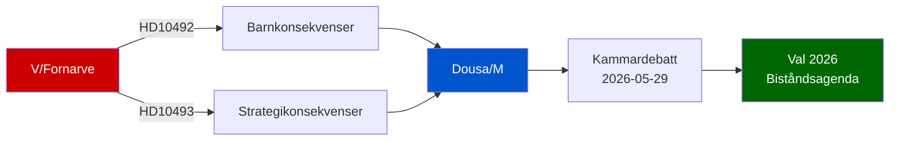

# Classification Results — Interpellations 2026-05-15

**Template**: Political Classification 7-Dimension Framework  
**Classification date**: 2026-05-15  

---

## Per-Document Classification

### HD10492 — Konsekvenserna för barn när biståndet minskar

| Dimension | Classification | Evidence |
|-----------|---------------|---------|
| Policy domain | Foreign affairs / International development | Bistånds- och utrikeshandelsminister Dousa (M) is the target [A2] |
| Political priority tier | P2 High | Biståndspolitik är en valrörelsetema, barnrättsargument has broad appeal [A2] |
| Party alignment | V (opposition) → M (government) | Lotta Johnsson Fornarve (V) → Benjamin Dousa (M) [A1] |
| Ideological valence | Left-progressive vs. centre-right | ODA reduction framed as "efficiency" by M vs. "responsibility" by V [A2] |
| Temporal horizon | Short-medium term | Svarsdatum 2026-05-29; val 2026 in September [A2] |
| GDPR Art. 9 relevance | None — public political data only | Named MPs exercising public mandate [A1] |
| Data retention | Permanent parliamentary record | Official Riksdag record at data.riksdagen.se [A1] |

**Priority tier**: P2 — High political significance, moderate media potential  
**Access**: Public [A1]

### HD10493 — Konsekvenserna av nedlagda biståndsstrategier

| Dimension | Classification | Evidence |
|-----------|---------------|---------|
| Policy domain | Foreign affairs / International development / Security policy | Three-dimensional scrutiny: general, gender, security [A2] |
| Political priority tier | P1 Very High | Halvering of strategies touches Sweden's international role, Agenda 2030, security [A2] |
| Party alignment | V (opposition) → M (government) | Lotta Johnsson Fornarve (V) → Benjamin Dousa (M) [A1] |
| Ideological valence | Left-progressive vs. centre-right + SD | Tidöavtalet coalition policy under scrutiny [A2] |
| Temporal horizon | Medium-long term | Post-2026 election trajectory; Agenda 2030 to 2030 [A2] |
| GDPR Art. 9 relevance | None — public political data only | Named MPs exercising public mandate [A1] |
| Data retention | Permanent parliamentary record | Official Riksdag record at data.riksdagen.se [A1] |

**Priority tier**: P1 — Very high political significance, high media/public interest potential  
**Access**: Public [A1]

## Cluster Classification

Both interpellations form a coherent **biståndskritik-cluster** targeting Dousa's portfolio:
- Thematic unity: consequences analysis (konsekvensanalys) as common thread
- Strategic purpose: establishing public record that no analysis was done before cuts
- Parliamentary timing: coordinated for 2026-05-18 anmälan, 2026-05-29 debate

