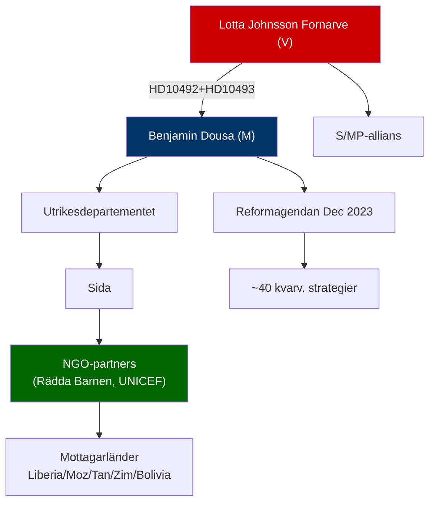

# Cross-Reference Map — Interpellations 2026-05-15

**Purpose**: Policy cluster links, legislative chains, document network  

---

## Policy Cluster: Biståndspolitiken

| Document | Relation | DOK_ID | Status |
|----------|---------|--------|--------|
| HD10492 | Primary — Barn/bistånd | HD10492 | Active |
| HD10493 | Primary — Strategikonsekvenser | HD10493 | Active |
| Reformagendan "Bistånd för ny era" | Policy baseline | UD-dok Dec 2023 | In force |
| Tidöavtalet biståndsklausul | Koalitionskontrakt | Tidö 2022 | In force |
| CRC (Barnkonventionen) | Legal framework | FN 1989 → Sv lag 2020 | Binding |

---

## Legislative Chain

```
Tidöavtalet (2022) → Budgetproposition 2023/24 → Biståndsreform Dec 2023
    → Strategiavveckling Dec 2025 (Liberia, Moz, Tan, Zim, Bolivia)
        → HD10492 (Barnkonsekvenser) 2026-05-15
        → HD10493 (Strategikonsekvenser) 2026-05-15
            → Kammardebatt 2026-05-29
                → [KU-anmälan? / Valrörelse 2026]
```

---

## Sibling Document Network

| Category | Connected documents |
|----------|-------------------|
| Earlier bistånd-interpellationer | Fornarves tidigare interpellationer i 2024/25 (sökning behövs) |
| Betänkanden om bistånd | UU4, UU2 (Utrikesutskottet) — ej funnet direkt relaterat |
| Statsbudget | Prop. 2025/26:1 (UO 7 Internationellt bistånd) |
| Sida officiella rapporter | Sida årsredovisning 2025 (ej ännu publicerad) |

---

## Key Actors Network


