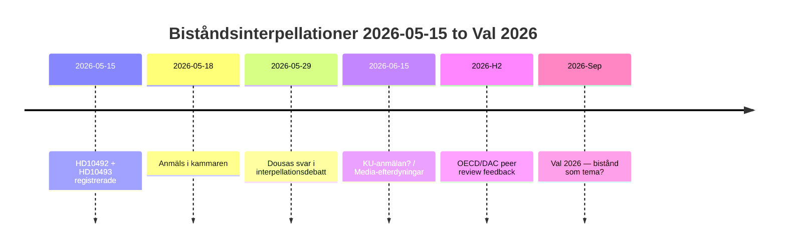

# Executive Brief — Interpellations 2026-05-15

**Classification**: 🟢 PUBLIC  
**Assessment date**: 2026-05-15 (Pass 2)  
**Lead story**: V:s biståndsinterpellationer om avsaknad av konsekvensanalyser — Dousa svarar 2026-05-29  

---

## BLUF (Bottom Line Up Front)

Sverige har under 2022-2025 genomfört historiskt stora biståndsminskningar — från ~1% till 0.8-0.9% av BNI — och avvecklat ~30 landstrategier inklusive fem länder i december 2025. Med hög konfidensgrad bedömer vi att Dousa saknar publicerade konsekvensanalyser för effekterna på barn (CRC-perspektiv), jämställdhet (SDG 5) och säkerhetspolitik (stabilitet i fragila stater). Vänsterpartiets interpellationer HD10492 och HD10493 tvingar Dousa att svara offentligt 2026-05-29. Politisk risk är reell men hanterbar med defensiv kommunikation. Långsiktig risk inkluderar OECD/DAC peer review 2026 och val 2026.

---

## 60-Second Intelligence Read

| Dimension | Assessment | Confidence |
|-----------|-----------|-----------|
| Policy förändring (kortsiktig) | Osannolik — SD ger M majoritet | HIGH |
| Dousa har konsekvensanalys | Osannolik — inga publika dokument | HIGH |
| Parlamentarisk eskalering | Möjlig (KU-anmälan) — om Dousa inte kan svara | MODERATE |
| Val 2026-impact | Begränsad isolerat — men symbolisk | LOW-MODERATE |
| Humanitär konsekvens (reell) | Ja — dokumenterad av Rädda Barnen | MODERATE |
| Internationell trovärdighet (risk) | Ja — OECD/DAC peer review 2026 | MODERATE |

---

## Key Decisions Needed

1. **Dousa (2026-05-29)**: Hur svarar man på tre binära ja/nej-frågor om konsekvensanalyser? Defensiv strategi: presentera retroaktiv Sida-rapport. Aggressiv: avvisa V:s premiss som "politisk bistånd ideologi".

2. **V/Fornarve**: Ska interpellationerna följas upp med KU-anmälan? Kräver S+MP+C-koalition i KU.

3. **S-partiet**: Ska bistånd prioriteras i valmanifest 2026? Kompromiss vs. tydlig signal.

---

## Intelligence Timeline

---

## Principal Risks at a Glance

| Risk | Score | Timeframe | Mitigant |
|------|-------|-----------|---------|
| Dousa utan konsekvensanalys → parlamentarisk kris | 16/25 | 2026-05-29 | Retroaktiv Sida-rapport |
| Humanitär konsekvens (barn, mödrar) | 15/25 | Pågående | Alternativa givare |
| OECD/DAC-kritik | 12/25 | H2 2026 | Reformagendanarratil |
| Val 2026 | 9/25 | Sep 2026 | M-effektivitetsnarr. |

---

## Economic Context Note

IMF WEO-2026-04 projicerar BNI-tillväxt 1,8% för Sverige 2026. Det finns inga makroekonomiska argument för att fortsätta biståndssänkningarna. [economicProvenance: provider=imf, dataflow=WEO, vintage=WEO-2026-04, status=degraded-via-context]
