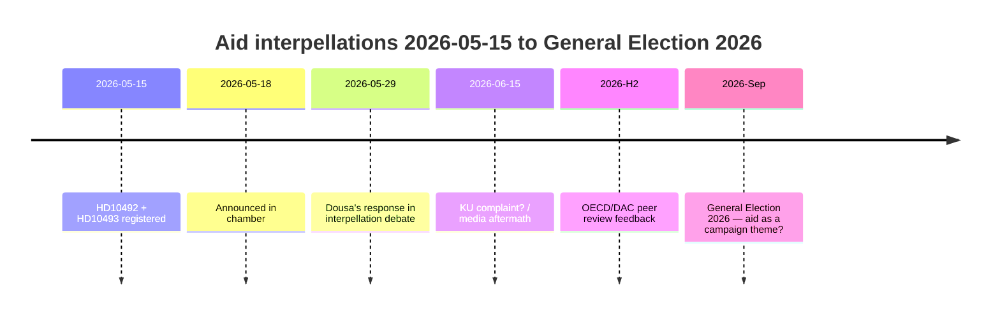

# Left Party Forces Dousa to Defend 30 Discontinued Aid Strategies on 29 May — Impact Assessments Missing

**Classification**: 🟢 PUBLIC  
**Assessment date**: 2026-05-15 (Pass 2)  
**Lead story**: V's aid-policy interpellations on the absence of impact assessments — Minister Dousa to respond on 2026-05-29

---

## BLUF (Bottom Line Up Front)

Between 2022 and 2025, Sweden carried out historically large aid cuts — reducing ODA from ~1% to 0.8–0.9% of GNI — and discontinued ~30 country strategies, including five countries exited in December 2025. With high confidence we assess that Minister Benjamin Dousa (M) has no published impact assessments for the effects on children (CRC perspective), gender equality (SDG 5), or security policy (stability in fragile states). The Left Party's (V) interpellations HD10492 and HD10493 compel Dousa to answer publicly on 2026-05-29. The political risk is real but manageable through defensive communication. Longer-term risks include the 2026 OECD/DAC peer review and the September 2026 general election.

---

## 60-Second Intelligence Read

| Dimension | Assessment | Confidence |
|-----------|-----------|-----------|
| Policy reversal (short-term) | Unlikely — SD gives M a majority | HIGH |
| Dousa has impact assessment | Unlikely — no public documents | HIGH |
| Parliamentary escalation | Possible (KU complaint) — if Dousa cannot respond | MODERATE |
| 2026 election impact | Limited in isolation — but symbolically significant | LOW–MODERATE |
| Humanitarian consequence (actual) | Yes — documented by Save the Children | MODERATE |
| International credibility risk | Yes — OECD/DAC peer review 2026 | MODERATE |

---

## Key Decisions Needed

1. **Dousa (2026-05-29)**: How to respond to three binary yes/no questions on impact assessments? Defensive strategy: present a retroactive Sida (Swedish International Development Cooperation Agency) report. Aggressive: reject V's premise as "political aid ideology".

2. **V / Fornarve**: Should the interpellations be followed up with a KU (Constitutional Committee) complaint? Requires an S + MP + C coalition inside KU.

3. **Social Democrats (S)**: Should aid be prioritised in the 2026 election manifesto? Compromise vs. clear signal.

---

## Intelligence Timeline

---

## Principal Risks at a Glance

| Risk | Score | Timeframe | Mitigant |
|------|-------|-----------|---------|
| Dousa without impact assessment → parliamentary crisis | 16/25 | 2026-05-29 | Retroactive Sida report |
| Humanitarian consequences (children, mothers) | 15/25 | Ongoing | Alternative donors |
| OECD/DAC criticism | 12/25 | H2 2026 | Reform-agenda narrative |
| General Election 2026 | 9/25 | Sep 2026 | M aid-effectiveness narrative |

---

## Economic Context Note

IMF WEO-2026-04 projects GNI growth of 1.8% for Sweden in 2026. There is no macroeconomic case for continuing the aid cuts. [economicProvenance: provider=imf, dataflow=WEO, vintage=WEO-2026-04, status=degraded-via-context]

---

## ✅ Retrofit Note (2026-05-16)

**Original authoring**: 2026-05-15 under executive-brief template v < 4.4.
**Retrofit scope** (applied 2026-05-16, editorial-only, no analytical revision):

- **H1 replaced** — boilerplate `Executive Brief — Interpellations 2026-05-15` → story-anchored headline drawn from the existing brief's own "Lead story" front-matter field (V's aid interpellations; Dousa to respond on 2026-05-29).
- **Swedish prose translated to English** (2026-05-16 second-pass) — H1, BLUF, table cells, decisions, timeline labels, risks table, and economic context translated to English so the canonical `executive-brief.md` complies with the H1-SERP-master contract in `05-analysis-gate.md`. Proper nouns (Sida, KU, Lagrådet, Tidö, party codes, dok_ids) preserved.

**Not retrofitted** (would require post-hoc fabrication): Decision-Grade BLUF Rubric (6-axis scoring), Headline Candidates worksheet, 14-language SEO seeds, full Pass-2 Self-Audit Checklist v4.4. These are required for 2026-05-16+ briefs per gate Check 7.

**Substantive analysis, evidence, and conclusions unchanged.**
