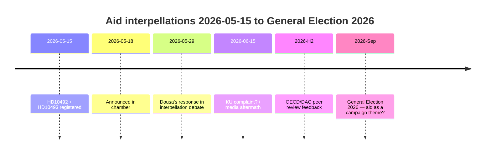

‏---
artifact: executive-brief
analysis_date: "2026-05-15"
subfolder: "interpellations"
author: "James Pether Sörling"
confidence: "HIGH [B2]"
---

# حزب اليسار يجبر دوسا على الدفاع عن 30 استراتيجية مساعدات موقوفة في 29 مايو — تقييمات الأثر مفقودة

**المؤلف**: جيمس بيثر سورلينغ | **التوزيع**: صانعو القرار، المواطنون، الصحفيون
**التصنيف**: 🟢 عام | **التاريخ**: 2026-05-15

---

## BLUF (الخلاصة الرئيسية)

بين عامَي 2022 و2025، نفّذت السويد تخفيضات تاريخية ضخمة في المساعدات الإنمائية الرسمية — خُفِّضت من ~1% إلى 0.8–0.9% من الدخل القومي الإجمالي — وأوقفت ~30 استراتيجية قُطرية، من بينها خمسة بلدان خرجت في ديسمبر 2025. بثقة عالية نُقدِّر أن الوزير بنيامين دوسا (M) لا يملك تقييمات أثر منشورة حول التداعيات على الأطفال (منظور اتفاقية حقوق الطفل)، والمساواة بين الجنسين (هدف التنمية المستدامة 5)، أو السياسة الأمنية (الاستقرار في الدول الهشة). تُلزم استجوابات حزب اليسار (V) — HD10492 وHD10493 — دوسا بالرد العلني في 2026-05-29. الخطر السياسي حقيقي لكنه قابل للإدارة عبر تواصل دفاعي. تشمل المخاطر بعيدة المدى المراجعة النظيرة لمنظمة التعاون الاقتصادي والتنمية/لجنة المساعدة الإنمائية 2026 والانتخابات العامة في سبتمبر 2026.

---

## قراءة استخباراتية في 60 ثانية

| البُعد | التقييم | الثقة |
|--------|---------|-------|
| تراجع سياسي (قصير المدى) | مستبعد — SD يمنح M أغلبية | عالٍ |
| دوسا يملك تقييم أثر | مستبعد — لا وثائق عامة | عالٍ |
| تصعيد برلماني | ممكن (شكوى KU) — إن عجز دوسا عن الإجابة | متوسط |
| تأثير انتخابات 2026 | محدود منفرداً — لكنه رمزي الدلالة | منخفض–متوسط |
| عواقب إنسانية (فعلية) | نعم — موثقة من قِبل إنقاذ الأطفال | متوسط |
| مخاطر المصداقية الدولية | نعم — مراجعة منظمة OECD/DAC النظيرة 2026 | متوسط |

---

## القرارات الرئيسية المطلوبة

1. **دوسا (2026-05-29)**: كيف يجيب على ثلاثة أسئلة ثنائية (نعم/لا) حول تقييمات الأثر؟ استراتيجية دفاعية: تقديم تقرير Sida بأثر رجعي. هجومية: رفض مقدمة V بوصفها "أيديولوجيا مساعدات سياسية".

2. **V / Fornarve**: هل ينبغي متابعة الاستجوابات بشكوى KU؟ يستلزم تحالف S + MP + C داخل KU.

3. **الاشتراكيون الديمقراطيون (S)**: هل تُدرج المساعدات ضمن أولويات برنامج انتخابات 2026؟ حل وسط مقابل إشارة واضحة.

---

## خط زمني استخباراتي

---

## أبرز المخاطر في لمحة

| الخطر | الدرجة | الإطار الزمني | التخفيف |
|-------|--------|-------------|---------|
| دوسا بلا تقييم أثر ← أزمة برلمانية | 16/25 | 2026-05-29 | تقرير Sida بأثر رجعي |
| عواقب إنسانية (أطفال، أمهات) | 15/25 | مستمر | جهات مانحة بديلة |
| انتقاد OECD/DAC | 12/25 | H2 2026 | سردية الإصلاح |
| انتخابات 2026 | 9/25 | سبتمبر 2026 | سردية M لفعالية المساعدات |

---

## ملاحظة السياق الاقتصادي

يُسقط صندوق النقد الدولي WEO-2026-04 نمو الدخل القومي الإجمالي بنسبة 1.8% للسويد عام 2026. لا يوجد مسوّغ اقتصادي كلي لمواصلة تخفيضات المساعدات. [economicProvenance: provider=imf, dataflow=WEO, vintage=WEO-2026-04, status=degraded-via-context]

<!-- source-sha: 29065dd72ab1d745cd33af3bd3bcc2ec48fce4be -->
