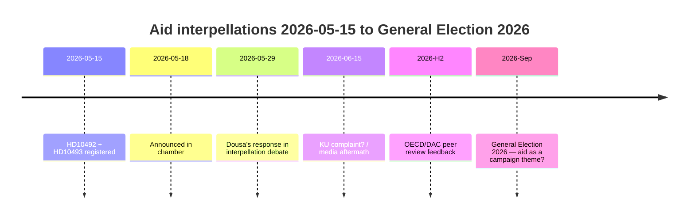

# Venstre tvinger Dousa til at forsvare 30 afbrudte bistandsstrategier den 29. maj — konsekvensvurderinger mangler

**Klassificering**: 🟢 OFFENTLIG
**Vurderingsdato**: 2026-05-15 (Pass 2)
**Ledende nyhed**: V's bistandsinterpellationer om fraværet af konsekvensvurderinger — minister Dousa skal svare den 2026-05-29

---

## BLUF (Bottom Line Up Front)

Mellem 2022 og 2025 gennemførte Sverige historisk store bistandsnedskæringer — ODA reduceret fra ~1% til 0,8–0,9% af BNI — og afbrød ~30 landestrategier, herunder fem lande, der trak sig i december 2025. Med høj tillid vurderer vi, at minister Benjamin Dousa (M) ikke har offentliggjorte konsekvensvurderinger for effekterne på børn (børnerettsperspektiv), ligestilling (SDG 5) eller sikkerhedspolitik (stabilitet i skrøbelige stater). Venstre-partiets (V) interpellationer HD10492 og HD10493 tvinger Dousa til at svare offentligt den 2026-05-29. Den politiske risiko er reel men håndterbar gennem defensiv kommunikation. Langsigtede risici inkluderer OECD/DAC-peer-review 2026 og valget i september 2026.

---

## 60-sekunders efterretningslæsning

| Dimension | Vurdering | Tillid |
|-----------|-----------|--------|
| Politisk vending (kortsigtet) | Usandsynligt — SD giver M et flertal | HØJ |
| Dousa har konsekvensvurdering | Usandsynligt — ingen offentlige dokumenter | HØJ |
| Parlamentarisk eskalering | Muligt (KU-anmeldelse) — hvis Dousa ikke kan svare | MODERAT |
| Valgets indvirkning 2026 | Begrænset isoleret — men symbolsk signifikant | LAV–MODERAT |
| Humanitær konsekvens (faktisk) | Ja — dokumenteret af Red Barnet | MODERAT |
| International troværdighedsrisiko | Ja — OECD/DAC-peer-review 2026 | MODERAT |

---

## Nøglebeslutninger krævet

1. **Dousa (2026-05-29)**: Hvordan svare på tre binære ja/nej-spørgsmål om konsekvensvurderinger? Defensiv strategi: præsentere en retroaktiv Sida-rapport. Aggressiv: afvise V's præmis som "politisk bistandsideologi".

2. **V / Fornarve**: Skal interpellationerne følges op med en KU-anmeldelse? Kræver S + MP + C-koalition inden for KU.

3. **Socialdemokraterne (S)**: Skal bistand prioriteres i valgets 2026 valgmanifest? Kompromis vs. klart signal.

---

## Efterretnings-tidslinje

---

## Vigtigste risici kort sagt

| Risiko | Score | Tidsramme | Modforanstaltning |
|--------|-------|-----------|---------|
| Dousa uden konsekvensvurdering → parlamentarisk krise | 16/25 | 2026-05-29 | Retroaktiv Sida-rapport |
| Humanitære konsekvenser (børn, mødre) | 15/25 | Igangværende | Alternative donorer |
| OECD/DAC-kritik | 12/25 | H2 2026 | Reformnarrativ |
| Valg 2026 | 9/25 | Sep 2026 | M's bistandseffektivitetsnarrativ |

---

## Økonomisk kontekstnotat

IMF WEO-2026-04 forudsiger BNI-vækst på 1,8% for Sverige i 2026. Der er intet makroøkonomisk argument for at fortsætte bistandsnedskæringerne. [economicProvenance: provider=imf, dataflow=WEO, vintage=WEO-2026-04, status=degraded-via-context]

<!-- source-sha: 29065dd72ab1d745cd33af3bd3bcc2ec48fce4be -->
