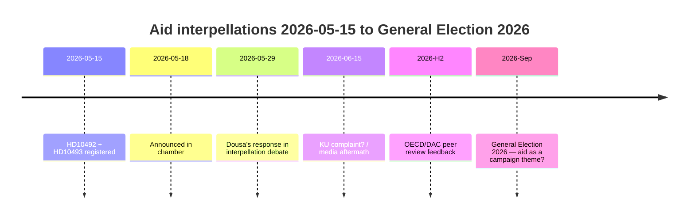

# Linkspartei zwingt Dousa, 30 eingestellte Hilfsstrategien am 29. Mai zu verteidigen — Folgenabschätzungen fehlen

**Einstufung**: 🟢 ÖFFENTLICH
**Bewertungsdatum**: 2026-05-15 (Pass 2)
**Hauptmeldung**: V's Hilfsinterpellationen über das Fehlen von Folgenabschätzungen — Minister Dousa antwortet am 2026-05-29

---

## BLUF (Bottom Line Up Front)

Zwischen 2022 und 2025 führte Schweden historisch große Hilfskürzungen durch — ODA wurde von ~1% auf 0,8–0,9% des BNE reduziert — und stellte ~30 Länderstrategien ein, darunter fünf Länder, die im Dezember 2025 ausschieden. Mit hoher Zuversicht bewerten wir, dass Minister Benjamin Dousa (M) keine veröffentlichten Folgenabschätzungen zu den Auswirkungen auf Kinder (KRK-Perspektive), Geschlechtergleichstellung (SDG 5) oder Sicherheitspolitik (Stabilität in fragilen Staaten) hat. Die Interpellationen HD10492 und HD10493 der Linkspartei (V) zwingen Dousa am 2026-05-29 zu einer öffentlichen Antwort. Das politische Risiko ist real, aber durch defensive Kommunikation handhabbar. Langfristige Risiken umfassen die OECD/DAC-Peer-Review 2026 und die Parlamentswahl im September 2026.

---

## 60-Sekunden-Geheimdienstlektüre

| Dimension | Bewertung | Zuversicht |
|-----------|-----------|-----------|
| Politische Kehrtwende (kurzfristig) | Unwahrscheinlich — SD gibt M eine Mehrheit | HOCH |
| Dousa hat Folgenabschätzung | Unwahrscheinlich — keine öffentlichen Dokumente | HOCH |
| Parlamentarische Eskalation | Möglich (KU-Beschwerde) — wenn Dousa nicht antworten kann | MODERAT |
| Wahleinfluss 2026 | Begrenzt für sich allein — aber symbolisch bedeutsam | NIEDRIG–MODERAT |
| Humanitäre Konsequenz (tatsächlich) | Ja — dokumentiert von Save the Children | MODERAT |
| Internationales Glaubwürdigkeitsrisiko | Ja — OECD/DAC-Peer-Review 2026 | MODERAT |

---

## Erforderliche Schlüsselentscheidungen

1. **Dousa (2026-05-29)**: Wie auf drei binäre Ja/Nein-Fragen zu Folgenabschätzungen antworten? Defensive Strategie: rückwirkenden Sida-Bericht vorlegen. Aggressiv: V's Prämisse als "politische Hilfsideologie" ablehnen.

2. **V / Fornarve**: Sollen die Interpellationen mit einer KU-Beschwerde nachverfolgt werden? Erfordert S + MP + C-Koalition innerhalb von KU.

3. **Sozialdemokraten (S)**: Soll Hilfe im Wahlprogramm 2026 priorisiert werden? Kompromiss vs. klares Signal.

---

## Geheimdienstzeitlinie

---

## Hauptrisiken auf einen Blick

| Risiko | Punktzahl | Zeitrahmen | Gegenmaßnahme |
|--------|-----------|------------|---------|
| Dousa ohne Folgenabschätzung → parlamentarische Krise | 16/25 | 2026-05-29 | Rückwirkender Sida-Bericht |
| Humanitäre Konsequenzen (Kinder, Mütter) | 15/25 | Laufend | Alternative Geber |
| OECD/DAC-Kritik | 12/25 | H2 2026 | Reformnarrativ |
| Wahl 2026 | 9/25 | Sep 2026 | M's Hilfseffektivitätsnarrativ |

---

## Wirtschaftlicher Kontexthinweis

IMF WEO-2026-04 prognostiziert ein BNE-Wachstum von 1,8% für Schweden im Jahr 2026. Es gibt kein makroökonomisches Argument für die Fortsetzung der Hilfskürzungen. [economicProvenance: provider=imf, dataflow=WEO, vintage=WEO-2026-04, status=degraded-via-context]

<!-- source-sha: 29065dd72ab1d745cd33af3bd3bcc2ec48fce4be -->
