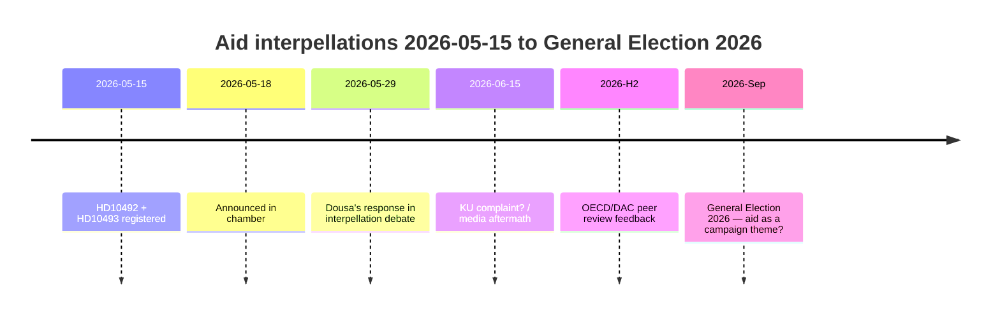

# El Partido de la Izquierda obliga a Dousa a defender 30 estrategias de ayuda suspendidas el 29 de mayo — faltan evaluaciones de impacto

**Clasificación**: 🟢 PÚBLICO
**Fecha de evaluación**: 2026-05-15 (Pass 2)
**Noticia principal**: Las interpelaciones de ayuda de V sobre la ausencia de evaluaciones de impacto — el ministro Dousa debe responder el 2026-05-29

---

## BLUF (Bottom Line Up Front)

Entre 2022 y 2025, Suecia realizó recortes de ayuda históricamente grandes — la AOD se redujo del ~1% al 0,8–0,9% del RNB — y abandonó ~30 estrategias nacionales, incluidos cinco países que salieron en diciembre de 2025. Con alta confianza evaluamos que el ministro Benjamin Dousa (M) no tiene evaluaciones de impacto publicadas sobre los efectos en los niños (perspectiva CDN), la igualdad de género (ODS 5) o la política de seguridad (estabilidad en estados frágiles). Las interpelaciones HD10492 y HD10493 del Partido de la Izquierda (V) obligan a Dousa a responder públicamente el 2026-05-29. El riesgo político es real pero manejable mediante comunicación defensiva. Los riesgos a largo plazo incluyen la revisión de pares de la OCDE/CAD 2026 y las elecciones generales de septiembre de 2026.

---

## Lectura de inteligencia de 60 segundos

| Dimensión | Evaluación | Confianza |
|-----------|-----------|---------|
| Giro político (corto plazo) | Poco probable — SD da a M una mayoría | ALTO |
| Dousa tiene evaluación de impacto | Poco probable — sin documentos públicos | ALTO |
| Escalada parlamentaria | Posible (queja KU) — si Dousa no puede responder | MODERADO |
| Impacto electoral 2026 | Limitado aislado — pero simbólicamente significativo | BAJO–MODERADO |
| Consecuencia humanitaria (real) | Sí — documentado por Save the Children | MODERADO |
| Riesgo de credibilidad internacional | Sí — revisión de pares OCDE/CAD 2026 | MODERADO |

---

## Decisiones clave requeridas

1. **Dousa (2026-05-29)**: ¿Cómo responder a tres preguntas binarias sí/no sobre evaluaciones de impacto? Estrategia defensiva: presentar un informe retroactivo de Sida. Agresiva: rechazar la premisa de V como "ideología de ayuda política".

2. **V / Fornarve**: ¿Deben las interpelaciones ser seguidas de una queja KU? Requiere coalición S + MP + C dentro del KU.

3. **Socialdemócratas (S)**: ¿Debe priorizarse la ayuda en el manifiesto electoral 2026? Compromiso vs. señal clara.

---

## Cronología de inteligencia

---

## Riesgos principales en resumen

| Riesgo | Puntuación | Plazo | Mitigación |
|--------|-----------|-------|---------|
| Dousa sin evaluación de impacto → crisis parlamentaria | 16/25 | 2026-05-29 | Informe retroactivo de Sida |
| Consecuencias humanitarias (niños, madres) | 15/25 | En curso | Donantes alternativos |
| Crítica OCDE/CAD | 12/25 | H2 2026 | Narrativa de reforma |
| Elecciones 2026 | 9/25 | Sep 2026 | Narrativa de eficacia de ayuda de M |

---

## Nota de contexto económico

IMF WEO-2026-04 proyecta un crecimiento del RNB del 1,8% para Suecia en 2026. No hay ningún argumento macroeconómico para continuar los recortes de ayuda. [economicProvenance: provider=imf, dataflow=WEO, vintage=WEO-2026-04, status=degraded-via-context]

<!-- source-sha: 29065dd72ab1d745cd33af3bd3bcc2ec48fce4be -->
