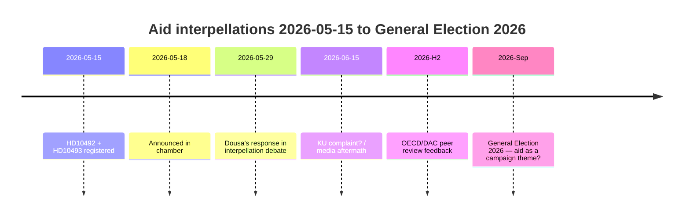

# Vasemmistopuolue pakottaa Dousan puolustamaan 30 lopetettua kehitysstrategiaa 29. toukokuuta — vaikutusarviot puuttuvat

**Luokitus**: 🟢 JULKINEN
**Arviointipäivämäärä**: 2026-05-15 (Pass 2)
**Pääuutinen**: V:n kehitysinterpellaatiot vaikutusarvioiden puuttumisesta — ministeri Dousa vastaa 2026-05-29

---

## BLUF (Ydinviesti)

Vuosina 2022–2025 Ruotsi toteutti historiallisesti suuria kehitysleikkauksia — ODA vähennettiin ~1%:sta 0,8–0,9%:iin BKTL:sta — ja lopetti ~30 maastrategiaa, mukaan lukien viisi maata, jotka poistuivat joulukuussa 2025. Korkean luottamuksen arviona arvioimme, että ministeri Benjamin Dousalla (M) ei ole julkaistuja vaikutusarvioita lapsiin (LOS-näkökulma), tasa-arvoon (SDG 5) tai turvallisuuspolitiikkaan (hauraat valtiot) kohdistuvista vaikutuksista. Vasemmistopuolueen (V) interpellaatiot HD10492 ja HD10493 pakottavat Dousan vastaamaan julkisesti 2026-05-29. Poliittinen riski on todellinen mutta hallittavissa defensiivisellä viestinnällä. Pitkän aikavälin riskeihin kuuluu OECD/DAC-vertaisarviointi 2026 ja syyskuun 2026 vaalit.

---

## 60 sekunnin tiedustelulukema

| Ulottuvuus | Arvio | Luottamus |
|------------|-------|-----------|
| Poliittinen muutos (lyhyt aikaväli) | Epätodennäköinen — SD antaa M:lle enemmistön | KORKEA |
| Dousalla on vaikutusarvio | Epätodennäköinen — ei julkisia asiakirjoja | KORKEA |
| Parlamentaarinen eskalaatio | Mahdollinen (KU-ilmoitus) — jos Dousa ei pysty vastaamaan | KOHTALAINEN |
| Vaalivaikutus 2026 | Rajoitettu yksinään — mutta symbolisesti merkittävä | MATALA–KOHTALAINEN |
| Humanitaarinen seuraus (todellinen) | Kyllä — dokumentoitu Pelastakaa Lapset -järjestön toimesta | KOHTALAINEN |
| Kansainvälinen uskottavuusriski | Kyllä — OECD/DAC-vertaisarviointi 2026 | KOHTALAINEN |

---

## Tarvittavat avainpäätökset

1. **Dousa (2026-05-29)**: Miten vastata kolmeen binaariseen kyllä/ei-kysymykseen vaikutusarvioista? Defensiivinen strategia: esittää takautuva Sida-raportti. Aggressiivinen: hylätä V:n lähtökohta "poliittisena kehitysideologiana".

2. **V / Fornarve**: Pitäisikö interpellaatioita seurata KU-ilmoituksella? Vaatii S + MP + C-koalition KU:n sisällä.

3. **Sosiaalidemokraatit (S)**: Pitäisikö kehitysyhteistyö priorisoida vuoden 2026 vaalimanifestissa? Kompromissi vs. selkeä signaali.

---

## Tiedustelun aikajana

---

## Tärkeimmät riskit lyhyesti

| Riski | Pisteet | Aikataulu | Lieventäminen |
|-------|---------|-----------|---------|
| Dousa ilman vaikutusarviota → parlamentaarinen kriisi | 16/25 | 2026-05-29 | Takautuva Sida-raportti |
| Humanitaariset seuraukset (lapset, äidit) | 15/25 | Käynnissä | Vaihtoehtoiset lahjoittajat |
| OECD/DAC-kritiikki | 12/25 | H2 2026 | Uudistusnarratiivi |
| Vaalit 2026 | 9/25 | Syys 2026 | M:n kehitystehokkuusnarratiivi |

---

## Taloudellinen kontekstihuomio

IMF WEO-2026-04 ennustaa BKTL-kasvua 1,8% Ruotsille vuonna 2026. Kehitysleikkauksien jatkamiselle ei ole makrotaloudellisia perusteita. [economicProvenance: provider=imf, dataflow=WEO, vintage=WEO-2026-04, status=degraded-via-context]

<!-- source-sha: 29065dd72ab1d745cd33af3bd3bcc2ec48fce4be -->
