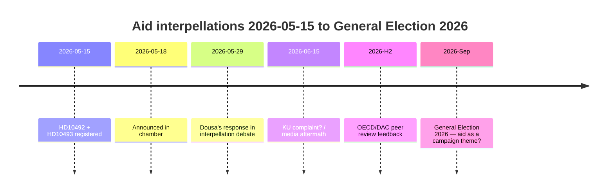

# Le Parti de gauche force Dousa à défendre 30 stratégies d'aide abandonnées le 29 mai — évaluations d'impact manquantes

**Classification** : 🟢 PUBLIC
**Date d'évaluation** : 2026-05-15 (Pass 2)
**Article principal** : Les interpellations d'aide de V sur l'absence d'évaluations d'impact — le ministre Dousa doit répondre le 2026-05-29

---

## BLUF (Bottom Line Up Front)

Entre 2022 et 2025, la Suède a procédé à des réductions d'aide historiquement importantes — l'APD réduite de ~1% à 0,8–0,9% du RNB — et a abandonné ~30 stratégies nationales, dont cinq pays qui ont quitté en décembre 2025. Avec une grande confiance, nous évaluons que le ministre Benjamin Dousa (M) ne dispose pas d'évaluations d'impact publiées sur les effets sur les enfants (perspective CDE), l'égalité des sexes (ODD 5) ou la politique de sécurité (stabilité dans les États fragiles). Les interpellations HD10492 et HD10493 du Parti de gauche (V) contraignent Dousa à répondre publiquement le 2026-05-29. Le risque politique est réel mais gérable par une communication défensive. Les risques à long terme comprennent l'examen par les pairs OCDE/CAD 2026 et les élections générales de septembre 2026.

---

## Lecture de renseignement en 60 secondes

| Dimension | Évaluation | Confiance |
|-----------|-----------|---------|
| Revirement politique (court terme) | Peu probable — SD donne à M une majorité | ÉLEVÉ |
| Dousa dispose d'une évaluation d'impact | Peu probable — aucun document public | ÉLEVÉ |
| Escalade parlementaire | Possible (plainte KU) — si Dousa ne peut pas répondre | MODÉRÉ |
| Impact électoral 2026 | Limité isolément — mais symboliquement significatif | FAIBLE–MODÉRÉ |
| Conséquence humanitaire (réelle) | Oui — documentée par Save the Children | MODÉRÉ |
| Risque de crédibilité internationale | Oui — examen par les pairs OCDE/CAD 2026 | MODÉRÉ |

---

## Décisions clés requises

1. **Dousa (2026-05-29)** : Comment répondre à trois questions binaires oui/non sur les évaluations d'impact ? Stratégie défensive : présenter un rapport Sida rétroactif. Agressive : rejeter la prémisse de V comme "idéologie d'aide politique".

2. **V / Fornarve** : Les interpellations doivent-elles être suivies d'une plainte KU ? Nécessite une coalition S + MP + C au sein du KU.

3. **Sociaux-démocrates (S)** : L'aide doit-elle être prioritaire dans le manifeste électoral 2026 ? Compromis vs. signal clair.

---

## Chronologie du renseignement

---

## Principaux risques en bref

| Risque | Score | Délai | Atténuation |
|--------|-------|-------|---------|
| Dousa sans évaluation d'impact → crise parlementaire | 16/25 | 2026-05-29 | Rapport Sida rétroactif |
| Conséquences humanitaires (enfants, mères) | 15/25 | En cours | Donateurs alternatifs |
| Critique OCDE/CAD | 12/25 | H2 2026 | Narratif de réforme |
| Élection 2026 | 9/25 | Sep 2026 | Narratif d'efficacité de l'aide de M |

---

## Note de contexte économique

IMF WEO-2026-04 projette une croissance du RNB de 1,8% pour la Suède en 2026. Il n'y a aucun argument macroéconomique pour poursuivre les réductions d'aide. [economicProvenance: provider=imf, dataflow=WEO, vintage=WEO-2026-04, status=degraded-via-context]

<!-- source-sha: 29065dd72ab1d745cd33af3bd3bcc2ec48fce4be -->
