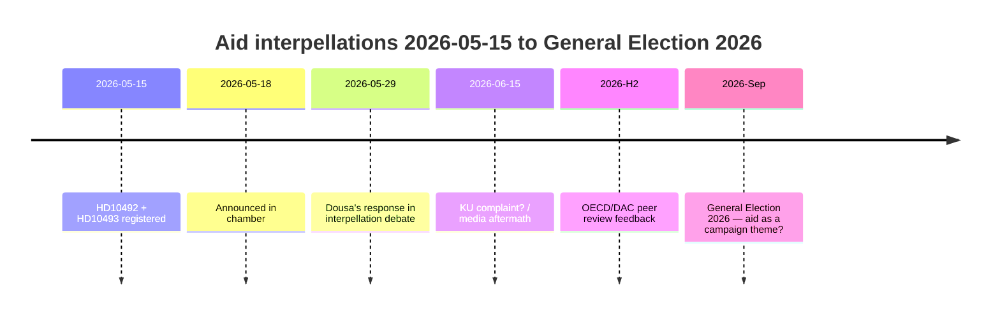

‏---
artifact: executive-brief
analysis_date: "2026-05-15"
subfolder: "interpellations"
author: "James Pether Sörling"
confidence: "HIGH [B2]"
---

# מפלגת השמאל מכריחה את דוסה להגן על 30 אסטרטגיות סיוע שבוטלו ב-29 במאי — הערכות השפעה חסרות

**מחבר**: ג'יימס פת'ר סורלינג | **הפצה**: מקבלי החלטות, אזרחים, עיתונאים
**סיווג**: 🟢 ציבורי | **תאריך**: 2026-05-15

---

## BLUF (מסקנה עיקרית)

בין 2022 ל-2025, ביצעה שוודיה קיצוצים היסטוריים גדולים בסיוע — ODA קוצץ מ-~1% ל-0.8–0.9% מהGNI — ובוטלו ~30 אסטרטגיות מדיניות, כולל חמישה מדינות שיצאו בדצמבר 2025. בביטחון גבוה אנו מעריכים כי לשר בנימין דוסה (M) אין הערכות השפעה מפורסמות לגבי ההשפעות על ילדים (נקודת מבט UNCRC), שוויון מגדרי (SDG 5), או מדיניות ביטחון (יציבות במדינות שבירות). שאלות הממשלה HD10492 ו-HD10493 של מפלגת השמאל (V) מכריחות את דוסה לענות בפומבי ב-2026-05-29. הסיכון הפוליטי הוא ממשי אך ניתן לניהול באמצעות תקשורת הגנתית. סיכונים ארוכי טווח כוללים את סקירת עמיתי OECD/DAC 2026 ובחירות ספטמבר 2026.

---

## קריאת מודיעין של 60 שניות

| ממד | הערכה | ביטחון |
|-----|-------|--------|
| היפוך מדיניות (טווח קצר) | לא סביר — SD מעניק ל-M רוב | גבוה |
| דוסה מחזיק הערכת השפעה | לא סביר — אין מסמכים ציבוריים | גבוה |
| הסלמה פרלמנטרית | אפשרי (תלונת KU) — אם דוסה לא יכול לענות | בינוני |
| השפעת בחירות 2026 | מוגבלת בנפרד — אך חשובה סמלית | נמוך–בינוני |
| השלכה הומניטרית (בפועל) | כן — מתועד על ידי הצלת הילדים | בינוני |
| סיכון אמינות בינלאומית | כן — סקירת עמיתי OECD/DAC 2026 | בינוני |

---

## החלטות מפתח נדרשות

1. **דוסה (2026-05-29)**: כיצד לענות על שלוש שאלות בינאריות כן/לא לגבי הערכות השפעה? אסטרטגיה הגנתית: הגשת דוח Sida רטרואקטיבי. תוקפנית: דחיית הנחת V כ"אידיאולוגיית סיוע פוליטית".

2. **V / Fornarve**: האם יש לעקוב אחר שאלות הממשלה עם תלונת KU? דורש קואליציה S + MP + C בתוך KU.

3. **הסוציאל-דמוקרטים (S)**: האם יש להעניק עדיפות לסיוע במניפסט הבחירות 2026? פשרה לעומת אות ברור.

---

## ציר זמן מודיעיני

---

## הסיכונים העיקריים בתמצית

| סיכון | ציון | מסגרת זמן | הפחתה |
|-------|------|-----------|-------|
| דוסה ללא הערכת השפעה → משבר פרלמנטרי | 16/25 | 2026-05-29 | דוח Sida רטרואקטיבי |
| השלכות הומניטריות (ילדים, אמהות) | 15/25 | מתמשך | תורמים חלופיים |
| ביקורת OECD/DAC | 12/25 | H2 2026 | נרטיב רפורמה |
| בחירות 2026 | 9/25 | ספטמבר 2026 | נרטיב יעילות סיוע של M |

---

## הערת הקשר כלכלי

IMF WEO-2026-04 מציג צמיחת GNI של 1.8% לשוודיה ב-2026. אין טיעון מקרו-כלכלי להמשיך בקיצוצי הסיוע. [economicProvenance: provider=imf, dataflow=WEO, vintage=WEO-2026-04, status=degraded-via-context]

<!-- source-sha: 29065dd72ab1d745cd33af3bd3bcc2ec48fce4be -->
