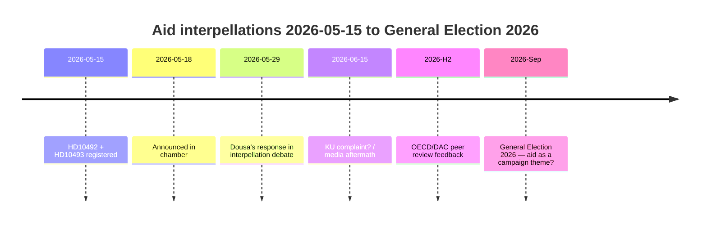

# 左翼党、5月29日にドウサに30の廃止援助戦略を弁明させる — 影響評価が欠如

**分類**: 🟢 公開
**評価日**: 2026-05-15 (Pass 2)
**主要ニュース**: V の援助質問演説での影響評価の欠如 — ドウサ大臣は2026-05-29に回答予定

---

## BLUF（結論）

2022年から2025年にかけて、スウェーデンは歴史的な大規模な援助削減を実施し、ODAを約1%から0.8〜0.9%（GNI比）に削減し、2025年12月に退出した5か国を含む約30か国戦略を廃止した。高い確信度で、ベンヤミン・ドウサ大臣（M）には子どもへの影響（CRC視点）、ジェンダー平等（SDG 5）、または安全保障政策（脆弱な国家の安定）に関する公開された影響評価が存在しないと評価する。左翼党（V）の質問演説HD10492およびHD10493は、ドウサに2026-05-29に公開回答を強いる。政治的リスクは実在するが、防衛的コミュニケーションにより対処可能。長期的リスクにはOECD/DAC同等審査2026年と2026年9月総選挙が含まれる。

---

## 60秒情報読解

| 側面 | 評価 | 信頼度 |
|------|------|--------|
| 政策転換（短期） | 可能性低 — SDがMに多数派を提供 | 高 |
| ドウサが影響評価を持つ | 可能性低 — 公開文書なし | 高 |
| 議会エスカレーション | 可能性あり（KU申告）— ドウサが回答できない場合 | 中程度 |
| 2026年選挙への影響 | 単独では限定的 — だが象徴的に重要 | 低〜中程度 |
| 人道的影響（実際） | あり — セーブ・ザ・チルドレンが文書化 | 中程度 |
| 国際的信頼性リスク | あり — OECD/DAC同等審査2026 | 中程度 |

---

## 必要な主要決定

1. **ドウサ（2026-05-29）**：影響評価に関する3つの二項目はい/いいえ質問にどう答えるか？防衛的戦略：遡及的Sida報告書を提示。攻撃的：Vの前提を「政治的援助イデオロギー」として拒否。

2. **V / Fornarve**：質問演説をKU申告で継続すべきか？KU内でのS + MP + C連立が必要。

3. **社会民主党（S）**：2026年選挙綱領で援助を優先すべきか？妥協案 vs. 明確なシグナル。

---

## 情報タイムライン

---

## 主要リスク概要

| リスク | スコア | 期間 | 軽減策 |
|--------|--------|------|--------|
| 影響評価なしのドウサ → 議会危機 | 16/25 | 2026-05-29 | 遡及的Sida報告書 |
| 人道的影響（子ども、母親） | 15/25 | 進行中 | 代替ドナー |
| OECD/DAC批判 | 12/25 | H2 2026 | 改革ナラティブ |
| 2026年選挙 | 9/25 | 2026年9月 | Mの援助効果性ナラティブ |

---

## 経済的背景注

IMF WEO-2026-04はスウェーデンの2026年GNI成長率を1.8%と予測。援助削減を続ける経済的根拠はない。[economicProvenance: provider=imf, dataflow=WEO, vintage=WEO-2026-04, status=degraded-via-context]

<!-- source-sha: 29065dd72ab1d745cd33af3bd3bcc2ec48fce4be -->
