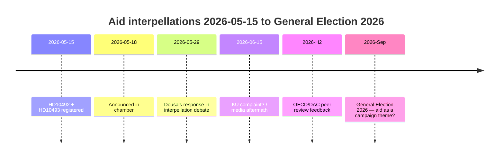

# 좌파당, 도우사에게 5월 29일 30개의 중단된 원조 전략 방어 강요 — 영향 평가 누락

**분류**: 🟢 공개
**평가 날짜**: 2026-05-15 (Pass 2)
**주요 뉴스**: V의 원조 대정부질문에서 영향 평가 부재 — 도우사 장관 2026-05-29 답변 예정

---

## BLUF (핵심 결론)

2022년부터 2025년까지 스웨덴은 역사적으로 대규모 원조 삭감을 단행했다 — ODA를 GNI 대비 ~1%에서 0.8~0.9%로 줄이고 2025년 12월에 철수한 5개국을 포함한 ~30개 국가 전략을 폐지했다. 높은 신뢰도로, 우리는 Benjamin Dousa 장관(M)이 아동(아동권리협약 관점), 성평등(SDG 5), 또는 안보 정책(취약국 안정)에 대한 영향 평가를 공개하지 않았다고 평가한다. 좌파당(V)의 대정부질문 HD10492 및 HD10493은 도우사가 2026-05-29에 공개적으로 답변하도록 강제한다. 정치적 위험은 실재하지만 방어적 소통을 통해 관리 가능하다. 장기적 위험에는 OECD/DAC 동료 검토 2026과 2026년 9월 총선이 포함된다.

---

## 60초 정보 요약

| 차원 | 평가 | 신뢰도 |
|------|------|--------|
| 정책 전환(단기) | 가능성 낮음 — SD가 M에게 과반수 제공 | 높음 |
| 도우사의 영향 평가 보유 | 가능성 낮음 — 공개 문서 없음 | 높음 |
| 의회 확대 | 가능(KU 제소) — 도우사 답변 불가 시 | 보통 |
| 2026년 선거 영향 | 단독으로는 제한적 — 그러나 상징적으로 중요 | 낮음~보통 |
| 인도주의적 결과(실제) | 예 — 세이브더칠드런이 문서화 | 보통 |
| 국제 신뢰성 위험 | 예 — OECD/DAC 동료 검토 2026 | 보통 |

---

## 필요한 핵심 결정

1. **도우사(2026-05-29)**: 영향 평가에 관한 3가지 이진 예/아니오 질문에 어떻게 답할 것인가? 방어적 전략: 소급 Sida 보고서 제출. 공격적: V의 전제를 "정치적 원조 이념"으로 거부.

2. **V / Fornarve**: 대정부질문을 KU 제소로 후속 진행할 것인가? KU 내 S + MP + C 연립 필요.

3. **사회민주당(S)**: 2026년 선거 공약에서 원조를 우선시해야 하는가? 타협 대 명확한 신호.

---

## 정보 타임라인

---

## 주요 위험 요약

| 위험 | 점수 | 기간 | 완화책 |
|------|------|------|--------|
| 영향 평가 없는 도우사 → 의회 위기 | 16/25 | 2026-05-29 | 소급 Sida 보고서 |
| 인도주의적 결과(아동, 어머니) | 15/25 | 진행 중 | 대체 공여국 |
| OECD/DAC 비판 | 12/25 | H2 2026 | 개혁 내러티브 |
| 2026년 선거 | 9/25 | 2026년 9월 | M의 원조 효과성 내러티브 |

---

## 경제적 맥락 메모

IMF WEO-2026-04는 2026년 스웨덴의 GNI 성장률을 1.8%로 예측한다. 원조 삭감을 계속할 거시경제적 근거가 없다. [economicProvenance: provider=imf, dataflow=WEO, vintage=WEO-2026-04, status=degraded-via-context]

<!-- source-sha: 29065dd72ab1d745cd33af3bd3bcc2ec48fce4be -->
