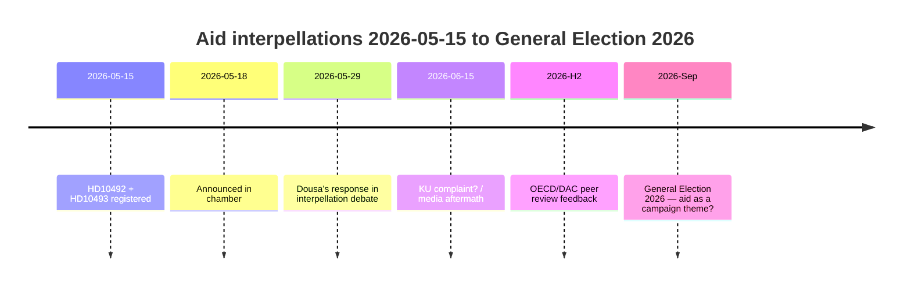

# Linkse Partij dwingt Dousa om 30 beëindigde hulpstrategieën op 29 mei te verdedigen — impactbeoordelingen ontbreken

**Classificatie**: 🟢 OPENBAAR
**Beoordelingsdatum**: 2026-05-15 (Pass 2)
**Hoofdnieuws**: V's hulpinterpellaties over het ontbreken van impactbeoordelingen — minister Dousa moet op 2026-05-29 antwoorden

---

## BLUF (Bottom Line Up Front)

Tussen 2022 en 2025 voerde Zweden historisch grote hulpkortingen door — ODA teruggebracht van ~1% tot 0,8–0,9% van het BNI — en beëindigde ~30 landenstrategieën, waaronder vijf landen die in december 2025 uittraden. Met grote zekerheid beoordelen we dat minister Benjamin Dousa (M) geen gepubliceerde impactbeoordelingen heeft voor de effecten op kinderen (KRV-perspectief), gendergelijkheid (SDG 5) of veiligheidsbeleid (stabiliteit in fragiele staten). De interpellaties HD10492 en HD10493 van de Linkse Partij (V) dwingen Dousa op 2026-05-29 publiekelijk te antwoorden. Het politieke risico is reëel maar beheersbaar via defensieve communicatie. Langetermijnrisico's omvatten de OESO/DAC-peer review 2026 en de verkiezingen van september 2026.

---

## 60 seconden inlichtingenlectuur

| Dimensie | Beoordeling | Zekerheid |
|----------|-----------|---------|
| Politieke ommezwaai (korte termijn) | Onwaarschijnlijk — SD geeft M een meerderheid | HOOG |
| Dousa heeft impactbeoordeling | Onwaarschijnlijk — geen publieke documenten | HOOG |
| Parlementaire escalatie | Mogelijk (KU-klacht) — als Dousa niet kan antwoorden | MATIG |
| Verkiezingsinvloed 2026 | Beperkt op zichzelf — maar symbolisch significant | LAAG–MATIG |
| Humanitaire gevolg (feitelijk) | Ja — gedocumenteerd door Save the Children | MATIG |
| Internationaal geloofwaardigheidsrisico | Ja — OESO/DAC-peer review 2026 | MATIG |

---

## Vereiste sleutelbeslissingen

1. **Dousa (2026-05-29)**: Hoe antwoord op drie binaire ja/nee-vragen over impactbeoordelingen? Defensieve strategie: retroactief Sida-rapport presenteren. Agressief: V's premisse afwijzen als "politieke hulpideologie".

2. **V / Fornarve**: Moeten de interpellaties worden opgevolgd met een KU-klacht? Vereist S + MP + C-coalitie binnen KU.

3. **Sociaaldemocraten (S)**: Moet hulp worden geprioriteerd in het verkiezingsmanifest 2026? Compromis vs. duidelijk signaal.

---

## Inlichtingentijdlijn

---

## Voornaamste risico's in het kort

| Risico | Score | Tijdskader | Mitigatie |
|--------|-------|-----------|---------|
| Dousa zonder impactbeoordeling → parlementaire crisis | 16/25 | 2026-05-29 | Retroactief Sida-rapport |
| Humanitaire gevolgen (kinderen, moeders) | 15/25 | Lopend | Alternatieve donoren |
| OESO/DAC-kritiek | 12/25 | H2 2026 | Hervormingsnarratie |
| Verkiezingen 2026 | 9/25 | Sep 2026 | M's hulpeffectiviteitsnarratief |

---

## Economische contextnotitie

IMF WEO-2026-04 projecteert een BNI-groei van 1,8% voor Zweden in 2026. Er is geen macro-economisch argument voor het voortzetten van de hulpkortingen. [economicProvenance: provider=imf, dataflow=WEO, vintage=WEO-2026-04, status=degraded-via-context]

<!-- source-sha: 29065dd72ab1d745cd33af3bd3bcc2ec48fce4be -->
