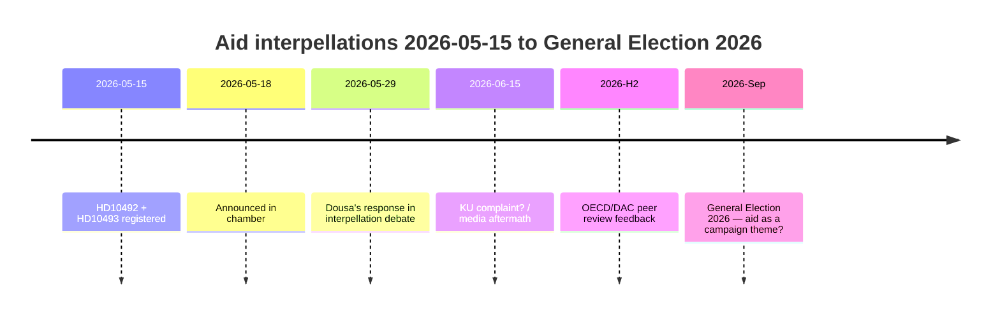

# Venstresiden tvinger Dousa til å forsvare 30 avsluttede bistandsstrategier 29. mai — konsekvensanalyser mangler

**Klassifisering**: 🟢 OFFENTLIG
**Vurderingsdato**: 2026-05-15 (Pass 2)
**Ledende nyhet**: V's bistands-interpellasjoner om fraværet av konsekvensanalyser — minister Dousa skal svare 2026-05-29

---

## BLUF (Bottom Line Up Front)

Mellom 2022 og 2025 gjennomførte Sverige historisk store bistands-kutt — ODA redusert fra ~1% til 0,8–0,9% av BNI — og avsluttet ~30 landsstrategier, inkludert fem land som trakk seg i desember 2025. Med høy tillit vurderer vi at minister Benjamin Dousa (M) ikke har publiserte konsekvensanalyser for virkningene på barn (barnerettsperspektiv), likestilling (SDG 5) eller sikkerhetspolitikk (stabilitet i skjøre stater). Venstrepartiets (V) interpellasjoner HD10492 og HD10493 tvinger Dousa til å svare offentlig 2026-05-29. Den politiske risikoen er reell men håndterbar gjennom defensiv kommunikasjon. Langsiktige risikoer inkluderer OECD/DAC-fagfellevurdering 2026 og stortingsvalget i september 2026.

---

## 60-sekunders etterretningslesning

| Dimensjon | Vurdering | Tillit |
|-----------|-----------|--------|
| Politisk vending (kortsiktig) | Usannsynlig — SD gir M flertall | HØY |
| Dousa har konsekvensanalyse | Usannsynlig — ingen offentlige dokumenter | HØY |
| Parlamentarisk eskalering | Mulig (KU-anmeldelse) — hvis Dousa ikke kan svare | MODERAT |
| Valgets innvirkning 2026 | Begrenset isolert — men symbolsk signifikant | LAV–MODERAT |
| Humanitær konsekvens (faktisk) | Ja — dokumentert av Redd Barna | MODERAT |
| Internasjonal troverdighetsrisiko | Ja — OECD/DAC-fagfellevurdering 2026 | MODERAT |

---

## Nøkkelbeslutninger som kreves

1. **Dousa (2026-05-29)**: Hvordan svare på tre binære ja/nei-spørsmål om konsekvensanalyser? Defensiv strategi: presentere en retroaktiv Sida-rapport. Aggressiv: avvise V's premiss som "politisk bistandsideologi".

2. **V / Fornarve**: Bør interpellasjonene følges opp med en KU-anmeldelse? Krever S + MP + C-koalisjon innen KU.

3. **Sosialdemokratene (S)**: Bør bistand prioriteres i valgets 2026 valgmanifest? Kompromiss vs. klart signal.

---

## Etterretnings-tidslinje

---

## Viktigste risikoer kort sagt

| Risiko | Score | Tidsramme | Mottiltak |
|--------|-------|-----------|---------|
| Dousa uten konsekvensanalyse → parlamentarisk krise | 16/25 | 2026-05-29 | Retroaktiv Sida-rapport |
| Humanitære konsekvenser (barn, mødre) | 15/25 | Pågående | Alternative givere |
| OECD/DAC-kritikk | 12/25 | H2 2026 | Reformnarrativ |
| Valg 2026 | 9/25 | Sep 2026 | M's bistandseffektivitetsnarrativ |

---

## Økonomisk kontekstnote

IMF WEO-2026-04 prosjekterer BNI-vekst på 1,8% for Sverige i 2026. Det er intet makroøkonomisk argument for å fortsette bistands-kuttene. [economicProvenance: provider=imf, dataflow=WEO, vintage=WEO-2026-04, status=degraded-via-context]

<!-- source-sha: 29065dd72ab1d745cd33af3bd3bcc2ec48fce4be -->
