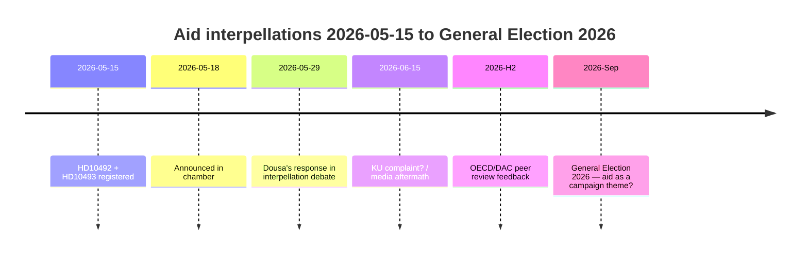

# Vänsterpartiet tvingar Dousa att försvara 30 avslutade biståndsstrategier den 29 maj — konsekvensbedömningar saknas

**Klassificering**: 🟢 OFFENTLIG
**Bedömningsdatum**: 2026-05-15 (Pass 2)
**Ledande nyhet**: V:s biståndsinterpellationer om frånvaron av konsekvensbedömningar — minister Dousa ska svara den 2026-05-29

---

## BLUF (Bottom Line Up Front)

Mellan 2022 och 2025 genomförde Sverige historiskt stora biståndsminskningar — ODA minskades från ~1% till 0,8–0,9% av BNI — och avslutade ~30 landsstrategier, inklusive fem länder som lämnade i december 2025. Med hög konfidens bedömer vi att minister Benjamin Dousa (M) inte har publicerade konsekvensbedömningar för effekterna på barn (barnrättsperspektiv), jämställdhet (SDG 5) eller säkerhetspolitik (stabilitet i sköra stater). Vänsterpartiets (V) interpellationer HD10492 och HD10493 tvingar Dousa att svara offentligt den 2026-05-29. Den politiska risken är verklig men hanterbar genom defensiv kommunikation. Långsiktiga risker inkluderar OECD/DAC-kamratgranskningen 2026 och riksdagsvalet i september 2026.

---

## 60-sekunders underrättelselektion

| Dimension | Bedömning | Konfidens |
|-----------|-----------|-----------|
| Politisk vändning (kort sikt) | Osannolikt — SD ger M en majoritet | HÖG |
| Dousa har konsekvensbedömning | Osannolikt — inga offentliga dokument | HÖG |
| Parlamentarisk eskalering | Möjligt (KU-anmälan) — om Dousa inte kan svara | MÅTTLIG |
| Valets påverkan 2026 | Begränsad isolerat — men symboliskt signifikant | LÅG–MÅTTLIG |
| Humanitär konsekvens (faktisk) | Ja — dokumenterat av Rädda Barnen | MÅTTLIG |
| Risk för internationell trovärdighet | Ja — OECD/DAC-kamratgranskning 2026 | MÅTTLIG |

---

## Nyckelbeslutt som krävs

1. **Dousa (2026-05-29)**: Hur svara på tre binära ja/nej-frågor om konsekvensbedömningar? Defensiv strategi: presentera en retroaktiv Sida-rapport. Aggressiv: avfärda V:s premiss som "politisk biståndsideologi".

2. **V / Fornarve**: Bör interpellationerna följas upp med en KU-anmälan? Kräver S + MP + C-koalition inom KU.

3. **Socialdemokraterna (S)**: Bör bistånd prioriteras i valets 2026 valmanifest? Kompromiss kontra tydlig signal.

---

## Underrättelsetidslinje

---

## Viktigaste risker i korthet

| Risk | Poäng | Tidsram | Motåtgärd |
|------|-------|---------|---------|
| Dousa utan konsekvensbedömning → parlamentarisk kris | 16/25 | 2026-05-29 | Retroaktiv Sida-rapport |
| Humanitära konsekvenser (barn, mödrar) | 15/25 | Pågående | Alternativa givare |
| OECD/DAC-kritik | 12/25 | H2 2026 | Reformnarrativ |
| Val 2026 | 9/25 | Sep 2026 | M:s biståndsnyttonarrativ |

---

## Ekonomisk kontextnotering

IMF WEO-2026-04 projicerar BNI-tillväxt på 1,8% för Sverige 2026. Det finns inget makroekonomiskt argument för att fortsätta biståndsneddragningarna. [economicProvenance: provider=imf, dataflow=WEO, vintage=WEO-2026-04, status=degraded-via-context]

<!-- source-sha: 29065dd72ab1d745cd33af3bd3bcc2ec48fce4be -->
