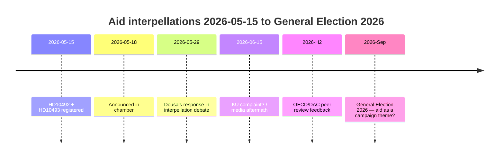

# 左翼党迫使杜萨在5月29日为30项已终止的援助战略辩护 — 缺少影响评估

**分类**：🟢 公开
**评估日期**：2026-05-15 (Pass 2)
**主要新闻**：V关于缺少影响评估的援助质询 — 杜萨部长须于2026-05-29作答

---

## BLUF（核心结论）

2022年至2025年间，瑞典实施了历史性大规模援助削减——ODA从约1%降至GNI的0.8–0.9%——并终止了约30项国家战略，其中包括2025年12月退出的五个国家。我们以高度信任评估，Benjamin Dousa部长（M）未发布关于对儿童（儿童权利公约视角）、性别平等（SDG 5）或安全政策（脆弱国家稳定）影响的公开评估。左翼党（V）的质询HD10492和HD10493迫使杜萨在2026-05-29公开作答。政治风险真实但可通过防御性沟通加以管理。长期风险包括2026年经合组织/发展援助委员会同行评审和2026年9月大选。

---

## 60秒情报速览

| 维度 | 评估 | 信心度 |
|------|------|--------|
| 政策逆转（短期） | 不太可能——SD给M多数席位 | 高 |
| 杜萨有影响评估 | 不太可能——无公开文件 | 高 |
| 议会升级 | 可能（KU申诉）——若杜萨无法回答 | 中等 |
| 2026年大选影响 | 单独看有限——但象征意义重大 | 低~中等 |
| 人道主义后果（实际） | 是——由救助儿童会记录 | 中等 |
| 国际公信力风险 | 是——经合组织/发展援助委员会同行评审2026 | 中等 |

---

## 所需关键决策

1. **杜萨（2026-05-29）**：如何回答三个关于影响评估的是/否问题？防御性策略：提交追溯性Sida报告。进攻性：拒绝V的前提为"政治性援助意识形态"。

2. **V / Fornarve**：是否应通过KU申诉跟进质询？需要KU内的S + MP + C联盟。

3. **社会民主党（S）**：是否应在2026年大选纲领中优先考虑援助？妥协 vs. 明确信号。

---

## 情报时间线

---

## 主要风险一览

| 风险 | 分数 | 时间框架 | 缓解措施 |
|------|------|---------|---------|
| 杜萨无影响评估→议会危机 | 16/25 | 2026-05-29 | 追溯性Sida报告 |
| 人道主义后果（儿童、母亲） | 15/25 | 持续 | 替代捐助方 |
| 经合组织/发展援助委员会批评 | 12/25 | H2 2026 | 改革叙事 |
| 2026年大选 | 9/25 | 2026年9月 | M的援助效益叙事 |

---

## 经济背景说明

IMF WEO-2026-04预测瑞典2026年GNI增长1.8%。继续援助削减没有宏观经济依据。[economicProvenance: provider=imf, dataflow=WEO, vintage=WEO-2026-04, status=degraded-via-context]

<!-- source-sha: 29065dd72ab1d745cd33af3bd3bcc2ec48fce4be -->
