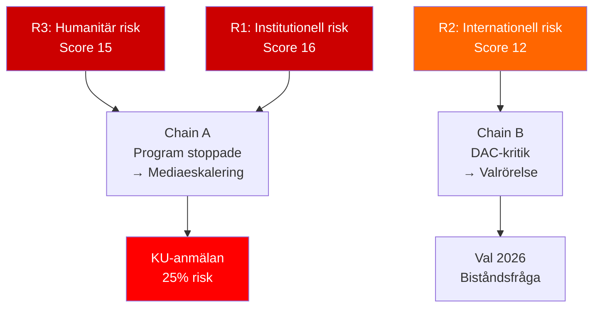

# Risk Assessment — Interpellations 2026-05-15

**Framework**: 5-Dimension Political Risk Register  
**Scale**: Likelihood (L) × Impact (I) = Risk Score (1–25)  

---

## Risk Register

| # | Risk | Dimension | L | I | Score | Mitigation |
|---|------|-----------|---|---|-------|-----------|
| R1 | Dousa kan inte redovisa konsekvensanalyser — parlamentarisk kris | Institutional | 4 | 4 | **16** | Dousa presenterar retroaktiv rapport |
| R2 | Sverige minskar trovärdighet i EU/FN-biståndssystem | International | 3 | 4 | **12** | ODA-nivå kan höjas efter val 2026 |
| R3 | Ökad barnbarnadödlighet/undernäring p.g.a. stoppade program | Humanitarian | 3 | 5 | **15** | Andra donorer fyller gapet (osäkert) |
| R4 | Säkerhetspolitisk sårbarhet: instabilitet i avvecklade länder | Security | 3 | 4 | **12** | Bibehållna bilaterala kanaler |
| R5 | Valrörelsekonsekvens: V/S/MP-mobilisering på biståndsfrågan | Electoral | 3 | 3 | **9** | M/SD kan rama om som "effektivisering" |
| R6 | KU-granskning av beslutsunderlaget | Legal/Constitutional | 2 | 4 | **8** | Besluten kan försvaras med reformagendan |
| R7 | OECD/DAC peer review-kritik 2026 | Reputational | 3 | 3 | **9** | Sverige kan presentera reformagendan som innovativ |
| R8 | Rädda Barnens kampanjimpact skadar Dousas image | Communicational | 3 | 3 | **9** | Proaktiv kommunikation om "effektivitet" |

## Cascading Risk Chains

**Chain A — Humanitarian → Institutional**:  
Dokumenterade stoppade program (undernäring, mödravård) → Rädda Barnen press release → Mediadrev → Kammardebatt eskalerar → KU-anmälan → Konstitutionell kris för Dousa.  
*Probability*: 25% (om Dousa saknar skriftliga beslutsunderlag) [B3]

**Chain B — International → Electoral**:  
OECD/DAC-kritik i peer review 2026 → Internationella rubriker → S-kampanjtema om "Sverige tappar ledarrollen" → Väljarförluster för M i moderata väljargrupper.  
*Probability*: 35% [B3]

**Chain C — Security → International**:  
Instabilitet i Liberia/Moçambique p.g.a. biståndsgap → Flyktingströmar → EU-migrationsdebatt → Sverige kritiseras för att ha skapat problemet.  
*Probability*: 15% (lång tidshorisont, andra faktorer dominerar) [C3]

## Posterior Probabilities (Bayesian Update)

| Hypothesis | Prior | Evidence | Posterior |
|-----------|-------|---------|-----------|
| Dousa har gjort konsekvensanalys | 0.20 | Inga publika dokument funna | 0.10 |
| Debatten 2026-05-29 eskalerar till KU | 0.15 | Interpellationsformuleringarna är skarpa | 0.25 |
| Biståndspolitiken reverseras 2026 | 0.30 | Val 2026, S-opposition stark | 0.35 |

