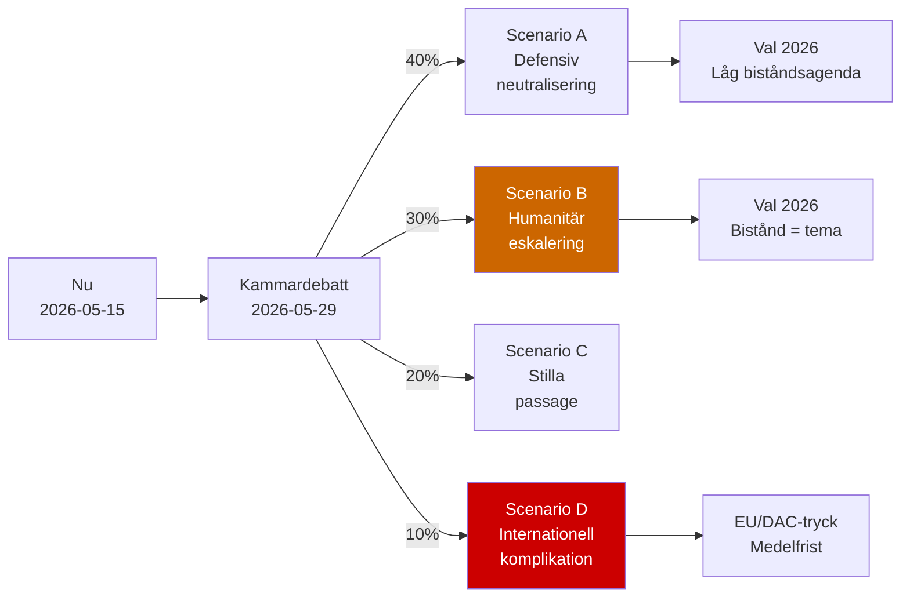

# Scenario Analysis — Interpellations 2026-05-15

**Method**: Alternative Futures Framework  
**Probability**: Must sum to 100%  

---

## Scenarios

### Scenario A — "Defensiv neutralisering" (40%)

**Description**: Dousa svarar med en post-hoc effektanalys och refererar till reformagendan. Media rapporterar men inga konkreta policyförändringar sker. V:s interpellationer leder till inga omedelbara konsekvenser.

**Conditions**: Dousa beställer snabbrapport från Sida, presenterar den 2026-05-29. Regeringskoalitionen håller ihop. Media fokuserar på andra frågor.

**Indicators**: UD/Sida beställer rapport maj 2026; Dousa förtydligar i presskonferens

**Intelligence value**: Bekräftar att reformagendan är pragmatisk, inte dogmatisk

---

### Scenario B — "Humanitär eskalering" (30%)

**Description**: Rädda Barnen publicerar skarpa data om stoppade program sammanfallande med kammardebatt. Media eskalerar. Dousa kan inte presentera trovärdiga analyser. S/V/MP kräver KU-granskning. Biståndsfrågan etableras som valrörelsetema.

**Conditions**: Rädda Barnen timing; Dousa utan underlag; S aktivt

**Indicators**: Rädda Barnen press release maj 2026; S kräver extra utskottssammanträde

**Intelligence value**: Hög — skapar defensivt läge för M inför val

---

### Scenario C — "Stilla passage" (20%)

**Description**: Kammardebatt 2026-05-29 genomförs utan större uppmärksamhet. Dousa svarar med standardfraser om reformagenda. Media rapporterar minimalt. Frågan lämnar dagordningen.

**Conditions**: Medialarm om annan fråga (säkerhet, ekonomi); V saknar amplifier; Bistånd lågt på väljaragendan

**Indicators**: Inga RB-kampanjer; Låg nyhetsposition

**Intelligence value**: Bistånd är inte electorally salient för bredare publik

---

### Scenario D — "Internationell komplikation" (10%)

**Description**: OECD/DAC publicerar kritisk förhandsgranskning av Sverige i maj/juni 2026 som sammanfaller med kammardebatt. EU-kommissionen uttrycker oro. Biståndsfrågan får internationell dimension.

**Conditions**: DAC accelererar peer review; EU budgetförhandlingar om ODA; Trump-USAID-kollaps sätter press på OECD-länder

**Indicators**: DAC-kommuniké; EU-rådsarbete om ODA-nivåer

**Intelligence value**: Skapar externt tryck som är svårt för Dousa att neutralisera

---

## Scenario Probability Table

| Scenario | Probability | Electoral impact | Policy impact |
|----------|------------|----------------|--------------|
| A: Defensiv neutralisering | 40% | Låg | Minimal |
| B: Humanitär eskalering | 30% | Medel-hög | Låg (kort sikt) |
| C: Stilla passage | 20% | Ingen | Ingen |
| D: Internationell komplikation | 10% | Medel | Medel (medelfrist) |

