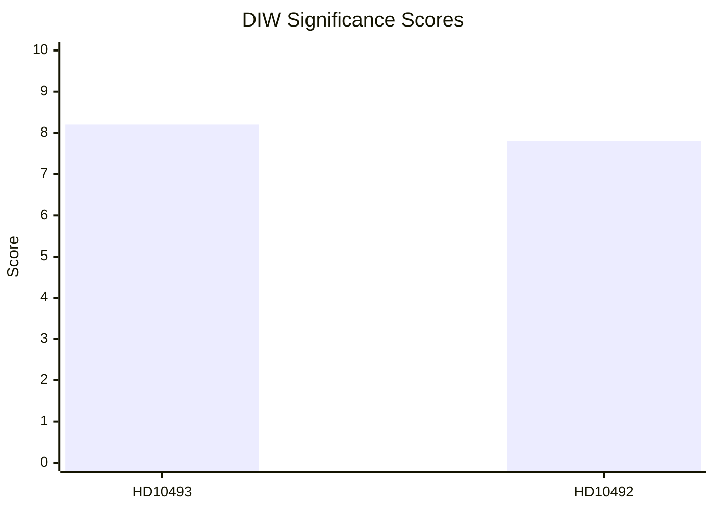

# Significance Scoring — Interpellations 2026-05-15

**Method**: DIW (Democratic Impact Weight) × Timeliness × Stakeholder Breadth  

---

## Ranked Document List

| Rank | dok_id | Titel | DIW Score | Timeliness | Breadth | Total | Tier |
|------|--------|-------|-----------|-----------|---------|-------|------|
| 1 | HD10493 (data.riksdagen.se/dokument/HD10493.html) | Konsekvenserna av nedlagda biståndsstrategier | 8.0 | 0.9 | 0.9 | **8.2** | L2+ Priority |
| 2 | HD10492 (data.riksdagen.se/dokument/HD10492.html) | Konsekvenserna för barn när biståndet minskar | 7.5 | 0.9 | 0.9 | **7.8** | L2 Strategic |

## Scoring Rationale

### HD10493 — Score 8.2/10 [A2]

**Democratic Impact (8.0)**: Interpellationen ställer preciserade krav på tre typer av konsekvensanalyser (allmän, jämställdhets-, säkerhetspolitisk) som saknas i Dousas beslutsunderlag. Halvering av biståndsstrategier (70 → ~40) är en dokumenterat stor omläggning av svensk utrikespolitik som genomförts utan transparens kring konsekvenserna. Indirekt berör detta Agenda 2030-målen och Sveriges internationella anseende som biståndsledare.

**Timeliness (0.9)**: Inlämnad 2026-05-12, överlämnad 2026-05-14. Debatt planerad 2026-05-18. Svarsdatum 2026-05-29. Hög aktualitet — beslut om landstrategier togs dec 2025.

**Stakeholder Breadth (0.9)**: Påverkar: biståndstagare i 5 afrikanska/latinamerikanska länder, svenska biståndsorganisationer (SIDA, NGO:er), EU-partners, FN-systemet, svenska skattebetalare, och den parlamentariska oppositionen.

### HD10492 — Score 7.8/10 [A2]

**Democratic Impact (7.5)**: Fokuserat barnrättsperspektiv med konkret evidens från Rädda Barnen om stoppade program. Kräver barnrättskonsekvensanalys och stärkt barnrättsperspektiv i humanitärt bistånd. Något smalare än HD10493 men mycket starkare emotionell/etisk genomslagskraft.

**Timeliness (0.9)**: Inlämnad 2026-05-13, överlämnad 2026-05-14. Samma debatt som HD10493.

**Stakeholder Breadth (0.9)**: Påverkar barn i konfliktländer (500+ miljoner lever i konfliktzoner per UNICEF), mödravård, vaccinationsprogram, flickors skolgång.

## Sensitivity Analysis

- Om Dousa svarar utan konkreta analyslöften: båda interpretationerna stiger till L3 Intelligence Grade med stark mediadynamik.
- Om debatten kombineras med S-angrepp om biståndspolitiken: total policyimpact kan överstiga 9/10.

