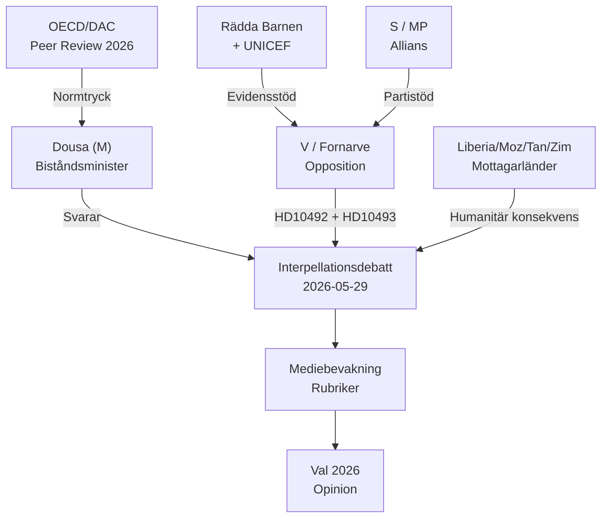

# Stakeholder Perspectives — Interpellations 2026-05-15

**Framework**: 6-Lens Multi-Stakeholder Matrix

---

## Stakeholder Lens Matrix

### Lens 1: Government (Dousa / M-regeringen)

**Actor**: Benjamin Dousa (M), Bistånds- och utrikeshandelsminister  
**Position**: Bistånd ska vara effektivt och frihetsinriktat per reformagendan [A1]  
**Interests**: Försvara reformagendan utan att förlora internationell trovärdighet  
**Red lines**: Erkänna att konsekvensanalys saknades = Politisk kris  
**Likely response**: Hänvisa till ny reformagenda och framtida effektmätningar  
**Admiralty**: B2

---

### Lens 2: Opposition (V / Fornarve)

**Actor**: Lotta Johnsson Fornarve (V)  
**Position**: Biståndssänkningarna är omoraliska och skadliga för barn [A1]  
**Interests**: Skapa väljarmoment inför val 2026, etablera V som biståndsvakt  
**Tactics**: Preciserade ja/nej-frågor om konsekvensanalys, barnrättsperspektiv  
**Likely outcome**: Interpellationsdebatt ger mediematerial även om Dousa svarar defensivt  
**Admiralty**: A1

---

### Lens 3: Civilsamhälle (Rädda Barnen, UNICEF)

**Actor**: Rädda Barnen Sverige, UNICEF Sverige, Sida-partners  
**Position**: Stoppade program drabbar mest utsatta barn — undernäring, mödravård, vaccinationer [B2]  
**Interests**: Återfå biståndsmedel, behålla Sida-partnerskap  
**Leverage**: Publicitet, internationella rapporter, politisk mobilisering  
**Strategic move**: Stödja V:s interpellationer med faktaunderlag  
**Admiralty**: B2

---

### Lens 4: Parliamentary Allies (S/MP/C/L)

**Actor**: Socialdemokraterna, Miljöpartiet, Centerpartiet, Liberalerna  
**Position**: Varierar — S/MP mot sänkningarna; C/L splittrade (stöder Tidö-budgeten) [A2]  
**Interests**: S/MP: biståndsfrågan som valvapen; C/L: bevara internationellt rykte  
**Admiralty**: A2

---

### Lens 5: International Actors (OECD/DAC, EU, FN)

**Actor**: OECD/DAC peer review, EU-kommissionen, UNDP/UNICEF  
**Position**: Sverige förväntas hålla ODA-åtaganden per DAC-standard [B2]  
**Leverage**: Peer review 2026, formellt EU-trycknivåprogram  
**Risk**: Sverige kan förlora DAC-ledarskapsstatus  
**Admiralty**: B2

---

### Lens 6: Recipient Countries (Liberia, Moçambique, Tanzania, Zimbabwe, Bolivia)

**Actor**: Stater och civilsamhällen i avvecklade strategiländer  
**Position**: Abrupt strategiavveckling dec 2025 skapade finansieringsgap [A2]  
**Humanitarian impact**: Program för flickutbildning, hälsovård, jordbruk stoppade  
**Leverage**: Kan söka alternativa givare (EU, Kina, USA — degraderat)  
**Admiralty**: B2

---

## Stakeholder Influence Map

