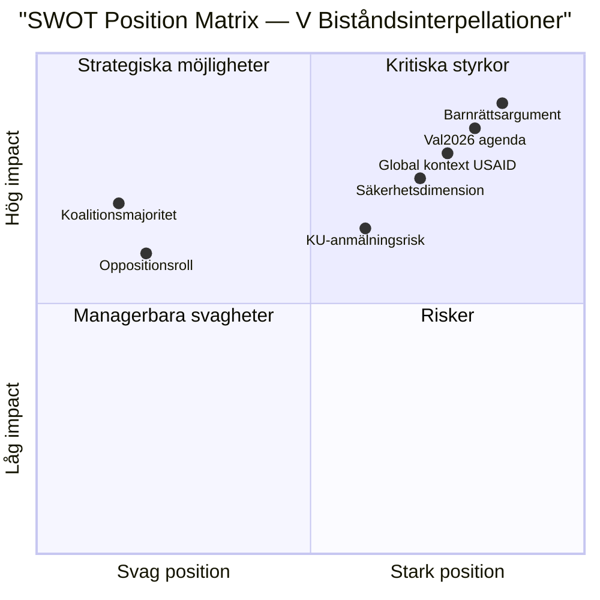

# SWOT Analysis — Interpellations 2026-05-15

**Focus**: V:s biståndsinterpellationer mot Dousa (HD10492, HD10493)  
**Perspective**: Parliamentary opposition scrutiny effectiveness  

---

## SWOT Matrix

### Strengths (V:s parlamentariska position)

| Strength | Evidence [Admiralty] |
|----------|---------------------|
| Konkreta sakfrågor om konsekvensanalys | Interpellationerna ställer mätbara krav: "har konsekvensanalys gjorts?" — binär fråga Dousa måste besvara [A2] |
| Stöd från civilsamhälle | Rädda Barnen har rapporterat om stoppade program (undernäring, mödravård, vaccinationer, flickors skolgång) — extern evidens stärker V:s tes [B2] |
| Global kontextförstärkning | USAID-kollaps (Trump 2025) gör svensk minskning extra kontroversiell — timing gynnar V [A2] |
| Barnrättsargument | Universellt sympatikapital — svårt för Dousa att avvisa barnrättsperspektivet [A2] |
| Säkerhetspolitisk dimension (HD10493) | Kopplar bistånd till stabilitet — argumentet är svårare för M att avfärda som "V-ideologi" [B2] |

### Weaknesses (V:s begränsningar)

| Weakness | Evidence [Admiralty] |
|----------|---------------------|
| Oppositionsroll — ingen beslutsmakt | V kan bara skapa opinionsrisk, inte stoppa policyn [A1] |
| Koalitionsdynamik | SD ger M-regeringen parlamentarisk majoritet för biståndsminskningarna [A2] |
| "Effektiviserings"-narrativet svårt att bemöta | Dousa kan hänvisa till reformagendan som "effektiv biståndspolitik" [B2] |
| Kommunikationsgap | Bistånd är inte en högt prioriterad väljarfråga för alla segment — riskerar att marginaliseras [B3] |

### Opportunities (möjliga konsekvenser)

| Opportunity | Evidence [Admiralty] |
|------------|---------------------|
| Val 2026-agenda | Biståndsdebatten kan mobilisera V/S/MP-väljare kring solidaritetsargumentet [A3] |
| KU-granskning | Om Dousa inte kan redovisa beslutsunderlag kan KU-anmälan bli aktuell [B3] |
| EU-trovärdighetsrisk | Sverige tappar inflytande i EU:s biståndspolitik om det inte håller ODA-nivå [B2] |
| FN/OECD-utvärdering | DAC peer review 2026 kan offentliggöra kritik mot Sverige [C3] |

### Threats (risker för V:s strategi)

| Threat | Evidence [Admiralty] |
|--------|---------------------|
| Dousa levererar retroaktiv analys | Om ministern kan presentera en rapport (även bristfällig) neutraliseras huvudfrågan [B3] |
| Media-agendabyte | Inrikes säkerhetsfrågor kan dominera kammardebatt 2026-05-29 [B3] |
| Internationellt fokus sjunker | Biståndsfatigue efter Ukraine-stöd och AI-diskussion kan minska publiken [C3] |

## TOWS Strategic Matrix

| | Opportunities | Threats |
|--|--------------|---------|
| **Strengths** | S+O: Använda civilsamhällsevidens (Rädda Barnen, UNICEF) + global USAID-kontext för stark valrörelsekampanj | S+T: Förbereda uppföljningsfrågor redan om Dousa presenterar en retroaktiv analys |
| **Weaknesses** | W+O: Söka S/MP-allians i biståndsgranskning för bredare parlamentarisk koalition | W+T: Riskminimering: kombinera interpellationerna med mediestrategi för att hålla biståndet relevant |

