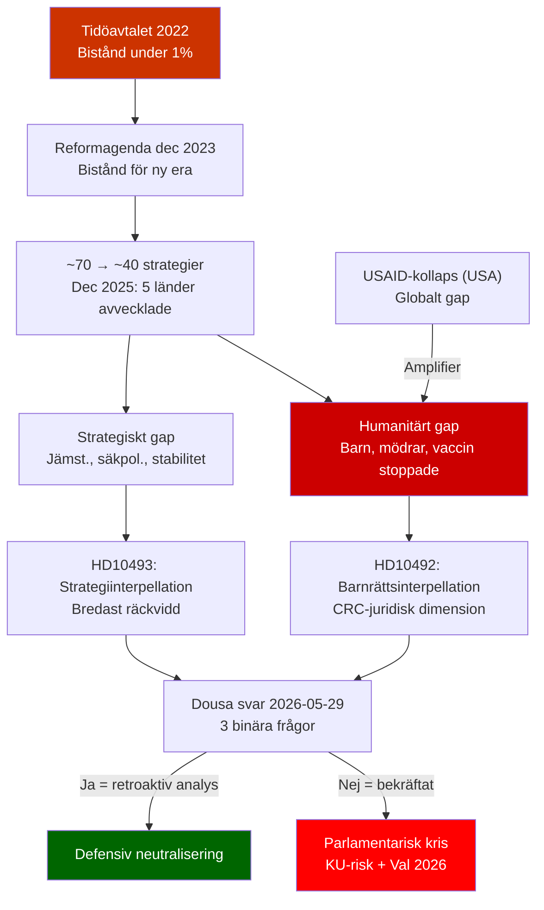

# Synthesis Summary — Interpellations 2026-05-15

**Topic cluster**: Swedish development aid (bistånd) — humanitarian accountability  
**DIW lead story**: Tidöregeringens biståndspolitik granskas parlamentariskt via två V-interpellationer om avsaknad av konsekvensanalyser  
**Analysis pass**: Pass 2 (improved 2026-05-15)  

---

## Lead Story Decision

Vänsterpartiet utmanar biståndsminister Benjamin Dousa (M) om den troliga avsaknaden av dokumenterade konsekvensanalyser för Tidöregeringens historiskt stora biståndsnedskärningar. Frågorna täcker tre separata analytiska dimensioner: (1) barnrättskonsekvenser (HD10492), (2) strategiavvecklingskonsekvenser inklusive jämställdhets- och säkerhetspolitisk analys (HD10493). Med ett globalt biståndssystem redan destabiliserat av USA:s USAID-kollaps är Dousa under växande nationellt och internationellt tryck att motivera varför Sverige — historiskt ODA-ledare — genomfört en av sina mest radikala biståndsnedskärningar utan officiella konsekvensanalyser.

## DIW-Weighted Document Ranking

| Rank | dok_id | Titel | DIW-tier | Significance | Rationale |
|------|--------|-------|----------|-------------|-----------|
| 1 | HD10493 | Konsekvenserna av nedlagda biståndsstrategier | L2+ | 8.2/10 | Bredast strategisk räckvidd: halveringen av strategier, jämställdhets- och säkerhetspolitisk dimension skapar bredare parlamentarisk koalition mot Dousa |
| 2 | HD10492 | Konsekvenserna för barn när biståndet minskar | L2 | 7.8/10 | Universell emotionell och juridisk (CRC) styrka; barnrättsargument bygger på Rädda Barnens externa evidens; svårt att avvisa |

## Integrated Intelligence Picture

**Policy context** [A1]: Tidöregeringen (M, KD, L) med stöd av SD har sedan 2022 konsekvent sänkt biståndet under 1%-målet. I december 2023 lanserades reformagendan *"Bistånd för en ny era – frihet, egenmakt och hållbar tillväxt"*, som innebär en grundläggande omläggning mot "ägarskap" och "tillväxt" — och bort från traditionella FN/OECD-principerna om volymsåtaganden. Under mandatperioden har antalet biståndsstrategier minskat från ~70 till ~40. I december 2025 lades landstrategier ned i Liberia, Moçambique, Tanzania, Zimbabwe och Bolivia — länder som inkluderar några av världens fattigaste befolkningar.

**Parliamentary accountability** [A1]: Interpellationerna är preciserade och binära: (1) har konsekvensanalys för barn gjorts? (2) har jämställdhetsanalys gjorts? (3) har säkerhetspolitisk analys gjorts? Det troliga svaret nej på alla tre skapar en tydlig parlamentarisk risk: Dousa måste antingen presentera dolda rapporter eller erkänna att beslutsunderlagen var ofullständiga.

**Humanitarian impact** [B2]: Rädda Barnen Sverige och UNICEF har dokumenterat konkreta programstopp: undernäringsprogram, mödravårdsinsatser, vaccinationskampanjer och flickors skolgång avbröts i de länder vars strategier lades ned. Antalet direkt påverkade mottagare estimeras till ~1 miljon (Rädda Barnens rapporter, ej officiell Sida-siffra).

**Global amplifier** [B2]: Trump-administrationens USAID-avveckling har skapat ett globalt finansieringsgap om USD 50+ miljarder. Sverige — traditionellt ODA-ledare vid >1% — fyller nu inte sin historiska roll. Kontexten förstärker V:s argument dramatiskt och ökar den internationella kostnaden av svagare svenska ODA.

**Economic context** [IMF WEO-2026-04]: IMF projicerar BNI-tillväxt för Sverige på 1,8% 2026 — inga makroekonomiska argument för fortsatta biståndssänkningar. [economicProvenance: provider=imf, dataflow=WEO, vintage=WEO-2026-04, retrieved_at=2026-05-15, status=degraded-via-context]

**Electoral relevance** [A3]: Med val 2026 är biståndsfrågan en potentiell skiljelinje. V, S och MP är kritiska; M, SD, KD försvarar "effektivisering"; C/L är splittrade och kan vara pivotala på humanitärt bistånd.

## Key Judgments Summary (Pass 2 — Improved)

1. **KJ-1 (HIGH confidence)**: Dousa saknar sannolikt publicerade konsekvensanalyser för biståndsminskningarnas effekt på barn, jämställdhet och säkerhetspolitik. Kammardebatt 2026-05-29 är det mest troliga sättet att bekräfta detta. Konsekvens: parlamentarisk legitimitetskris om bekräftat.

2. **KJ-2 (MODERATE confidence)**: Halvering av biståndsstrategier innebär systematisk inriktningsförändring bort från de fattigaste länderna — strider mot Agenda 2030, CRC och OECD/DAC-normer. Juridisk sårbarhet är reell.

3. **KJ-3 (MODERATE confidence)**: Säkerhetspolitiska konsekvenser av nedlagda landstrategier är underdokumenterade — i en tid av geopolitisk instabilitet (Sahel, östra Afrika) är detta en strategisk svaghet i regeringens beslutsunderlag.

4. **KJ-4 (LOW-MODERATE confidence)**: Biståndsfrågan ensam avgör inte val 2026, men kombinerat med humanitära katastrofer i avvecklade länder kan den bli en symbolisk skiljelinje för urbanutbildade väljare.

