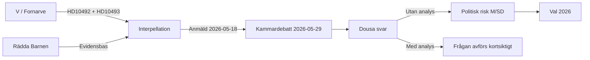

# Threat Analysis — Interpellations 2026-05-15

**Framework**: Political Threat Taxonomy (PTT)

---

## Political Threat Taxonomy

| Threat ID | Actor | Threat type | Vector | Target | TTL |
|-----------|-------|------------|--------|--------|-----|
| T1 | V (Fornarve) | Parliamentary scrutiny | Interpellation [A1] | Dousa / M-biståndspolitik | 2026-05-29 |
| T2 | Civilsamhälle (Rädda Barnen) | Public pressure | NGO campaigns [B2] | ODA-nivå | Ongoing |
| T3 | OECD/DAC | International norm | Peer review 2026 [B3] | Sweden ODA commitments | 2026 H2 |
| T4 | S/MP opposition | Cross-party criticism | Kammardebatt, val [A2] | Tidöavtalets biståndspolitik | Val 2026 |
| T5 | Global context (USAID) | External amplifier | International media [A2] | Swedish global role | Ongoing |

## Attack Tree Analysis

- Root: Destabilisera Dousas biståndsportfölj
  - Branch 1: Parlamentarisk granskning
    - HD10492: Barnrättsargument
    - HD10493: Strategikonsekvensanalys
  - Branch 2: Civilsamhällstryck
    - Rädda Barnens rapportering om stoppade program
    - UNICEF-data om 500M barn i konfliktzoner
  - Branch 3: Internationell norm
    - OECD/DAC peer review
    - EU-biståndsnormer

## Threat Phase Mapping

| Phase | Actor | Action | Context |
|-------|-------|--------|---------|
| Reconnaissance | V/Fornarve | Kartläggning av avvecklade strategier | Offentliga beslut [A1] |
| Weaponize | V/Fornarve | Formulering av skarpa frågor | HD10492, HD10493 [A1] |
| Delivery | Riksdagen | Anmälan i kammaren 2026-05-18 | Planerat [A1] |
| Exploitation | V/Media | Presskonferens + mediebevakning | Rädda Barnen amplifier [B2] |
| Framing | V | Etablering av "ingen konsekvensanalys gjord" | Kräver att Dousa motbevisar [B2] |
| Amplification | V/S/MP | Koordination med biståndskritik | [C3] |
| Electoral | V | Kapitalisering i valrörelse 2026 | [B3] |

## TTP Mapping (Political Context)

| TTP ID | Tactic | Technique | Procedure |
|--------|--------|-----------|-----------|
| P-T001 | Parliamentary Scrutiny | Interpellation | V riktar preciserade frågor till minister |
| P-T002 | Narrative Framing | Issue linkage | V kopplar bistånd till barnrättigheter |
| P-T003 | Norm Invocation | International standard | Hänvisning till Agenda 2030, OECD/DAC |
| P-T004 | Evidence Mobilization | Third-party citation | Rädda Barnen som extern evidensbase |
| P-T005 | Timing Optimization | Pre-election amplification | ~16 månader före val 2026 |

