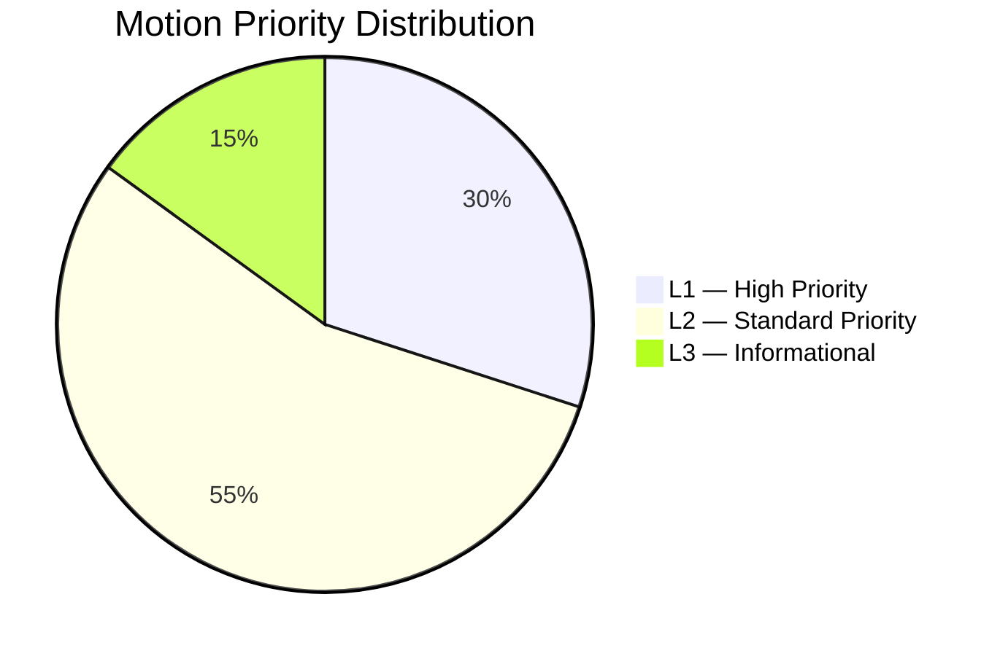
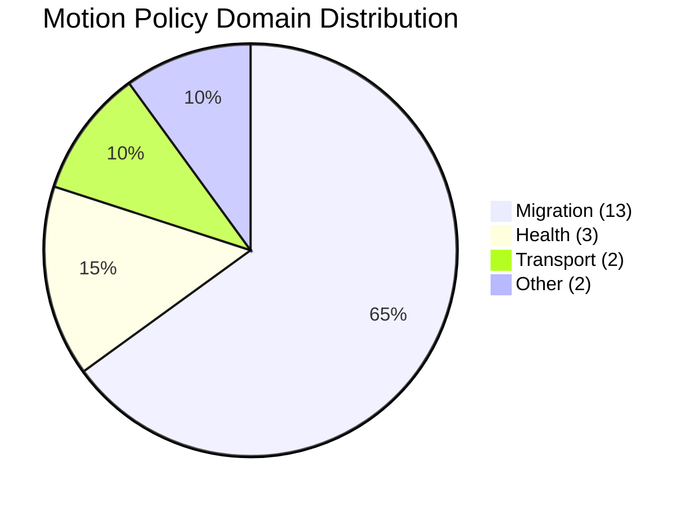

# Classification Results — Opposition Motions 2026-05-15

## Classification Framework

Per `political-classification-guide.md`: documents classified by policy domain, party origin, legislative posture, and strategic intent.

## Document Classification Table

| dok_id | Policy Domain | Party | Posture | Strategic Intent | Priority |
|--------|--------------|-------|---------|-----------------|----------|
| HD024151 | Constitutional / Transparency | S | Amendatory | Accountability expansion | L2 |
| HD024152 | Migration / Return | S | Oppositional | Full/partial rejection | L2 |
| HD024153 | Migration / Residence | S | Oppositional | Full rejection | L1 |
| HD024154 | Migration / Character | S | Oppositional | Scope restriction | L2 |
| HD024155 | Health / Mental | S | Amendatory | Resource augmentation | L2 |
| HD024156 | Research / Ethics | C | Amendatory | Procedural improvement | L3 |
| HD024157 | Migration / Residence | C | Oppositional | Full rejection | L1 |
| HD024158 | Health / Mental | C | Amendatory | Coordination mandate | L2 |
| HD024159 | Migration / Return | C | Amendatory | Human rights safeguards | L2 |
| HD024160 | Migration / Detention | C | Oppositional | ECHR compliance | L1 |
| HD024161 | Migration / Character | C | Amendatory | Proportionality fix | L2 |
| HD024162 | Transport / Infrastructure | S | Amendatory | Rail investment | L3 |
| HD024167 | Migration / Detention | V | Oppositional | Full rejection, rights | L1 |
| HD024168 | Migration / Character | V | Oppositional | Full rejection | L1 |
| HD024169 | Migration / Return | V | Oppositional | Full rejection | L1 |
| HD024173 | Migration / Return | MP | Amendatory | Rights preservation | L2 |
| HD024176 | Defence / Cooperation | MP | Amendatory | Parliamentary oversight | L2 |
| HD024179 | Transport / Infrastructure | V | Amendatory | Climate-transport nexus | L3 |
| HD024181 | Health / Mental | V | Amendatory | Rights-based care | L2 |
| HD024182 | Migration / Detention | V | Oppositional | Full rejection | L1 |

## Priority Distribution

## Domain Distribution

## Legislative Posture

- **Oppositional (full/near-full rejection)**: 8 motions — V and some C on migration detention/residence, the most confrontational posture.
- **Amendatory (seeking modifications)**: 11 motions — seeking human rights safeguards, resource additions, oversight requirements.
- **Mixed**: 1 (HD024173 — MP on return enforcement: opposes deportation pace but accepts return policy in principle).

## GDPR / Special Category Assessment

- All data processed is from publicly available Riksdag records (Art. 9(2)(e) — manifestly made public).
- Party membership = special category data — all attributions from official parliamentary documents.
- Data minimisation applied: only dok_id, party, committee, title, and legislative posture stored.
