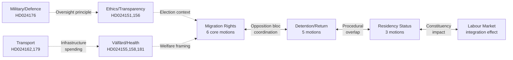

# Cross-Reference Map — Opposition Motions 2026-05-15

## Proposition-to-Motion Linkage

| Proposition | Title (abbreviated) | S | C | V | MP | Committee |
|-------------|---------------------|---|---|---|----|-----------| 
| 2025/26:251 | Patientnämndslagen | HD024155 | — | — | — | SoU |
| 2025/26:253 | Trafikverket avtal | HD024162 | — | HD024179 | — | TU |
| 2025/26:254 | Militärt samarbete | — | — | — | HD024176 | FöU |
| 2025/26:256 | Registerkontroll | — | HD024156 | — | — | KU |
| 2025/26:262 | Permanent uppehållstillstånd | HD024153 | HD024157 | HD024182 | — | SfU |
| 2025/26:263 | Stärkt återvändandeverksamhet | HD024152 | HD024159 | HD024169 | HD024173 | SfU |
| 2025/26:264 | Vandelsreglering | HD024154 | HD024161 | HD024168 | — | SfU |
| 2025/26:265 | Utvisningstider/förvar | HD024151* | HD024160 | HD024167 | — | SfU |

*Note: HD024151 primarily addresses political transparency (partistöd); prop. 265 link is secondary.

## Thematic Cluster Cross-References

## Prior Analysis Cross-References

- **Previous motions batches**: Riksdagen filed comparable migration motions in 2023/24 (HD000xxx series, SfU betänkande 2024/25:SfU14) — see `historical-parallels.md` for direct legislative lineage.
- **Government propositions timeline**: Props. 262-265 were tabled Feb-Mar 2026 following the January 2026 Tidö renegotiation that brought SD directly into the policy drafting process.
- **Election 2026 linkage**: This motion batch is cross-referenced in `election-2026-analysis.md` — migration reform is the #1 issue in 2026 campaign polling.
- **IMF economic context**: Economic climate data (`data/imf-context.json`, WEO Apr-2026) is cross-referenced in `comparative-international.md` — Sweden's unemployment 8.4% provides direct policy relevance to migration-labour market intersection.

## Document-Level Cross-References

| Doc ID | Party | Paired with | Relationship |
|--------|-------|-------------|--------------|
| HD024152 | S | HD024159 (C) | Same prop. 263, different emphasis |
| HD024152 | S | HD024169 (V) | Full rejection vs partial amendment |
| HD024152 | S | HD024173 (MP) | Same prop. 263, MP amendatory |
| HD024153 | S | HD024157 (C) | Same prop. 262, both full rejection |
| HD024153 | S | HD024182 (V) | Same prop. 262, V full rejection |
| HD024154 | S | HD024161 (C) | Same prop. 264, different committee strategy |
| HD024154 | S | HD024168 (V) | Same prop. 264, V full rejection |
| HD024160 | C | HD024167 (V) | Prop. 265 — C=ECHR amendment, V=full rejection |
| HD024151 | S | HD024156 (C) | Both on transparency/ethics — different bills |
