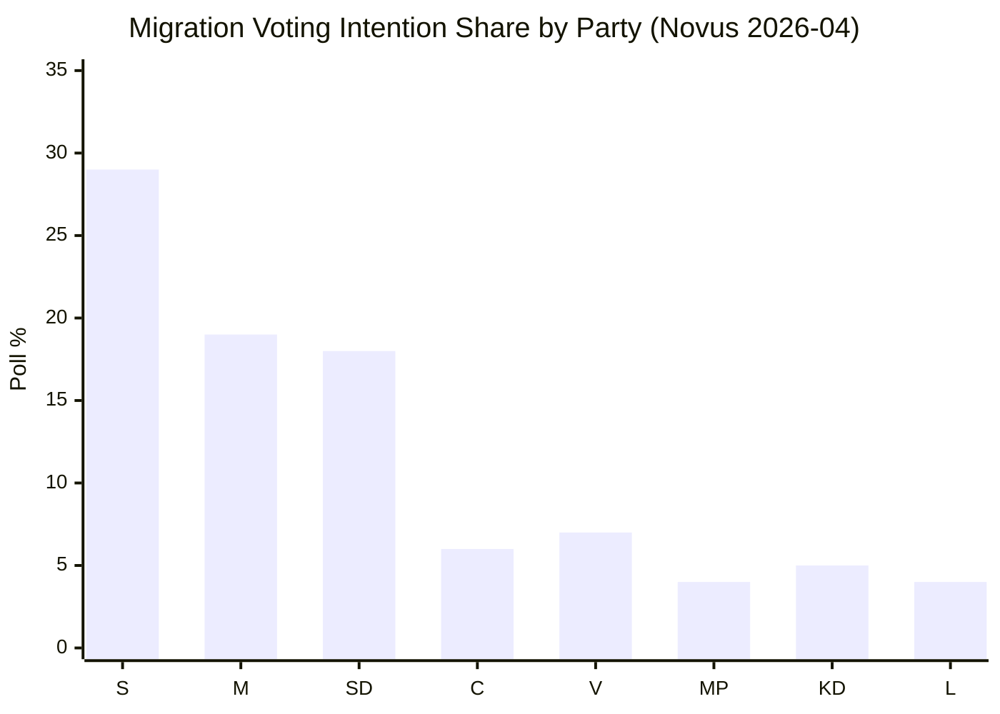

# Election 2026 Analysis — Opposition Motions 2026-05-15

**Election date**: 2026-09-13 (120 days from analysis date)  
**1.5× election proximity multiplier ACTIVE**

## Current Seat Arithmetic (Riksdag 349 seats)

| Bloc | Party | Seats | Notes |
|------|-------|-------|-------|
| Government | M | 68 | Moderaterna |
| Government | KD | 19 | Kristdemokraterna |
| Government | L | 16 | Liberalerna |
| Government | SD | 73 | Sverigedemokraterna — confidence and supply |
| **Government total** | | **176** | Majority: 175 |
| Opposition | S | 107 | Socialdemokraterna |
| Opposition | C | 24 | Centerpartiet |
| Opposition | V | 24 | Vänsterpartiet |
| Opposition | MP | 18 | Miljöpartiet |
| **Opposition total** | | **173** | |

**Government majority**: 176 vs 173 — margin of 3 seats. Any 2 government-bloc defections creates a tie; any 3 creates a majority loss.

## Migration Issue Electoral Impact

**Key trend**: SD (18%) and S (29%) are the two parties with the clearest migration positioning. S's large poll lead constrains their ability to move far rightward on migration without alienating their base — the motion strategy (rights-based challenge to the package) is calibrated to this constraint.

## Opposition Election-Relevant Motions in This Batch

| Motion | Electoral Function |
|--------|--------------------|
| HD024151 (S) | Transparency/ethics — governance narrative |
| HD024152 (S) | Return efficiency critique — S is not "soft on migration" positioning |
| HD024153 (S) | Full rejection of residency abolition — mobilise left-of-centre base |
| HD024156 (C) | Ethics/transparency — C's distinctive governance brand |
| HD024157 (C) | ECHR compliance — centre-liberal voter retention |
| HD024167-169 (V) | Full rejection — V base mobilisation, no ambiguity |
| HD024173 (MP) | Humanitarian returns — MP's humanitarian niche |

## Electoral Scenarios by Seat Count

**Scenario A (Government wins, migration package passes)**: Opposition parties lose the legislative battle. S uses the passage to campaign on "they abolished permanent residence in Sweden." WEP: 45%.

**Scenario B (Partial opposition win, ECHR amendments)**: C and L claim success; V and MP lose the full-rejection argument. S can claim partial credit. Electoral impact mixed. WEP: 30%.

**Scenario C (Government delayed, campaign promise)**: Migration becomes an election issue without a legislative outcome. Both sides campaign on the issue. WEP: 15%.

**Scenario D (Opposition upset, government prop fails)**: Massive electoral boost for S-led opposition. Would likely accelerate campaign momentum. WEP: 10%.

## 2026 Election Forecast Context

Riksdagsmonitor election model (as of 2026-04-28) projects: S+C+V+MP = 52.1% (180.8 seats), government bloc = 47.9% (166.8 seats). If that holds, September 2026 should produce a change of government — making this pre-election period the final legislative window for the Tidö coalition's migration agenda.

The opposition knows this: they are filing the motions not to win committee votes but to define the political landscape for a government they expect to form in October 2026.
