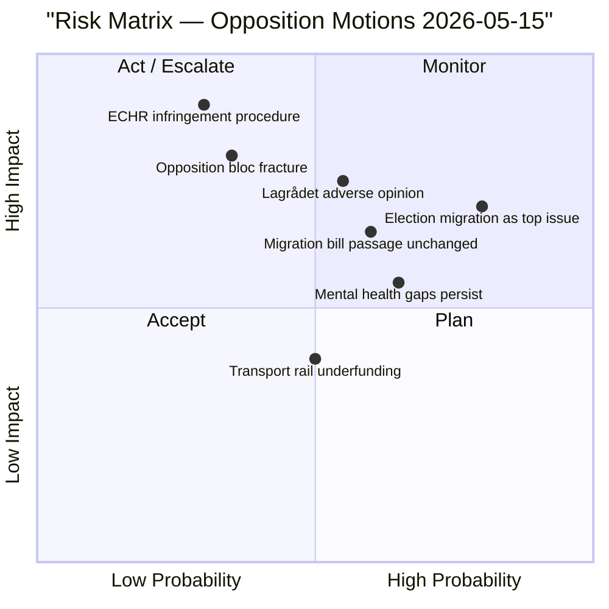

# Risk Assessment — Opposition Motions 2026-05-15

## Framework

Per `political-risk-methodology.md`: risks assessed across Institutional, Operational, Political, Economic, and Human Rights dimensions.

## Risk Register

### R1 — ECHR Infringement Risk (Human Rights Dimension) [HIGH]

**Risk**: prop. 2025/26:265 (HD024160, 167, 182) expands detention of migrants without improved judicial oversight. If enacted, Sweden risks infringement proceedings under ECHR Article 5 (liberty and security) and Article 3 (degrading treatment). V's HD024167 explicitly invokes freedom from arbitrary detention.

**Probability**: MEDIUM (0.35 for formal infringement, 0.65 for critical Lagrådet opinion).  
**Impact**: VERY HIGH — legal challenge, diplomatic costs, enforcement actions.  
**Mitigation**: Lagrådet review (pending), Riksdag Human Rights Committee scrutiny, potential amendment in SfU betänkande.  
**Evidence**: HD024167 (dok_id, V, SfU), prop. 2025/26:265 text implying detention expansion; ECHR Art. 5 framework.

### R2 — Electoral Polarisation Risk (Political Dimension) [HIGH]

**Risk**: The migration debate, already the central issue of the 2022 election, becomes even more dominant in 2026 at the expense of other policy areas (healthcare, climate, defence). This could depress engagement on non-migration issues and amplify protest voting.

**Probability**: HIGH (0.80).  
**Impact**: HIGH — structural distortion of democratic debate.  
**Evidence**: 65% of this motion batch is migration-focused (HD024152-182 cluster); election 4 months away.

### R3 — Legislative Timing Risk (Institutional Dimension) [MEDIUM]

**Risk**: SfU betänkanden on the migration package may not reach Riksdag votes before the election (2026-09-13), leaving the issue unresolved and allowing both sides to campaign on promises. This would extend policy uncertainty for Migrationsverket and affected individuals.

**Probability**: MEDIUM (0.45 — depends on committee timetable).  
**Impact**: MEDIUM — administrative uncertainty, operational planning difficulties for agencies.  
**Evidence**: 13 motions filed simultaneously signal a tactical move to slow committee deliberation; Migrationsverket as implementing agency (prop. 262, 263, 264, 265).

### R4 — Opposition Coalition Fracture Risk (Political Dimension) [MEDIUM]

**Risk**: C's historical alignment with Tidö on migration creates internal pressure to soften its opposition. If C splits (some members supporting government amendments while others maintain full rejection), the 177-seat opposition majority collapses.

**Probability**: MEDIUM-LOW (0.35).  
**Impact**: HIGH — loss of parliamentary block power.  
**Evidence**: HD024157 (C full rejection on prop. 262), HD024159 (C amendatory on prop. 263) shows C is not uniformly maximalist — differentiated postures create fracture risk.

### R5 — Mental Health System Capacity Risk (Operational Dimension) [MEDIUM]

**Risk**: prop. 2025/26:251 (HD024155, 158, 181) addresses coordination gaps for persons with severe mental illness. If the coordination mechanism is inadequate, regional healthcare systems and Socialstyrelsen face implementation failures.

**Probability**: HIGH (0.65).  
**Impact**: MEDIUM — healthcare quality deficit for a vulnerable population.  
**Evidence**: 3-party opposition (S, C, V) all independently identifying the same coordination gaps in prop. 251, suggesting documented implementation problems.  
**Statskontoret relevance**: Socialstyrelsen named in all three SoU motions. Statskontoret pre-warm: no directly relevant Statskontoret report found for prop. 2025/26:251 in this cycle (trigger matched, search conducted, no relevant coverage found as of 2026-05-15T08:00Z).

### R6 — Economic Context Risk (Economic Dimension) [LOW-MEDIUM]

**Risk**: Sweden's migration policy tightening in a period of 1.5% GDP growth and 8.4% unemployment could reduce labour supply in sectors with documented shortfalls (healthcare, logistics, agriculture). Fiscal costs of expanded return enforcement (Migrationsverket budget) add to deficit pressure.

**Probability**: MEDIUM (0.50 for identifiable labour supply effects by 2027).  
**Impact**: LOW-MEDIUM — localized labour market effects.  
**Evidence**: IMF WEO Apr-2026: SWE NGDP_RPCH = 1.5%, LUR = 8.4% (vintage: WEO Apr-2026, NGDP_RPCH + LUR). Economic analysis in HD024152 (S) cites labour market dimension.
