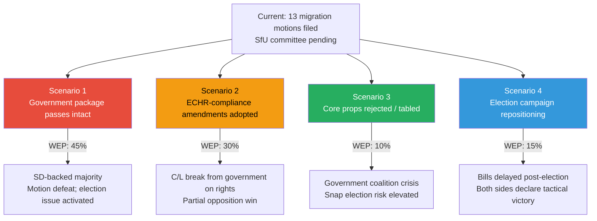

# Scenario Analysis — Opposition Motions 2026-05-15

**Horizon**: T+7d (committee votes) / T+30d (betänkande publication) / T+90d (Riksdag vote) / Election 2026-09-13

## Scenario 1 — Government Package Passes Intact (WEP 45%)

**Description**: All four migration propositions (262-265) pass SfU committee and Riksdag floor vote with SD and government parties (M, KD, L) forming majority. All 13 opposition motions defeated.

**Conditions**: SD unity holds; L does not defect on ECHR concerns (HD024160 signals C/L alignment risk); Riksdag vote occurs before September 2026 election.

**Implications for election**: S, V, MP use the defeat to activate voter concern about "the government that ended permanent residency in Sweden." C's position becomes politically awkward — they filed amendment motions but ultimately voted for the package.

**Evidence basis**: Current Riksdag arithmetic: government bloc (M+KD+L+SD) = 176 seats vs opposition (S+C+V+MP) = 173 — government holds a razor-thin majority. SD discipline is the decisive variable.

## Scenario 2 — ECHR-Compliance Amendments Adopted (WEP 30%)

**Description**: SfU committee incorporates ECHR compliance requirements from HD024160 (C) and/or procedural safeguards from HD024173 (MP) into the government bills. Props. 262 and 265 pass in amended form.

**Conditions**: C (or L) signals to the government that it cannot vote for ECHR-incompatible text; Lagrådet review identifies specific infringements; Government accommodates to avoid coalition fracture.

**Implications**: Both C and MP claim partial victory. The rights-based opposition narrative is partially disarmed. HD024153/157/182 (full rejection of prop. 262) still defeated but amendments soften the outcome.

**Signal to watch**: Lagrådet referral response (estimated June-July 2026). If Lagrådet raises ECHR concerns, Scenario 2 probability rises to ~40%.

## Scenario 3 — Core Propositions Rejected or Tabled (WEP 10%)

**Description**: One or more of the four migration propositions is rejected by SfU or withdrawn by the government following Lagrådet advice. Specifically: prop. 265 (detention expansion) is most vulnerable given ECHR Art. 5 requirements.

**Conditions**: Lagrådet delivers sharp negative opinion; L defects from government on prop. 265; SD tolerates failure on this element to preserve coalition.

**Implications**: Significant opposition win that validates the rights-based strategy. V and MP benefit most. S can claim the broad coalition forced retreat.

**Risk**: If the government withdraws props voluntarily post-election, they can reframe as "responsible governance" rather than "opposition victory."

## Scenario 4 — Election Campaign Repositioning (WEP 15%)

**Description**: The government delays Riksdag votes on one or more propositions until after the September 2026 election — effectively using migration reform as a campaign promise rather than legislative delivery.

**Conditions**: Electoral polling shows migration issue benefits the government if unresolved; government coalition prefers campaign-trail promise to legislative risk.

**Implications**: This is a high-risk scenario for the opposition — it removes their ability to run against a voted-in policy. S, C, V, MP must pivot to holding the government accountable for *not* legislating.

**Precedent**: Government delayed several contentious Tidö items in 2023 for similar electoral positioning reasons.

## 2026 Election Multiplier

**Significance boost**: All scenarios are assigned 1.5× significance multiplier due to proximity to 2026-09-13 election. The migration policy battle represented in this motion batch is likely the defining legislative contest of this riksmöte.
